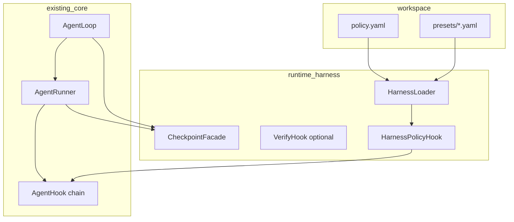

# Runtime Harness + 上下文/成本工程 · 设计规格

> 状态：**范围已确认，待实现**  
> 最后更新：2026-05-24  
> 实施清单：[`plan.md`](./plan.md)

本文档定义 nanobot 的 **Runtime Harness**（Claude Code 式 **在线** agent 运行时外壳），以及与之配套的 **上下文/成本预设**。遵守 [`.agent/design.md`](../design.md)：**少动** `loop.py` / `runner.py` 主路径；策略、验证、恢复落在 **hooks、tools、workspace 配置、session**。

### 明确不做（v1）

- **离线 eval Harness**：无 `nanobot harness run`、无 `cases/*.yaml` golden suite、无 CI 专用断言引擎。
- 产品回归与发版门禁用现有 **pytest**；skill 优化继续用 **GEPA `gepa_evaluator`**，不与此子系统合并。

### 命名约定

| 写法 | 用途 | 示例 |
|------|------|------|
| **Harness** | 子系统名（文档正文） | 「Runtime Harness 在每次 tool 前跑策略」 |
| `harness` | 配置键、目录、JSON 字段 | `agents.defaults.harness`、`workspace/.nanobot/harness/` |
| `HarnessPolicy` 等 | 代码类型（PascalCase） | `nanobot/agent/harness/policy.py` |

勿将本 Harness 与 Braintrust/Promptfoo 式 **eval harness** 混称；对外可写：**Runtime Harness (eval harness 不在范围内)**。

---

## 1. 背景与目标

### 1.1 要解决的问题

工业界共识：**Agent = Model + Harness**。模型可替换；**可靠性、安全、可恢复、成本** 主要由 Harness 决定。

nanobot 已具备 Harness **零件**（分散实现），缺一层 **可版本化、可组合** 的运行时策略：

| 能力 | 现有位置 | Harness 要补的 |
|------|----------|------------------|
| Tool 边界 | `runner` SSRF/workspace、`ExecTool` guard、sandbox | 统一 **策略链** + workspace `policy.yaml` |
| 生命周期 | `AgentHook`、`runtime_checkpoint` | **PreTool 决策**（deny / ask / allow）、用户可见 **/rewind** |
| 上下文 | `Consolidator`、`_microcompact`、skill retrieval | **Context preset**（lean/default/quality） |
| 完成质量 | 无统一闭环 | **`verify` tool** + Plan **command** 验收 |
| 可观测 | `TraceStore`、`_last_usage` | 每 turn **harness 事件**（违规、验证、preset） |

### 1.2 与 Claude Code Harness 的对齐

| Claude Code 层 | nanobot Runtime Harness v1 |
|----------------|----------------------------|
| Memory / 项目上下文 | `SOUL.md`、`USER.md`、skills（已有）；Harness **不重复**，只约束注入量（preset） |
| Tools / MCP | 已有 registry；Harness 做 **调用前策略** |
| Permissions | `policy.yaml` + `HarnessPolicyHook` |
| Hooks | 扩展 `AgentHook.before_execute_tools` → **可阻断** |
| 自验证 | `verify` tool；Plan `acceptance.type=command` |
| Checkpoint | 已有 `runtime_checkpoint`；暴露 **/rewind**、WebUI |
| Observability | trace + harness 结构化字段 |

### 1.3 目标（v1）

1. **每次对话在线生效**：gateway / CLI / channel 共用同一套策略。
2. **Workspace 可提交**：`workspace/.nanobot/harness/policy.yaml`（及可选 `presets/`）。
3. **完成前可验证**：模型或 Plan 步骤可要求跑测试命令，失败则继续改。
4. **上下文可预设**：`contextProfile` 展开为具体 config 字段，便于降本。
5. **不引入第二条 agent 栈**：复用 `AgentLoop` + `AgentRunner`。

### 1.4 非目标（v1）

- 外部 shell 脚本式 **hooks.json**（可 v2；v1 用 Python policy + 内置规则）。
- 替代 pytest 或 GEPA evaluator。
- 全文件系统 snapshot（仅消息级 checkpoint，已有）。
- 多 workspace 联邦策略中心。
- **Plan 模式**（先 plan 后执行）：见 [plan-mode](../plan-mode/design.md)，**Harness v1 不依赖 Plan**；R5 仅预留 verify 执行器给后续 Plan P3。

### 1.5 v1 交付范围（已确认，2026-05-24）

> 实施清单与 PR 切分见 [`plan.md`](./plan.md) §「v1 十项交付」。

**本迭代做（按 ROI 排序）**：

| # | 能力 | 说明 |
|---|------|------|
| 1 | **PreTool 策略链** | `policy.yaml` + `HarnessPolicyHook`；deny 不进 `registry.execute` |
| 2 | **通道 + 默认策略** | `channels.<name>.tools.*`；`defaults.on_unknown_tool` |
| 3 | **exec 命令约束** | `deny_patterns`；可选 `allow_patterns`；与 `ExecToolConfig` 收编为 policy 优先 |
| 4 | **写路径约束** | `write_file` / `edit_*` 的 `paths_allow` / `paths_deny` |
| 5 | **deny 可观测** | 结构化 log + 与 `workspace_violation` 一致的 escalation hint |
| 6 | **`verify` tool** | 白名单执行器；Plan 后续共用 |
| 7 | **子 agent 继承 policy** | `spawn` 路径同样走 Harness；可对 `spawn` 单独 deny |
| 8 | **MCP 工具纳入 policy** | 按 registry tool 名 allow/deny（v1 最小：与 builtin 同一套 `tools.<name>`） |
| 9 | **context preset `lean`** | `presets/lean.yaml` + `contextProfile` 浅合并 |
| 10 | **`/rewind`** | 暴露已有 `runtime_checkpoint` |

**v1 明确不做（后置）**：

- `require_approval` 点选批准（v1.1）
- `profiles: readonly/developer` YAML 糖（可在 #2+#4 稳定后加）
- Plan `phase` 门禁（Plan 子项目，非本 Harness PR）
- turn USD 硬预算、PII/secret 扫描、离线 eval harness
- WebUI Harness 面板

**与现有 guard 关系不变**：Harness **只加严**；SSRF、`restrict_to_workspace`、sandbox **不可**被 policy 关闭。


## 2. 架构总览



**数据流（单 turn）**：

1. `AgentLoop` 构建 context（应用 `contextProfile`）。
2. `AgentRunner` 每轮 LLM → 若有 tool calls → **`HarnessPolicyHook.before_execute_tools`**。
3. 策略返回 `allow` | `deny` | `require_approval`（v1.1）→ deny 时 tool 结果写明确错误（类 Claude exit 2）。
4. 工具执行；可选 **PostTool**：`verify` 由模型显式调用，或 Plan 完成步骤时跑 **command**。
5. Turn 结束；checkpoint 已由 runner 写入（`/stop` 可恢复）。

---

## 3. Workspace 配置

### 3.1 目录布局

```text
workspace/.nanobot/harness/
  policy.yaml              # 工具策略（必选可空）
  presets/
    lean.yaml              # 可选；覆盖 context 相关字段
    quality.yaml
```

**不**包含 `cases/`、`manifest.yaml`、`nanobot harness run`。

### 3.2 `policy.yaml`（示例）

```yaml
version: 1
defaults:
  on_unknown_tool: deny   # allow | deny

tools:
  exec:
    action: allow
    constraints:
      deny_patterns:
        - "rm\\s+-rf"
        - "curl.*\\|.*sh"
  write_file:
    action: allow
    constraints:
      paths_allow:
        - "**/*.py"
        - "**/*.md"
      paths_deny:
        - "**/.env"
        - "**/secrets/**"
  read_file:
    action: allow

channels:
  telegram:
    tools:
      exec:
        action: deny   # 通道级覆盖
```

**语义**：

- 最长匹配：`channels.<name>.tools.<tool>` > `tools.<tool>` > `defaults`。
- `deny`：不执行，返回结构化 tool error（含 `harness_policy: deny`）。
- `allow`：交现有 runner 边界（SSRF、workspace）**之后**仍生效——Harness 是额外一层，不削弱已有安全。

### 3.3 Context preset（`presets/*.yaml`）

由 `agents.defaults.harness.contextProfile` 选择（默认 `default` = 不加载文件，用全局 config）。

| Profile | 意图 | 典型展开（写入 config 合并逻辑） |
|---------|------|----------------------------------|
| `default` | 生产默认 | 无覆盖 |
| `lean` | 降 token | 更激进 retrieval、`maxMessages`↓、更早 consolidate |
| `quality` | 长会话质量 | `maxMessages`↑、`maxToolResultChars`↑ |

展开在 **session 创建或 turn 开始** 时做一次浅合并到运行时 config 视图（不修改磁盘 `~/.nanobot/config.json`）。

---

## 4. HarnessPolicyHook

### 4.1 挂载点

- 实现 `AgentHook`，在 `AgentLoop` 组装 `CompositeHook` 时 **置于用户 hooks 之前**（系统策略优先）。
- 入口：`before_execute_tools(context: AgentHookContext)`，遍历 `context.tool_calls`。

### 4.2 决策模型

```python
@dataclass
class PolicyDecision:
    action: Literal["allow", "deny"]
    reason: str | None = None
    rule_id: str | None = None
```

- **deny**：该 tool call 不进入 `registry.execute`；结果写入与 SSRF 类似的 soft error，供模型重试。
- **allow**：继续现有 `_run_tool` 路径。

### 4.3 与现有 guard 的关系

| 层 | 职责 |
|----|------|
| Harness policy | 项目/通道策略（路径、命令模式、工具开关） |
| `prepare_call` / schema | 参数合法性 |
| SSRF / workspace | 全局安全边界（不可被 policy 关闭） |
| Sandbox | exec 可选容器 |

---

## 5. `verify` tool（自验证闭环）

### 5.1 职责

供模型在声称「完成」前 **确定性** 检查：

- 跑 `pytest` / `ruff` / 用户配置的短命令（cwd 默认 workspace）。
- 返回 stdout/stderr 摘要 + exit code。

**不是**离线 case runner；**一次调用 = 一次命令**。

### 5.2 参数（草案）

| 参数 | 说明 |
|------|------|
| `command` | 必填；须在 `harness.verify.allowCommands` 白名单前缀内 |
| `working_dir` | 可选，相对 workspace |
| `timeout_s` | 默认 120 |

### 5.3 安全

- 白名单默认：`pytest`, `ruff`, `python -m`, `npm test`, `bun test`（可配置扩展）。
- `trustedWorkspace: true` 才可 `allowArbitraryCommands`。
- 不执行聊天原文；仅 tool 显式参数。

### 5.4 与 Plan 的关系

Plan 步骤 `acceptance.type=command` 时，`plan_complete_step` **内部调用同一执行器**（与 `verify` tool 共享 `nanobot/agent/harness/verify.py`），避免两套逻辑。

---

## 6. Checkpoint 与恢复（用户面）

### 6.1 已有能力

- `session.metadata["runtime_checkpoint"]`：assistant message + 已完成 tool results + pending calls。
- `/stop` 后 `AgentLoop` 可 `_restore_runtime_checkpoint`。

### 6.2 Harness 暴露

| 入口 | 行为 |
|------|------|
| `/rewind` | 恢复最近 checkpoint；丢弃 pending tool calls |
| `/checkpoint` | 列出最近 N 个 checkpoint 摘要（v1 可仅 1 个） |
| WebUI | 按钮「撤销到上一工具前」（Phase R4） |

**不**新增文件级 snapshot；与 Plan/evolution 独立。

---

## 7. 上下文与成本工程

### 7.1 原则

- **策略** = config + preset + 现有 runner 治理。
- **度量** = 现有 `usage` / `TraceStore`；`/status` 继续展示上一轮 usage。
- **不发版离线 suite**；调参时团队自选 pytest 或手工对比 `/status`。

### 7.2 Prompt cache 友好（文档化 + 保持现状）

1. Tool 定义 builtins 稳定排序（已有）。
2. 动态块置尾：runtime context、history 在后（`ContextBuilder` 约定）。
3. Skill 进化不在 mid-turn 改 active skills（evolution 设计已定）。

### 7.3 可选：turn 级 token 软上限

`harness.maxTurnPromptTokens`：超限时 **warn** 注入 system 或 hook 日志，**不**硬中断（避免误杀）。硬中断留 v2。

---

## 8. 配置（`HarnessConfig` → `AgentDefaults.harness`）

```python
class HarnessConfig(Base):
    enable: bool = True
    policy_path: str | None = None       # 默认 workspace/.nanobot/harness/policy.yaml
    context_profile: str = "default"     # default | lean | quality | 或 presets 名
    verify: HarnessVerifyConfig = Field(default_factory=HarnessVerifyConfig)

class HarnessVerifyConfig(Base):
    enabled: bool = True
    allow_commands: list[str] = ...      # 前缀白名单
    allow_arbitrary_commands: bool = False
    default_timeout_s: int = 120
```

JSON 别名：`contextProfile`, `allowCommands`, 等（camelCase）。

**全局 config** 可覆盖 workspace 文件（例如 DM 通道强制 `exec: deny`）。

---

## 9. 与 Plan / Evolution / Hermes

| 子系统 | 关系 |
|--------|------|
| [plan-mode](../plan-mode/design.md) | `acceptance.type=command` + 共享 verify 执行器；Plan **`phase` 工具门禁**（先规划后执行）与 Harness policy **叠加**；**无** `acceptance.type=harness` |
| [hermes-design](../hermes-design.md) | PostTask/GEPA **不**依赖本 Harness；trace 照常 |
| GEPA | `gepa_evaluator` 仅优化循环；与 Runtime Harness 无关 |

---

## 10. 可观测性

- 结构化日志：`harness policy deny tool=exec rule=deny_patterns channel=telegram`。
- Trace 扩展（可选字段）：`harness_events[]`（policy_decisions, verify_runs）。
- 不在 v1 做独立 metrics 服务。

---

## 11. 失败模式

| 情况 | 处理 |
|------|------|
| `policy.yaml` 缺失 | 仅全局 config + runner 默认 guard |
| YAML 解析错误 | 启动 gateway 告警；该 workspace turn 用空 policy |
| verify 命令不在白名单 | tool 返回明确错误 |
| deny 后模型反复重试 | 与 workspace_violation 相同，runner 可累计 escalation |
| preset 名不存在 | 回退 `default` + warn |

---

## 12. 文件布局（计划）

```text
nanobot/agent/harness/
  __init__.py
  loader.py           # policy.yaml + presets
  policy.py           # 匹配与 PolicyDecision
  policy_hook.py      # HarnessPolicyHook
  verify.py           # 命令执行 + 白名单
  checkpoint.py       # /rewind 辅助（可选薄封装）

nanobot/agent/tools/verify.py   # LLM 可见 verify tool
nanobot/command/harness.py      # /rewind, /checkpoint（或并入 builtin）
nanobot/config/schema.py        # HarnessConfig

tests/agent/harness/
  test_policy.py
  test_verify.py
  test_policy_hook.py
```

**不**新增 `nanobot/harness/runner.py`（离线 runner 已取消）。

---

## 13. 开放问题（已定 / 后置）

| 项 | 决定 |
|----|------|
| `require_approval` 点选 | **v1.1**；v1 仅 allow/deny |
| Policy 表达式 | v1 **仅** pattern 列表 + path glob |
| 子 agent 继承 policy | **v1 必做**（见 §1.5 #7） |
| `on_unknown_tool` 默认 | 实现默认 **`allow`**（无 policy 文件 = 行为不变）；示例 policy 推荐生产用 `deny` + 显式 allowlist |
| ExecTool `deny_patterns` 与 policy | **policy 优先**；config 作 fallback 或合并文档化 |

---

## 14. 参考

- Claude Code：Hooks、Plan Mode、checkpoint、settings 权限分层。
- LangChain Terminal Bench：context + self-verification 来自 harness 而非单点 prompt。
- Martin Fowler：Agent = Model + Harness。

实施阶段见 [`plan.md`](./plan.md)。
