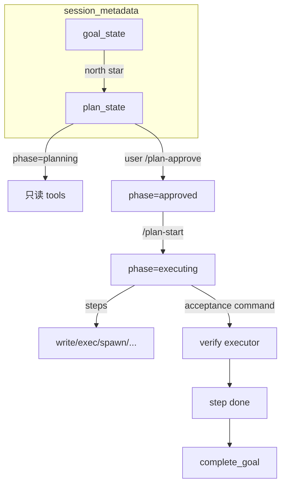

# Plan 模式与显式任务图 · 设计规格

> 状态：**设计定稿，待实现**  
> 最后更新：2026-05-24  
> 实施清单：[`plan.md`](./plan.md)

**本仓库范围**：Plan 仅面向 **CLI / gateway 通道（Telegram 等）+ slash 命令**；**不做 WebUI**（无侧栏、无 `webui/` 改动）。若需看图可用 `/plan` 文本树。

本文档定义 nanobot 的 **Plan 模式**（结构化任务图 + 可验证步骤），在现有 **`long_task` / `complete_goal`**（Codex 式 sustained goal）之上扩展，并与 **Runtime Harness**（在线策略 + `verify`）对接。

**产品核心（v1）**：对齐 **Claude Code `--plan`**——终端/通道上 **先只读规划、用户确认后再执行**；靠 **`plan_state.phase` + Runner 工具门禁** 保证，不单靠 prompt。

同时遵守 [`.agent/design.md`](../design.md)：**core 保持薄**；阶段策略、验证落在 **tools / session / command / runner 薄钩子**。

**命名**：Runtime Harness 见 [context-cost/design.md](../context-cost/design.md)。Plan 验收用 `acceptance.type=command`（共享 verify 执行器），**无** 离线 `nanobot harness run` / `case_id`。

---

## 1. 背景与目标

### 1.1 现状（代码事实）

| 能力 | 位置 | 行为 |
|------|------|------|
| Sustained goal | `nanobot/agent/tools/long_task.py` | 在 `session.metadata["goal_state"]` 存 **单一** `objective` 字符串 |
| 完成目标 | `complete_goal` | 标记 `status: completed`，WebSocket 同步 |
| Runtime 注入 | `nanobot/session/goal_state.py` | 每 turn 将 active goal 写入 Runtime Context（防 compaction 丢失） |
| 子 agent | `spawn` | 后台任务，**无** DAG 编排 |
| 文档声明 | `long_task.py` 模块 docstring | **无** sub-agent orchestrator、**无** 专用 agent_ui 任务树 |

`long_task` 的 tool description 明确要求：**不要**为规划拖延调用——说明当前产品意图是「快启 goal + 普通工具执行」，而非显式多步计划。

### 1.2 工业界参考（对齐点，非复制）

| 产品 / 模式 | 可借鉴点 | nanobot 取舍 |
|-------------|----------|----------------|
| **Claude Code Plan Mode** (`--plan`) | 规划期只读调研；用户批准后才改文件/跑命令 | **硬两阶段**：`phase=planning` 时 deny 写/执行类 tool；`/plan-approve` + `/plan-start`（或配置合并为一步） |
| **OpenAI Codex / Cloud tasks** | 任务在隔离环境跑、状态可查询 | 复杂步骤可 **`spawn`**，plan 只记录状态与验收 |
| **Devin / Linear-style task list** | 步骤勾选、阻塞原因、依赖 | `steps[]` + `status` + 可选 `blocked_reason` |
| **Cursor Agent to-do** | UI 可见 checklist | 本仓库用 **`/plan` + `plan_show` tool** 代替专用 UI |
| **GitHub Actions / CI stages** | `needs:` 依赖、job 状态机 | 步骤 `deps` **仅支持线性 + 简单 DAG（v1 可仅线性）** |

### 1.3 目标（v1）

1. **显式任务图**：用户与模型共享同一份「当前计划」结构（非仅聊天里的 markdown 列表）。
2. **Claude 式两阶段**：`planning` → 用户批准 → `executing`；规划期 **禁止** `write_file` / `exec` / `spawn` / `verify` 等（见 §4.4）。
3. **与 long_task 分工清晰**：`long_task` = 北星目标；`plan` = 可跟踪子步骤。
4. **可验证完成**：步骤可绑定 **固定 shell 命令**（`acceptance.type=command`），由 Runtime Harness 的 verify 执行器跑通后再标 `done`。
5. **不膨胀 core**：`loop.py` / `runner.py` 仅增加 runtime 注入 + **plan phase 工具过滤**（薄函数，可放在 `plan_state.py` 供 runner 调用）。

### 1.4 非目标（v1 不做）

- **WebUI Plan 面板**、`webui/` 改动、Plan 专用 WebSocket 推送（用户不用 WebUI）。
- 通用 workflow 引擎（Airflow 级 DAG、重试策略、定时调度）→ 已有 **cron**。
- 替代 `spawn` 的分布式 worker 池。
- 在 turn 中途由系统自动改写 plan（仅允许 **tool / slash / 用户** 显式更新）。
- 多 plan 并行（v1：**每 session 至多一个 active plan**）。

---

## 2. 核心概念与关系



| 概念 | 存储键 | 说明 |
|------|--------|------|
| **Goal** | `goal_state` | 不变；`long_task` / `complete_goal` |
| **Plan** | `plan_state` | 含 `phase`、`steps[]`、批准元数据 |
| **Plan phase** | `plan_state.phase` | 会话级执行门禁（与 step `status` 正交） |
| **Step** | `plan_state.steps[i]` | `id`, `title`, `status`, `acceptance`, `deps`, `evidence` |

**推荐语义（终端，类 `claude --plan`）**：

1. 用户：「先出计划，确认后再改代码」→ `plan` `create`（`phase=planning`）→ 只读调研 + 写/改 steps。
2. 用户：`/plan` 审阅 → `/plan-approve`（可选 `/plan-revise` 改步骤）。
3. 用户：`/plan-start` 或「开始执行」→ `phase=executing` → `start_step` / 改文件 / `exec`。
4. 每步 `complete_step`（可 command 验收）→ 全部 `done`/`skipped` 后 `complete_goal`。

`long_task` 可在步骤 1 之前或并行创建；**不得**在 `planning` 阶段用破坏性 tool 代替「执行」。

---

## 3. 数据模型

### 3.1 `plan_state`（session.metadata）

```json
{
  "version": 1,
  "status": "active",
  "phase": "executing",
  "title": "修复登录流程并补测试",
  "created_at": "2026-05-26T10:00:00",
  "updated_at": "2026-05-26T10:15:00",
  "approved_at": "2026-05-26T10:08:00",
  "approved_by": "slash:plan-approve",
  "linked_goal_summary": "可选，来自 goal_state.ui_summary",
  "steps": [
    {
      "id": "s1",
      "title": "复现 bug 并定位根因",
      "status": "done",
      "deps": [],
      "acceptance": {
        "type": "command",
        "command": "pytest tests/test_login.py::test_oauth -x -q"
      },
      "evidence": {
        "completed_at": "2026-05-26T10:05:00",
        "verify_exit_code": 0,
        "note": "pytest tests/test_login.py::test_oauth -x 通过"
      }
    },
    {
      "id": "s2",
      "title": "实现修复并跑全量测试",
      "status": "in_progress",
      "deps": ["s1"],
      "acceptance": {
        "type": "command",
        "command": "pytest tests/test_login.py -q"
      },
      "evidence": null
    }
  ]
}
```

### 3.2 Plan `phase` 状态机（执行门禁）

与 plan 生命周期 `status`（`active` / `cancelled` / `completed`）正交；**工具门禁只看 `phase`**（当 `status=active` 时）。

```text
planning ──approve──► approved ──start_execution──► executing ──► completed
    ▲                    │                              │
    └── revise ──────────┘                              │
    cancel (任意) ──────────────────────────────────────┴──► cancelled
```

| phase | 含义 | 主 Agent 工具（默认 `requireExplicitApprove=true`） |
|-------|------|-----------------------------------------------------|
| `planning` | 只调研、只维护计划结构 | **允许**：`plan`（create/show/add_steps/update_step/cancel）、`read_file`、`grep`/`list_dir`、`web_fetch`/`web_search` 等只读类；**拒绝**：`write_file`、`edit_*`、`exec`、`spawn`、`verify`、`complete_goal`（若会改仓库） |
| `approved` | 用户已认可计划，尚未开干 | 同 `planning`，另允许 `plan` `start_step`（仅将 step 标为待执行，**仍不**跑写/执行类 tool，除非 `autoStartAfterApprove=true`） |
| `executing` | 按步骤实施 | **全部**常规模块工具（仍受 Runtime Harness `policy.yaml` 约束） |
| — | `status=completed` 或 `cancelled` | 仅 `plan` `show`、slash 只读命令 |

**默认**：`plan` `create` 后 `phase=planning`（**不是** `executing`）。

**配置**（见 §6）：

- `requireExplicitApprove: true`（默认）— 必须 slash `approve` 或 `plan` `approve` 才能离开 `planning`。
- `autoStartAfterApprove: false`（默认）— 批准后还要 `start_execution`（`/plan-start` 或自然语言）；`true` 时 `approve` 直接进入 `executing`。
- `requireExplicitApprove: false` — trusted 模式：创建 plan 后可直接 `executing`（**不**推荐终端默认）。

### 3.3 Step `status` 状态机

```text
pending → in_progress → done
                   ↘ blocked → in_progress
                   ↘ skipped (需用户或 slash 显式)
                   ↘ cancelled (plan 取消时级联)
```

**规则**：

- 仅当 `deps` 中所有 step 为 `done` 或 `skipped` 时，才可将本 step 标为 `in_progress`（tool 层 enforce，模型可被拒绝并提示）。
- `done` 若配置了 `acceptance`（`command`），默认 **必须** 通过 verify 执行器（可配置 `plan.requireVerifyForDone: false` 用于 trusted workspace）。
- `skipped` 必须带 `evidence.note` 说明原因（审计）。

### 3.4 Acceptance 类型（可扩展）

| type | 含义 | v1 |
|------|------|-----|
| `none` | 模型自证 + recap | ✅ |
| `command` | 跑固定 shell（共享 Runtime Harness verify 执行器） | ✅ |
| `manual` | 仅用户 slash `/plan-signoff <step_id>` 可标 done | 可选 v1.1 |

> **命名**：计划级批准用 `/plan-approve`；步骤级人工签收用 `/plan-signoff`，避免与计划批准混淆。

### 3.5 版本与并发

- `plan_state.version` 整数，每次 mutating tool 调用 +1。
- 保存 session 时用 **read-modify-write**；若检测到 version 冲突（可选 optimistic lock），返回错误请重载 plan。
- **同 session 串行**：依赖现有 `AgentLoop` per-session lock；plan tools 不需额外全局锁。

---

## 4. 工具与命令 API

### 4.1 Tools（`nanobot/agent/tools/plan.py`，建议单文件多 tool 或统一 `plan` action）

| Tool / action | 作用 |
|---------------|------|
| action | 作用 | 允许的 `phase` |
|--------|------|----------------|
| `create` | 创建 plan；`phase=planning`；若已有 active plan 则拒绝（或 `replace=true`） | — |
| `show` | 人类可读摘要（含 **phase** 与下一步 slash 提示） | 任意 |
| `add_steps` / `update_step` | 维护步骤图 | `planning`；`executing` 时仅可改 **未开始**（`pending`）步骤，见 §8 |
| `approve` | `planning` → `approved`（或 `executing` 若 `autoStartAfterApprove`） | `planning` |
| `revise` | `approved`/`executing` → `planning`（执行中需配置 `allowReviseWhileExecuting`） | 见 §8 |
| `start_execution` | `approved` → `executing` | `approved` |
| `start_step` | step `pending` → `in_progress` | `executing`（`approved` 且 `autoStartAfterApprove` 时亦可） |
| `complete_step` | 标 `done`；`command` 时先 verify | `executing` |
| `block_step` / `skip_step` | 状态变更 | `executing` |
| `cancel` | `status=cancelled`，清 phase | 任意 active |

**Scope**：`_scopes = {"core"}`（主 agent）；子 agent **默认无** plan tools，避免后台任务改主会话 plan。

**ContextAware**：与 `long_task` 相同，依赖 `RequestContext.session_key` + `SessionManager`。

### 4.2 Slash commands（`nanobot/command/plan.py`）

| 命令 | 行为 |
|------|------|
| `/plan` | 显示 plan 树 + **`phase`** + 下一步建议（如「待批准：/plan-approve」） |
| `/plan-approve` | `planning` → `approved`（写 `approved_at` / `approved_by`）；若 `autoStartAfterApprove` 则直接 `executing` |
| `/plan-start` | `approved` → `executing`（`autoStartAfterApprove=false` 时必用） |
| `/plan-revise` | 回到 `planning` 改步骤（默认仅当 `phase` 为 `approved`；执行中见配置） |
| `/plan-cancel` | 取消 active plan |
| `/plan-signoff <step_id>` | `acceptance.type=manual` 时标 step done（v1.1） |
| `/plan-verify <step_id>` | 强制跑 step 的 acceptance command（调试；仅 `executing`） |

自然语言「计划 OK，开始执行」：Agent 应依次调用 `plan` `approve` + `start_execution`（或单次 approve 若配置自动开干）。

### 4.3 Plan phase 工具门禁（Runner）

**实现位置**：`AgentRunner` 执行 tool 前（与 Harness `before_execute_tools` **并列**；Plan 先或 Harness 先均可，均需执行）。

```python
# nanobot/session/plan_state.py
def plan_tool_decision(metadata, tool_name: str) -> Literal["allow", "deny"] | None:
    """None = 无 active plan，不干预。"""
```

- **deny** 时返回与 SSRF 类似的 soft error，含 `plan_phase: deny`、`phase`、`hint`（如 `Use /plan-approve then /plan-start`）。
- allowlist / denylist 可配置 `PlanConfig.planningAllowedTools` / `planningDeniedTools`；默认 denylist 覆盖写/执行/子 agent。
- **子 agent**：继承主 session 的 `plan_state`（同一 workspace policy）；`phase!=executing` 时子 agent 同样 **不得** `write_file`/`exec`。
- **slash 命令** `/plan-approve` 等由 command 层直接改 `plan_state`，**不**经 LLM tool。

与 Runtime Harness 关系：Harness 管 **项目/通道** 策略；Plan phase 管 **「是否已批准执行」**；二者同时 deny 时合并 reason。

### 4.4 Runtime Context 注入

在 `goal_state_runtime_lines` 旁新增 `plan_state_runtime_lines(metadata)`：

- 注入 **phase** + title +（`executing` 时）当前 `in_progress` step + 下一个 `pending` step（截断）。
- `planning` 时额外一行：`Planning only — no write/exec until /plan-approve`。
- **不**注入完整 evidence；细节用 `plan` `show`。

---

## 5. 与 long_task / spawn / Runtime Harness 的集成

### 5.1 long_task

| 场景 | 行为 |
|------|------|
| 仅有 plan，无 goal | 允许（小任务） |
| 有 goal，无 plan | 保持现状 |
| 二者并存 | plan.title 应服务 goal；`complete_goal` 前建议 plan 所有 step `done` 或 `skipped`（可配置 `warnOnly` vs `block`） |
| 新 `long_task` 覆盖旧 goal | 不自动取消 plan；返回警告，建议先 `/plan-cancel` |

### 5.2 spawn

- **`phase=planning` / `approved` 时 deny `spawn`**（门禁层）。
- `executing` 时：某 step 可注明「建议 spawn」；**不**由系统自动 spawn。
- step `evidence` 可记录 `subagent_task_id`；子 agent 完成后主 agent 仍须 `complete_step`。

### 5.3 Command 验收（Runtime Harness verify）

- `plan_complete_step` 当 `acceptance.type=command`：
  1. 调用 `nanobot.agent.harness.verify.run_verify_command`（与 `verify` tool 同源）。
  2. 失败：返回结构化错误（stdout 摘要、exit code），**不**标 done。
  3. 成功：写入 `evidence.verify_exit_code`，标 done。
- 配置：`agents.defaults.plan.verifyFailOpen: false`（默认严格；原 `harnessFailOpen` 更名）。

---

## 6. 配置（`PlanConfig` → `AgentDefaults.plan`）

```python
class PlanConfig(Base):
    enable: bool = True
    max_steps: int = 32
    max_step_title_chars: int = 500

    # Claude --plan 式两阶段（默认开启）
    require_explicit_approve: bool = True
    auto_start_after_approve: bool = False
    allow_revise_while_executing: bool = False  # true: /plan-revise 可回 planning；已 in_progress 的 step 保持

    require_verify_for_done: bool = True
    block_complete_goal_if_plan_open: bool = True
    allow_replace_active_plan: bool = False
    inject_runtime_summary: bool = True

    # 可选覆盖默认 planning 工具集
    planning_allowed_tools: list[str] | None = None
    planning_denied_tools: list[str] | None = None  # 默认 write_*, exec, spawn, verify, ...
```

JSON 别名：`requireExplicitApprove`, `autoStartAfterApprove`, `allowReviseWhileExecuting`, 等（camelCase）。

---

## 7. 安全与滥用边界

- Plan 内容进入 session metadata 与 runtime → **strip_think**、长度上限，防 prompt 注入撑爆 metadata。
- **不**通过 plan 执行任意命令（acceptance `command` 类型若做，必须 workspace 内 allowlist）。
- Plan tools **不能**修改 `goal_state` 以外系统的 metadata 键。
- 跨 session：plan 不共享；`unified_session` 下仍按 effective session key 隔离。

---

## 8. 失败模式与边缘情况

| 情况 | 处理 |
|------|------|
| 有 active plan 且 `phase=planning` 却调 `write_file` | Runner **deny** + 提示 `/plan-approve` |
| 无 plan 直接改代码 | 允许（小任务）；skill 引导大任务先 `plan` `create` |
| 用户批准后又改口 | `/plan-revise` 或 `plan` `revise` → `planning` |
| 中途用户改口 | `plan_cancel` + 新 `plan_create`；或 `plan_add_steps` 追加 |
| verify 命令 flaky | acceptance 用稳定子集测试；文档建议 `-x` / 小套件 |
| 通道断线重连 | plan 以 session 持久化为准；用户 `/plan` 刷新视图 |
| Session 恢复 / checkpoint | plan 随 session 持久化；与 workspace checkpoint（若另有）独立 |
| 并发两条用户消息 | per-session lock 串行；第二条见 pending queue 或新 turn |
| Step id 冲突 | `plan_add_steps` 自动生成 `s{N}` |
| deps 环 | 创建/更新时 DAG 环检测，拒绝 |
| 超大 plan | `max_steps` 拒绝；建议 spawn 拆 session |

---

## 9. 可观测性

- 结构化日志：`Plan [session] phase planning→approved`、`plan_tool_deny tool=write_file`、`step s2 in_progress`。
- 可选：将 plan 变更摘要写入 `history.jsonl`（**不**默认，避免噪音）；优先 Trace 已有 tool_events。
- Metrics（未来）：`plan_steps_completed_total`，`plan_verify_failures_total`。

---

## 10. 与 Hermes / 进化的关系

- Plan **不**触发 PostTask 特殊逻辑；正常 turn trace 仍记录。
- 可从 **成功完成 plan 的 traces** 提炼 workflow skill（非离线 eval case）。
- GEPA **不**优化 plan tools 的 SKILL（非 skill 范畴）；可优化「何时用 plan」类 workflow skill。

---

## 11. 文件布局（计划）

```text
nanobot/session/plan_state.py      # parse, phase, plan_tool_decision, runtime_lines
nanobot/agent/tools/plan.py        # plan tool (actions)
nanobot/agent/runner.py            # 调用 plan_tool_decision（薄接线）
nanobot/command/plan.py            # /plan, /plan-approve, /plan-start, …
nanobot/config/schema.py           # PlanConfig
nanobot/skills/plan-workflow/      # 可选内置 skill
tests/session/test_plan_state.py
tests/tools/test_plan_tools.py
tests/command/test_builtin_plan.py
```

---

## 12. 开放问题（已定 / 待定）

| 项 | 决定 |
|----|------|
| 单 tool `plan` + action | ✅ **单 tool 多 action**（与 `cron` 类似） |
| `complete_goal` vs open plan | ✅ 默认 **block**（`blockCompleteGoalIfPlanOpen`） |
| 计划批准 vs 开干 | ✅ 默认 **两步**：`approve` + `start_execution`（`autoStartAfterApprove=false`） |
| 执行中修订计划 | ✅ 默认 **仅改 pending 步骤**；整 plan 回 `planning` 需 `allowReviseWhileExecuting` 或先 cancel |
| Plan 默认启用 | ✅ `plan.enable=true`；小任务可不创建 plan |
| `require_approval` 点选 UI | ❌ v1 不做（见 context-cost v1.1）；终端用 slash |

---

## 13. 参考链接

- Claude Code: Plan Mode（先计划后执行）
- OpenAI Codex: 长时间任务与云沙箱任务状态
- agentskills.io：workflow skill 与 plan 文档可共存

实施阶段、验收与测试矩阵见 [`plan.md`](./plan.md)。
