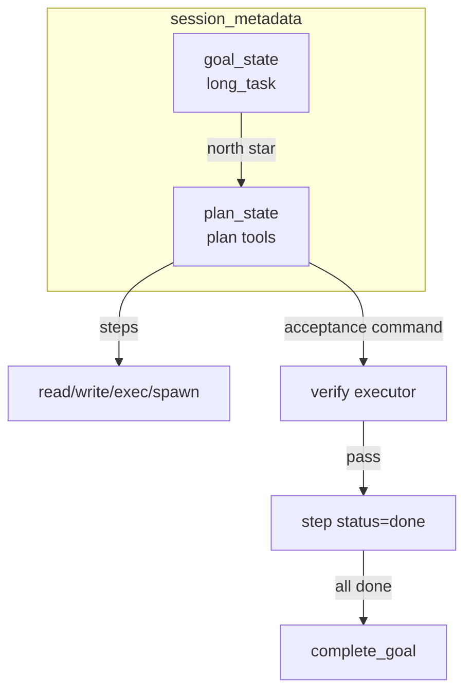

# Plan 模式与显式任务图 · 设计规格

> 状态：**设计定稿，待实现**  
> 最后更新：2026-05-26  
> 实施清单：[`plan.md`](./plan.md)

**本仓库范围**：Plan 仅面向 **CLI / gateway 通道（Telegram 等）+ slash 命令**；**不做 WebUI**（无侧栏、无 `webui/` 改动）。若需看图可用 `/plan` 文本树。

本文档定义 nanobot 的 **Plan 模式**（结构化任务图 + 可验证步骤），在现有 **`long_task` / `complete_goal`**（Codex 式 sustained goal）之上扩展，并与 **Runtime Harness**（在线策略 + `verify`）对接。对齐工业界「Plan Mode / task list / acceptance criteria」实践，同时遵守 [`.agent/design.md`](../design.md)：**core 保持薄，能力落在 tools / session / command / Harness**。

**命名**：Runtime Harness 见 [context-cost/design.md](../context-cost/design.md)。Plan 验收用 `acceptance.type=command`（共享 verify 执行器），**无** 离线 `nanobot harness run` / `case_id`。

---

## 1. 背景与目标

### 1.1 现状（代码事实）

| 能力 | 位置 | 行为 |
|------|------|------|
| Sustained goal | `nanobot/agent/tools/long_task.py` | 在 `session.metadata["goal_state"]` 存 **单一** `objective` 字符串 |
| 完成目标 | `complete_goal` | 标记 `status: completed`，WebSocket 同步 |
| Runtime 注入 | `nanobot/session/goal_state.py` | 每 turn 将 active goal 写入 Runtime Context（防 compaction 丢失） |
| 子 agent | `spawn` | 后台任务，**无** DAG 编排 |
| 文档声明 | `long_task.py` 模块 docstring | **无** sub-agent orchestrator、**无** 专用 agent_ui 任务树 |

`long_task` 的 tool description 明确要求：**不要**为规划拖延调用——说明当前产品意图是「快启 goal + 普通工具执行」，而非显式多步计划。

### 1.2 工业界参考（对齐点，非复制）

| 产品 / 模式 | 可借鉴点 | nanobot 取舍 |
|-------------|----------|----------------|
| **Claude Code Plan Mode** | 先出计划、用户确认、再执行；可修订计划 | 支持 **plan → 执行** 两阶段；确认通过 channel 消息或 `/plan` 查看 |
| **OpenAI Codex / Cloud tasks** | 任务在隔离环境跑、状态可查询 | 复杂步骤可 **`spawn`**，plan 只记录状态与验收 |
| **Devin / Linear-style task list** | 步骤勾选、阻塞原因、依赖 | `steps[]` + `status` + 可选 `blocked_reason` |
| **Cursor Agent to-do** | UI 可见 checklist | 本仓库用 **`/plan` + `plan_show` tool** 代替专用 UI |
| **GitHub Actions / CI stages** | `needs:` 依赖、job 状态机 | 步骤 `deps` **仅支持线性 + 简单 DAG（v1 可仅线性）** |

### 1.3 目标（v1）

1. **显式任务图**：用户与模型共享同一份「当前计划」结构（非仅聊天里的 markdown 列表）。
2. **与 long_task 分工清晰**：`long_task` = 北星目标；`plan` = 可跟踪子步骤。
3. **可验证完成**：步骤可绑定 **固定 shell 命令**（`acceptance.type=command`），由 Runtime Harness 的 verify 执行器跑通后再标 `done`，避免模型自报「做完了」。
4. **不膨胀 core**：`loop.py` / `runner.py` 仅增加必要的 runtime 行注入（若需要），逻辑在 tools + `session/plan_state.py` + command。

### 1.4 非目标（v1 不做）

- **WebUI Plan 面板**、`webui/` 改动、Plan 专用 WebSocket 推送（用户不用 WebUI）。
- 通用 workflow 引擎（Airflow 级 DAG、重试策略、定时调度）→ 已有 **cron**。
- 替代 `spawn` 的分布式 worker 池。
- 在 turn 中途由系统自动改写 plan（仅允许 **tool / slash / 用户** 显式更新）。
- 多 plan 并行（v1：**每 session 至多一个 active plan**）。

---

## 2. 核心概念与关系



| 概念 | 存储键 | 说明 |
|------|--------|------|
| **Goal** | `goal_state` | 不变；`long_task` / `complete_goal` |
| **Plan** | `plan_state` | 新；含 `steps[]`、版本、来源 |
| **Step** | `plan_state.steps[i]` | `id`, `title`, `status`, `acceptance`, `deps`, `evidence` |

**推荐语义**：

- 用户提出大任务 → 可先 `long_task`（可选）→ `plan_create` 拆步骤 → 逐步执行工具 → 每步 `plan_complete_step`（可要求 command 验收）→ 全部完成后 `complete_goal`。

---

## 3. 数据模型

### 3.1 `plan_state`（session.metadata）

```json
{
  "version": 1,
  "status": "active",
  "title": "修复登录流程并补测试",
  "created_at": "2026-05-26T10:00:00",
  "updated_at": "2026-05-26T10:15:00",
  "linked_goal_summary": "可选，来自 goal_state.ui_summary",
  "steps": [
    {
      "id": "s1",
      "title": "复现 bug 并定位根因",
      "status": "done",
      "deps": [],
      "acceptance": {
        "type": "command",
        "command": "pytest tests/test_login.py::test_oauth -x -q"
      },
      "evidence": {
        "completed_at": "2026-05-26T10:05:00",
        "verify_exit_code": 0,
        "note": "pytest tests/test_login.py::test_oauth -x 通过"
      }
    },
    {
      "id": "s2",
      "title": "实现修复并跑全量测试",
      "status": "in_progress",
      "deps": ["s1"],
      "acceptance": {
        "type": "command",
        "command": "pytest tests/test_login.py -q"
      },
      "evidence": null
    }
  ]
}
```

### 3.2 Step `status` 状态机

```text
pending → in_progress → done
                   ↘ blocked → in_progress
                   ↘ skipped (需用户或 slash 显式)
                   ↘ cancelled (plan 取消时级联)
```

**规则**：

- 仅当 `deps` 中所有 step 为 `done` 或 `skipped` 时，才可将本 step 标为 `in_progress`（tool 层 enforce，模型可被拒绝并提示）。
- `done` 若配置了 `acceptance`（`command`），默认 **必须** 通过 verify 执行器（可配置 `plan.requireVerifyForDone: false` 用于 trusted workspace）。
- `skipped` 必须带 `evidence.note` 说明原因（审计）。

### 3.3 Acceptance 类型（可扩展）

| type | 含义 | v1 |
|------|------|-----|
| `none` | 模型自证 + recap | ✅ |
| `command` | 跑固定 shell（共享 Runtime Harness verify 执行器） | ✅ |
| `manual` | 仅用户 slash `/plan-approve <step>` 可标 done | 可选 v1.1 |

### 3.4 版本与并发

- `plan_state.version` 整数，每次 mutating tool 调用 +1。
- 保存 session 时用 **read-modify-write**；若检测到 version 冲突（可选 optimistic lock），返回错误请重载 plan。
- **同 session 串行**：依赖现有 `AgentLoop` per-session lock；plan tools 不需额外全局锁。

---

## 4. 工具与命令 API

### 4.1 Tools（`nanobot/agent/tools/plan.py`，建议单文件多 tool 或统一 `plan` action）

| Tool / action | 作用 |
|---------------|------|
| `plan_create` | 创建 plan；若已有 active plan 则拒绝（或 `replace=true` 需确认） |
| `plan_add_steps` | 批量追加步骤（ids 自动生成） |
| `plan_update_step` | 改 title / deps / acceptance |
| `plan_start_step` | `pending` → `in_progress`（校验 deps） |
| `plan_complete_step` | 标 `done`；若有 `command` acceptance 则先跑 verify |
| `plan_block_step` | `blocked` + reason |
| `plan_skip_step` | `skipped` + reason |
| `plan_cancel` | plan `status=cancelled`，不清 goal |
| `plan_show` | 返回人类可读摘要（给模型自检） |

**Scope**：`_scopes = {"core"}`（主 agent）；子 agent **默认无** plan tools，避免后台任务改主会话 plan。

**ContextAware**：与 `long_task` 相同，依赖 `RequestContext.session_key` + `SessionManager`。

### 4.2 Slash commands（`nanobot/command/plan.py`）

| 命令 | 行为 |
|------|------|
| `/plan` | 显示当前 plan 树状摘要 |
| `/plan-cancel` | 取消 active plan |
| `/plan-approve <step_id>` | `acceptance.type=manual` 时标 done |
| `/plan-verify <step_id>` | 强制对该 step 跑 acceptance command（调试） |

### 4.3 Runtime Context 注入（原 4.4）

在 `goal_state_runtime_lines` 旁新增 `plan_state_runtime_lines(metadata)`：

- 注入 **active plan** 的 title + 当前 `in_progress` step + 下一个 `pending` step（截断）。
- 目的：compaction 后模型仍看到「正在执行哪一步」。
- **不**注入完整 history of evidence（太长）；细节用 `plan_show` tool。

---

## 5. 与 long_task / spawn / Runtime Harness 的集成

### 5.1 long_task

| 场景 | 行为 |
|------|------|
| 仅有 plan，无 goal | 允许（小任务） |
| 有 goal，无 plan | 保持现状 |
| 二者并存 | plan.title 应服务 goal；`complete_goal` 前建议 plan 所有 step `done` 或 `skipped`（可配置 `warnOnly` vs `block`） |
| 新 `long_task` 覆盖旧 goal | 不自动取消 plan；返回警告，建议先 `/plan-cancel` |

### 5.2 spawn

- 某 step 的 title 可注明「建议 spawn」；**不**由系统自动 spawn。
- step `evidence` 可记录 `subagent_task_id` 供追溯。
- 子 agent 完成 announce 后，主 agent 仍需 `plan_complete_step`（避免混淆「子任务完成」与「计划步骤完成」）。

### 5.3 Command 验收（Runtime Harness verify）

- `plan_complete_step` 当 `acceptance.type=command`：
  1. 调用 `nanobot.agent.harness.verify.run_verify_command`（与 `verify` tool 同源）。
  2. 失败：返回结构化错误（stdout 摘要、exit code），**不**标 done。
  3. 成功：写入 `evidence.verify_exit_code`，标 done。
- 配置：`agents.defaults.plan.verifyFailOpen: false`（默认严格；原 `harnessFailOpen` 更名）。

---

## 6. 配置（`PlanConfig` → `AgentDefaults.plan`）

```python
class PlanConfig(Base):
    enable: bool = True
    max_steps: int = 32
    max_step_title_chars: int = 500
    require_verify_for_done: bool = True   # acceptance.type=command 时
    block_complete_goal_if_plan_open: bool = True
    allow_replace_active_plan: bool = False  # 需用户确认或 slash
    inject_runtime_summary: bool = True
```

JSON 别名：`requireVerifyForDone`, `blockCompleteGoalIfPlanOpen`, 等（camelCase）。

---

## 7. 安全与滥用边界

- Plan 内容进入 session metadata 与 runtime → **strip_think**、长度上限，防 prompt 注入撑爆 metadata。
- **不**通过 plan 执行任意命令（acceptance `command` 类型若做，必须 workspace 内 allowlist）。
- Plan tools **不能**修改 `goal_state` 以外系统的 metadata 键。
- 跨 session：plan 不共享；`unified_session` 下仍按 effective session key 隔离。

---

## 8. 失败模式与边缘情况

| 情况 | 处理 |
|------|------|
| 模型跳过 plan 直接改代码 | 允许，但 slash `/plan` 可暴露「无 plan」；skill 引导大任务先 plan |
| 中途用户改口 | `plan_cancel` + 新 `plan_create`；或 `plan_add_steps` 追加 |
| verify 命令 flaky | acceptance 用稳定子集测试；文档建议 `-x` / 小套件 |
| 通道断线重连 | plan 以 session 持久化为准；用户 `/plan` 刷新视图 |
| Session 恢复 / checkpoint | plan 随 session 持久化；与 workspace checkpoint（若另有）独立 |
| 并发两条用户消息 | per-session lock 串行；第二条见 pending queue 或新 turn |
| Step id 冲突 | `plan_add_steps` 自动生成 `s{N}` |
| deps 环 | 创建/更新时 DAG 环检测，拒绝 |
| 超大 plan | `max_steps` 拒绝；建议 spawn 拆 session |

---

## 9. 可观测性

- 结构化日志：`Plan [session] step s2 in_progress`、`verify command exit=0|1`。
- 可选：将 plan 变更摘要写入 `history.jsonl`（**不**默认，避免噪音）；优先 Trace 已有 tool_events。
- Metrics（未来）：`plan_steps_completed_total`，`plan_verify_failures_total`。

---

## 10. 与 Hermes / 进化的关系

- Plan **不**触发 PostTask 特殊逻辑；正常 turn trace 仍记录。
- 可从 **成功完成 plan 的 traces** 提炼 workflow skill（非离线 eval case）。
- GEPA **不**优化 plan tools 的 SKILL（非 skill 范畴）；可优化「何时用 plan」类 workflow skill。

---

## 11. 文件布局（计划）

```text
nanobot/session/plan_state.py      # parse, runtime_lines, validators
nanobot/agent/tools/plan.py        # plan tool (actions)
nanobot/command/plan.py            # /plan, /plan-cancel, …
nanobot/config/schema.py           # PlanConfig
nanobot/skills/plan-workflow/      # 可选内置 skill
tests/session/test_plan_state.py
tests/tools/test_plan_tools.py
tests/command/test_builtin_plan.py
```

---

## 12. 开放问题（实现前需拍板）

1. **单 tool `plan` + action 字段** vs **多个 Tool 类**？建议：**单 tool 多 action**（减少 registry 膨胀），与 `cron` 类似。
2. **`complete_goal` 与 plan 强制联动** 默认 `block` 还是 `warn`？建议：**block**（trusted 可关）。
3. **Plan 是否默认启用**？建议：`plan.enable=true`，但 skill 引导「小任务不必 plan」。

---

## 13. 参考链接

- Claude Code: Plan Mode（先计划后执行）
- OpenAI Codex: 长时间任务与云沙箱任务状态
- agentskills.io：workflow skill 与 plan 文档可共存

实施阶段、验收与测试矩阵见 [`plan.md`](./plan.md)。
