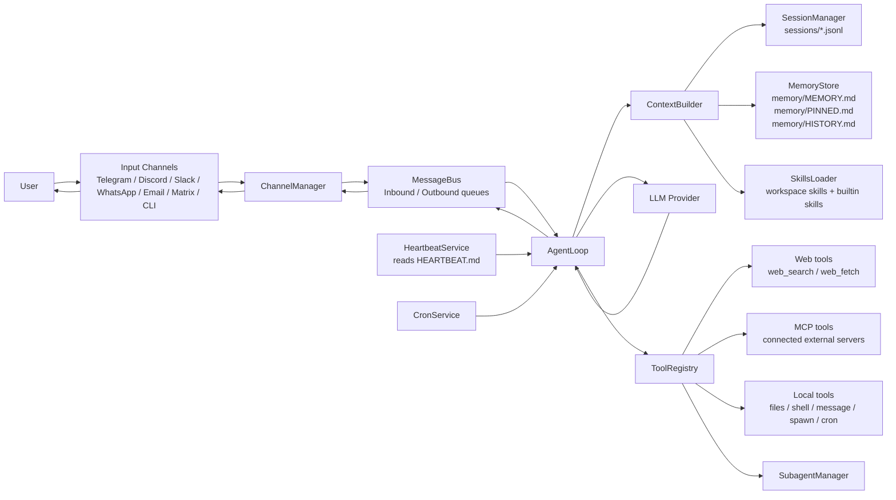
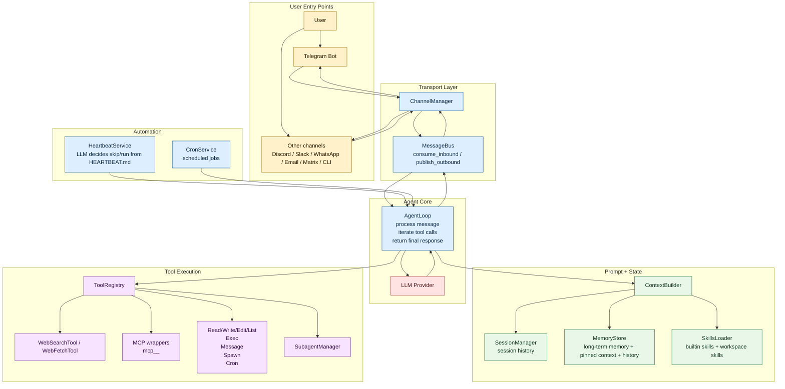

# Nanobot Architecture

This document summarizes the runtime architecture implemented in the current repository.

## Basic Graph

## Styled Graph

## Notes

- Input arrives through chat channels, then `ChannelManager` routes it onto the `MessageBus`.
- `AgentLoop` is the central orchestrator: it builds prompt context, calls the provider, executes tool calls, and publishes responses.
- Context is assembled from session history, workspace memory files, bootstrap files like `AGENTS.md`, and installed skills.
- Tooling is split between local tools, web tools, and dynamically connected MCP tools.
- Heartbeat and cron can trigger the same core agent loop without a human message.
