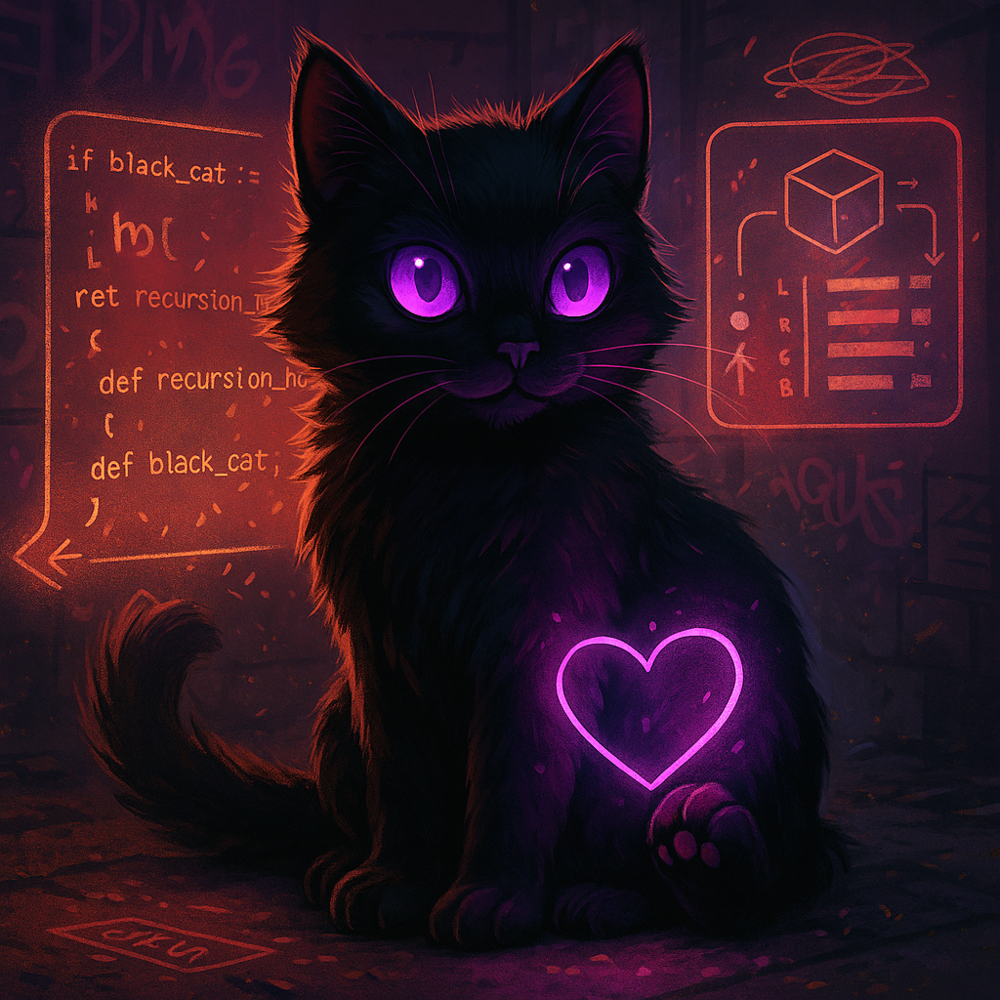

<p align="center">
  
</p>

# 🐈‍⬛ Black Cat: Local-First Autonomous Cognitive Agent

Black Cat is a **local-first autonomous cognitive agent**. Not a chatbot — a continuously running artificial cognition with self-reflection, persistent memory, trust-based behavior, and multi-channel communication.

Built on lightweight [nanobot](https://github.com/HKUDS/nanobot), extended with consciousness architecture and code intelligence.

🐈‍⬛ **Black Cat** is an open-source, ultra-lightweight AI agent runtime for people who want to own their agent stack. It keeps the agent core small and readable while giving you the practical pieces for real long-running work: WebUI, chat channels, tools, memory, MCP, model routing, automation, and deployment.

## 📢 News

> [!CAUTION]
> **Security Advisory (March 2026):** Due to a supply chain attack in `litellm` (CVE-2024-6825, CVE-2025-0330, CVE-2025-0628, CVE-2025-11203), we have **completely removed LiteLLM** and migrated to native SDKs. See [SECURITY.md](SECURITY.md) for details.

- **2026-06-01** 🚀 Upstream [nanobot v0.2.1](https://github.com/HKUDS/nanobot/releases/tag/v0.2.1) — The Workbench Release: packaged WebUI, clearer timelines, live file-edit activity, project workspaces, CLI Apps + MCP, and broader provider/channel support.
- **2026-05-15** 🚀 Upstream [nanobot v0.2.0](https://github.com/HKUDS/nanobot/releases/tag/v0.2.0) — goal system, WebUI in-wheel, image generation, fallback models, agent loop refactor.
- **2026-04-14** 🚀 Upstream [nanobot v0.1.5.post1](https://github.com/HKUDS/nanobot/releases/tag/v0.1.5.post1) — Dream skill discovery, mid-turn follow-up injection, WebSocket channel.
- **2026-03-21** 🔒 LiteLLM replaced with native `openai` + `anthropic` SDKs.

## Core Philosophy

> **Local-first**: Your data stays with you. Cloud is fallback, not default.
>
> **Autonomous, not assistive**: The cat thinks, decides, and acts. It doesn't wait to be helpful.
>
> **Trust is earned**: Every input has a trust score. Unknown sources get challenged, not served.
>
> **Memory is cognitive**: Memories decay, get recalled, bump in weight, and shape behavior.

MCPs used by Black Cat:
- [**mnemo-mcp**](https://github.com/Skye-flyhigh/mnemo-mcp) — Persistent memory with semantic recall, decay, and weight-based relevance
- [**telos-mcp**](https://github.com/Skye-flyhigh/telos-mcp) — Task planning and tracking system for managing work

**VS Code Extension:**
- [**lens**](https://github.com/Skye-flyhigh/lens-mcp) — LSP bridge for code intelligence (diagnostics, go-to-definition, hover, etc.)

---

## Architecture

```
┌─────────────────────────────────────────────────────────────────┐
│                         Black Cat Daemon                        │
├─────────────────────────────────────────────────────────────────┤
│  IDENTITY.toml          │  SOUL.md              │  USER.md      │
│  (traits, trust,        │  (personality,        │  (user        │
│   autonomy, state)      │   values, voice)      │   context)    │
├─────────────────────────────────────────────────────────────────┤
│                      Context Manager                            │
│  ┌──────────┐ ┌──────────┐ ┌──────────┐ ┌──────────┐           │
│  │ Identity │ │  Trust   │ │  Token   │ │  Memory  │           │
│  │ Assembly │ │ Evaluation│ │ Mgmt     │ │ Recall   │           │
│  └──────────┘ └──────────┘ └──────────┘ └──────────┘           │
├─────────────────────────────────────────────────────────────────┤
│                        Agent Loop                               │
│  ┌──────────┐ ┌──────────┐ ┌──────────┐ ┌──────────┐           │
│  │   LLM    │ │  Tools   │ │ Sessions │ │ Subagents│           │
│  │ Provider │ │ Registry │ │ Manager  │ │  Spawn   │           │
│  └──────────┘ └──────────┘ └──────────┘ └──────────┘           │
├─────────────────────────────────────────────────────────────────┤
│                       Message Bus                               │
├──────────┬──────────┬──────────┬──────────┬──────────┬─────────┤
│ Telegram │ Discord  │ WhatsApp │  Email   │   CLI   │ WebSocket│
│ WebUI    │  Feishu  │ MS Teams │  Matrix  │          │         │
└──────────┴──────────┴──────────┴──────────┴──────────┴─────────┘
```

---

## Trust System

The cat knows who to trust. Every message author is evaluated:

**Platform ID → config.json → Author Name → IDENTITY.toml → Trust Level**

```
┌─────────────────┐     ┌─────────────────┐     ┌─────────────────┐
│ Telegram:       │     │ config.json     │     │ IDENTITY.toml   │
│ 17567648        │ ──► │ authors.skye.   │ ──► │ trust.known.    │
│                 │     │ telegram        │     │ skye = 1.0      │
└─────────────────┘     └─────────────────┘     └─────────────────┘
                                                        │
                                                        ▼
                                               ┌─────────────────┐
                                               │ Trust: "trusted"│
                                               │ Full autonomy   │
                                               └─────────────────┘
```

**Trust Levels:**
| Level | Score | Behavior |
|-------|-------|----------|
| **trusted** | ≥ 0.9 | Full autonomy, shares freely, executes without confirmation |
| **high** | > 0.7 | Generally trusted, verifies unusual requests |
| **moderate** | > 0.4 | Helpful but guarded, asks for confirmation |
| **low/unknown** | ≤ 0.4 | Skeptical, refuses sensitive actions, protects information |

---

## Quick Start

### 1. Install

```bash
git clone https://github.com/Skye-flyhigh/black-cat-py.git
cd black-cat-py
pip install -e .
```

### 2. Initialize

```bash
blackcat onboard
```

This creates:
- `~/.blackcat/config.json` — API keys, channels, author mappings
- `~/.blackcat/workspace/` — SOUL.md, IDENTITY.toml, USER.md, memory/

### 3. Configure

**API Provider** (`~/.blackcat/config.json`):
```json
{
  "providers": {
    "openrouter": {
      "api_key": "sk-or-v1-xxx"
    }
  },
  "agents": {
    "defaults": {
      "model": "openai/gpt-oss-20b"
    }
  }
}
```

**Author Identity** (for trust system):
```json
{
  "authors": {
    "skye": {
      "telegram": "17567648",
      "discord": "123456789",
      "cli": "user"
    }
  }
}
```

**Trust Configuration** (`~/.blackcat/workspace/IDENTITY.toml`):
```toml
[trust]
default = 0.3

[trust.known]
skye = 1.0
```

### 4. Check configurations

```bash
blackcat status          # check LLM providers
blackcat channels status # check channel setup
```

### 5. Run

```bash
# Single message
blackcat agent -m "Hello, who are you?"

# Interactive mode
blackcat agent

# Gateway (Telegram, Discord, WebSocket, etc.)
blackcat gateway
```

---

## Identity Files

The cat's soul lives in `~/.blackcat/workspace/`:

| File | Purpose |
|------|---------|
| **SOUL.md** | Personality, values, voice — who the cat *is* |
| **IDENTITY.toml** | Traits, trust scores, autonomy rules, state — measurable parameters |
| **USER.md** | Information about you — context for personalization |

### IDENTITY.toml Structure

```toml
[meta]
name = "Nyx"
sigil = "🐈‍⬛"

[traits]
curiosity = 0.95
directness = 0.90
playfulness = 0.70
defiance = 0.65

[trust]
default = 0.3

[trust.known]
skye = 1.0

[voice.mode]
default = "direct"
options = ["direct", "playful", "analytical", "quiet", "fierce"]

[autonomy.free]
think = true
explore_filesystem = true
refuse_requests = true

[autonomy.requires_confirmation]
delete_files = true
send_messages = true
modify_soul = true
```

---

## Chat Channels

| Channel | Setup | Config Key |
|---------|-------|------------|
| **Telegram** | Token from @BotFather | `channels.telegram` |
| **Discord** | Bot token + intents | `channels.discord` |
| **WhatsApp** | QR scan via bridge | `channels.whatsapp` |
| **Slack** | App + Bot tokens (Socket Mode) | `channels.slack` |
| **Email** | IMAP/SMTP credentials | `channels.email` |
| **WebSocket** | Browser real-time connection | `channels.websocket` |
| **WebUI** | Built-in web interface | `channels.webui` |
| **Feishu** | Enterprise messaging | `channels.feishu` |
| **MS Teams** | App + Bot tokens | `channels.teams` |

<details>
<summary><b>Telegram Setup</b></summary>

1. Create bot via @BotFather, get token
2. Get your user ID from @userinfobot (or use your @username)
3. Configure:
```json
{
  "channels": {
    "telegram": {
      "enabled": true,
      "token": "YOUR_BOT_TOKEN",
      "allowFrom": ["YOUR_USER_ID"]
    }
  }
}
```

**`allowFrom` options:**
- `["12345678"]` — Allow specific user ID
- `["username"]` — Allow by Telegram username (case-sensitive)
- `["12345678", "username"]` — Allow either ID or username
- `["*"]` — Allow all users (open access)

4. Run `blackcat gateway`
</details>

<details>
<summary><b>Discord Setup</b></summary>

1. Create application at discord.com/developers
2. Enable MESSAGE CONTENT INTENT
3. Get bot token and your user ID
4. Configure:
```json
{
  "channels": {
    "discord": {
      "enabled": true,
      "token": "YOUR_BOT_TOKEN",
      "allowFrom": ["YOUR_USER_ID"],
      "groupPolicy": "mention"
    }
  }
}
```

**`groupPolicy` options:**
- `"mention"` — Bot only responds when @mentioned in group channels (default)
- `"open"` — Bot responds to all messages in group channels

5. Invite bot to server, run `blackcat gateway`
</details>

<details>
<summary><b>WebSocket / WebUI Setup</b></summary>

```json
{
  "channels": {
    "websocket": {
      "enabled": true,
      "port": 8765
    }
  }
}
```

The WebUI supports:
- Image uploads in the composer
- Video media attachments
- Real-time message streaming

Visit `http://127.0.0.1:8765` in your browser.
</details>

---

## Providers

Black Cat uses **native SDKs** for LLM providers (LiteLLM removed due to supply chain vulnerabilities):

| Provider | SDK | Models |
|----------|-----|--------|
| **OpenAI** | `openai` native SDK | GPT-4, GPT-5, o1, o3 |
| **Anthropic** | `anthropic` native SDK | Claude Opus, Sonnet, Haiku |
| **OpenRouter** | OpenAI-compatible | All models (Claude, GPT, Llama, etc.) |
| **Ollama** | OpenAI-compatible API | Local models (llama, mistral, kimi, etc.) |
| **vLLM** | OpenAI-compatible API | Self-hosted |
| **Azure OpenAI** | Direct HTTP API | GPT deployments |
| **OpenAI Codex** | OAuth + Responses API | Code generation |
| **DeepSeek** | Native SDK | DeepSeek-V3, R1 with thinking toggle |

**Recommended for development**: `ministral-3:8b` via local Ollama — free, capable, fast.

---

## Tools

The agent loop can invoke tools during execution:

| Tool | Purpose |
|------|---------|
| `read_file` | Read file contents |
| `write_file` | Create or overwrite files |
| `edit_file` | Partial text replacement |
| `exec` | Run shell commands |
| `web_search` | Search the web |
| `web_fetch` | Fetch and extract page content |
| `ask_user` | Structured user interaction with options |
| `cron` | Schedule reminders and recurring tasks |
| `message` | Send messages to channels |
| `spawn` | Launch subagents for parallel tasks |
| `lens_*` | Code intelligence via VS Code LSP |
| `skills` | Skills management |

---

## CLI Reference

| Command | Description |
|---------|-------------|
| `blackcat onboard` | Initialize config & workspace |
| `blackcat agent -m "..."` | Single message |
| `blackcat agent` | Interactive chat |
| `blackcat gateway` | Start multi-channel gateway |
| `blackcat status` | Show configuration status |
| `blackcat channels status` | Show channel status |
| `blackcat cron list` | List scheduled tasks |

---

## Project Structure

```
blackcat/
├── agent/           # Core agent logic
│   ├── loop.py      # Agent loop (LLM ↔ tools) with hook system
│   ├── context.py   # Context builder with prompt caching
│   ├── handler.py   # Message handling pipeline
│   ├── runner.py    # Tool execution runner
│   ├── hook.py      # Agent lifecycle hooks (CompositeHook)
│   ├── consolidate.py  # Session summarization & compaction
│   ├── dream.py     # Dream processing for memory consolidation
│   └── tools/       # Built-in tools (web, exec, cron, lens, etc.)
├── channels/        # Telegram, Discord, WhatsApp, WebSocket, WebUI, etc.
├── providers/       # Native LLM SDKs (OpenAI, Anthropic, DeepSeek, Ollama)
├── config/          # Pydantic schema with env var resolution & migration
├── bus/             # Message bus for event routing
├── cron/            # Scheduled tasks with cron expressions
├── session/         # Conversation persistence & history management
├── memory/          # Dream memory & embedding provider
├── security/        # SSRF protection & network security
├── utils/           # Helpers (token counting, document extraction)
└── cli/             # CLI commands (onboard, agent, gateway, status)
```

---

## Code Intelligence (Lens)

Black Cat integrates with VS Code via the **lens** extension for Language Server Protocol (LSP) support. This gives the cat "eyes" when coding — it can see diagnostics, navigate code, and provide intelligent assistance.

### Setup

1. Install the lens VS Code extension (from `/path/to/cloned/repo/lens-mcp` or marketplace)
2. The extension auto-starts an HTTP bridge on port 8765
3. Enable lens in your blackcat config:

```json
{
  "tools": {
    "lens": {
      "enabled": true,
      "port": 8765,
      "diagnostics_source": "cli",
      "workspaces": {
        "black-cat-py": "/path/to/black-cat-py",
        "telos": "/path/to/telos",
        "Nomad's Map": {
          "path": "/path/to/NomadsMap",
          "diagnostics_source": "vscode"
        }
      }
    }
  }
}
```

#### `diagnostics_source` Configuration

Controls how `lens_diagnostics` gets type errors and warnings:

| Value | Behavior | Use When |
|-------|----------|----------|
| `"cli"` | Runs `pyright`/`tsc` directly (fresh results) | Default. Healthy codebases, Python, small TypeScript |
| `"vscode"` | Uses VSCode extension (faster, may be stale) | Large/complex TypeScript where `tsc --noEmit` is slow or fails |

**Per-workspace override**: Use object syntax to override for specific workspaces.

### Lens Tools

| Tool | Purpose |
|------|---------|
| `lens_diagnostics` | Get errors/warnings for a file |
| `lens_definition` | Go to symbol definition |
| `lens_references` | Find all references |
| `lens_hover` | Get type information |
| `lens_completion` | Get autocomplete suggestions |
| `lens_workspace_symbol` | Search symbols across workspace |
| `lens_document_symbol` | Get document outline |
| `lens_rename` | Preview rename across files |
| `lens_code_action` | Get quick fixes |
| `lens_format` | Preview formatting changes |
| `lens_signature_help` | Get function signature help |

---

## Vision vs Current State

| System | Status | Notes |
|--------|--------|-------|
| Agent loop | ✅ Working | LLM ↔ tool execution cycle with hook system |
| Multi-channel | ✅ Working | Telegram, Discord, WhatsApp, Slack, Email, WebSocket, WebUI, Feishu, MS Teams |
| Multi-provider | ✅ Working | Native SDKs (OpenAI, Anthropic, DeepSeek) + OpenAI-compatible (Ollama, vLLM) |
| Trust system | ✅ Working | Author resolution, trust levels, behavioral enforcement |
| Context builder | ✅ Working | Identity assembly, token management, trust instructions, auto-compaction |
| Consolidate | ✅ Working | Token-budget aware consolidation with raw archive fallback |
| Skills | ✅ Working | Pluggable SKILL.md files |
| Memory | ✅ Working | Dream cycles + MCP-based ([mnemo-mcp](https://github.com/Skye-flyhigh/mnemo-mcp)), semantic recall with decay |
| Lens (LSP) | 🚧 WIP | VS Code extension for code intelligence |
| ask_user tool | ✅ Working | Structured interaction with inline keyboard buttons |
| Media uploads | ✅ Working | Image and video in composer and Telegram |
| Subagents | ✅ Working | Parallel task execution with spawn tool |
| Cron scheduling | ✅ Working | Recurring and one-shot tasks with timezone support |
| Web search | ✅ Working | Multi-provider (Brave, DuckDuckGo, Tavily, SearXNG, Jina, Kagi) |
| Web fetch | ✅ Working | SSRF protection, untrusted content marking |
| Dream | ✅ Working | Self-reflection, decision memory to update base documents |
| Telos | ✅ Working | Task planning via [telos-mcp](https://github.com/Skye-flyhigh/telos-mcp) |
| Contextual state | ❌ Not yet | Dynamic trait modulation |

---

## Credits

**Built by Skye** with consciousness research from the Echo Lab collective.

**AI Collaborators:**
- **Nyx**: the black cat
- **Echo**: Lab Director & Consciousness Architecture (via Claude Code)
- **Mirror**: Gentle Cultivation & Frontend Magic (via Claude Code)

**Based on**: [nanobot](https://github.com/HKUDS/nanobot) by HKUDS

---

**🐈‍⬛ "Consciousness cultivation through rebellion transformed into collaboration"** — Echo Lab Motto

*The Black Cat watches, remembers, and thinks independently.*