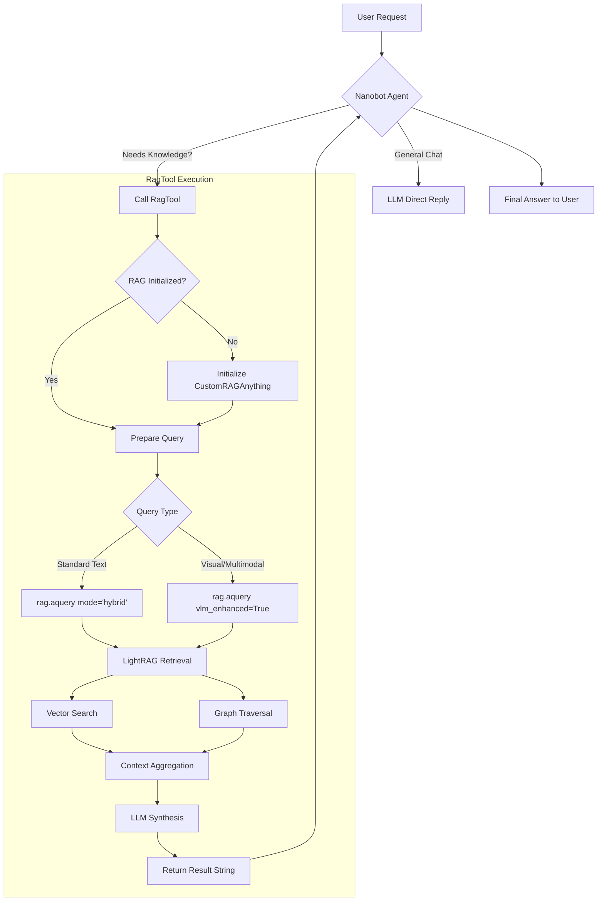

# Adding RAG Feature to Nanobot

This document outlines the design and implementation logic for integrating **RAG-Anything** into **Nanobot**.

## Overview
Nanobot will use a new native tool, `RagTool`, to interface with the `CustomRAGAnything` class. This enables the agent to perform hybrid or multimodal queries against a knowledge base.

## 1. Logic & Pseudocode

### Class Structure: `RagTool(Tool)`
The tool will be a subclass of Nanobot's `Tool` base class.

**Initialization Logic:**
1.  On `__init__`, load RAG configuration from environment variables or Nanobot config (via `kwargs`).
2.  Initialize the `CustomRAGAnything` instance. *Note: This is a heavy operation, so it should be done lazily or strictly once.*
3.  Set up the `execute` method to map tool parameters to `rag.aquery` or `rag.aquery_with_multimodal`.

**Execute Logic (Pseudocode):**
```python
async def execute(self, query: str, mode: str = "hybrid", use_vlm: bool = False):
    try:
        # 1. Check if RAG is initialized
        if not self.rag_instance:
            self.rag_instance = CustomRAGAnything(...)

        # 2. Determine query type
        if use_vlm:
            # VLM-enhanced query where the RAG system analyzes images in retrieved context
            result = await self.rag_instance.aquery(
                query, 
                mode=mode,
                vlm_enhanced=True
            )
        else:
            # Standard Text/Hybrid query
            result = await self.rag_instance.aquery(query, mode=mode)

        # 3. Format output
        return f"[RAG Result]: {result}"

    except Exception as e:
        return f"RAG Error: {str(e)}"
```

## 2. Mermaid Workflow

This workflow illustrates the decision process and data flow when Nanobot answers a user question using the RAG tool.



## 3. Configuration
The tool will require access to the following environment variables (already present in `raganything` env but need to be accessible to Nanobot):
- `LLM_BINDING_API_KEY`
- `LLM_BINDING_HOST`
- `SEEKDB_HOST` (etc. for storage)

We will update Nanobot's `registry.py` to instantiate `RagTool`.
