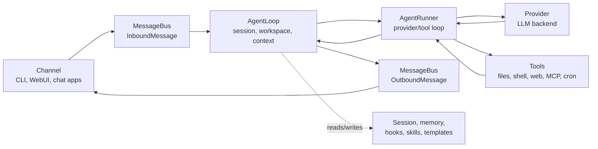

# 架构

本页面将 nanobot 的运行时行为映射到源文件。在调试内部实现、审查 PR、添加提供商/渠道/工具，或尝试了解某个用户可见行为的来源时，可以参考本页面。

如需了解产品层面的心智模型，请先阅读 [`concepts.md`](concepts-zh.md)。

## 核心流程



主要文件：

| 区域 | 文件 |
|---|---|
| 消息事件和队列 | `nanobot/bus/events.py`、`nanobot/bus/queue.py` |
| 轮次编排 | `nanobot/agent/loop.py` |
| 提供商/工具对话循环 | `nanobot/agent/runner.py` |
| 上下文构建 | `nanobot/agent/context.py` |
| 会话存储和压缩 | `nanobot/session/manager.py` |
| 长期记忆和 Dream | `nanobot/agent/memory.py` |

## Agent Loop 与 Agent Runner

`AgentLoop` 负责面向渠道的轮次：

- 接收传入消息；
- 确定有效的会话和工作区范围；
- 构建上下文；
- 接入钩子、进度和渠道元数据；
- 发布传出消息。

`AgentRunner` 负责面向模型的循环：

- 向选定的提供商发送消息；
- 处理流式增量内容和推理块；
- 执行工具调用；
- 将工具结果反馈给模型；
- 在生成最终答案或达到运行时限制时停止。

调试时请牢记这一划分。如果问题涉及渠道路由、会话键、工作区选择或传出消息投递，请从 `agent/loop.py` 开始排查。如果问题涉及提供商调用、工具调用、流式处理或迭代次数限制，请从 `agent/runner.py` 开始排查。

## 提供商

提供商元数据集中定义在 `nanobot/providers/registry.py` 中。配置字段位于 `nanobot/config/schema.py`。

提供商选择依据包括：

- 显式指定的 `agents.defaults.provider` 或预设提供商；
- 提供商注册表关键字；
- API 密钥前缀和 API 基础 URL 提示；
- 配置 `apiBase` 时使用本地提供商回退；
- 对于能够路由多个模型系列的提供商，使用网关回退。

提供商实现位于 `nanobot/providers/` 中。大多数托管提供商使用 OpenAI 兼容实现，而 Anthropic、Azure OpenAI、AWS Bedrock、OpenAI Codex 和 GitHub Copilot 使用专用路径。

有用文档：

- [`providers.md`](providers-zh.md)：实际配置指南；
- [`configuration.md#providers`](configuration-zh.md#providers)：完整的提供商参考。

## 渠道

渠道将外部平台转换为 `InboundMessage` 事件，并将 `OutboundMessage` 事件发送回平台。

主要文件：

| 区域 | 文件 |
|---|---|
| 基础渠道契约 | `nanobot/channels/base.py` |
| 渠道包 | `nanobot/channels/<channel>/` |
| 发现和生命周期 | `nanobot/channels/manager.py` |
| WebSocket/WebUI 渠道 | `nanobot/channels/websocket/` |

渠道通过扫描 `nanobot/channels/` 下的自包含包来发现。添加渠道时，请贡献一个遵循 [`channel-package-guide.md`](channel-package-guide-zh.md) 的包。

## WebUI 和网关

`nanobot gateway` 会启动：

- 已启用的聊天渠道；
- 配置后启用的 WebSocket 渠道；
- 工作区范围的 cron 服务；
- Dream 和 heartbeat 等系统任务；
- `gateway.port` 上的健康检查端点。

打包后的 WebUI 由 WebSocket 渠道提供，而不是由健康检查端点提供：

| 访问面 | 默认值 |
|---|---|
| 健康检查端点 | `http://127.0.0.1:18790/health` |
| WebUI/WebSocket | `http://127.0.0.1:8765` |

WebUI 源代码位于 `webui/`。生产构建产物会写入 `nanobot/web/dist/`，并打包到 wheel 中。

有用文档：

- [`webui.md`](webui-zh.md)：WebUI 用户指南；
- [`../webui/README.md`](../webui/README.md)：前端源代码开发；
- [`websocket.md`](websocket-zh.md)：协议详细信息。

## 工具

工具从 `nanobot/agent/tools/` 和插件入口点中发现。

重要文件：

| 工具区域 | 文件 |
|---|---|
| 工具基类和架构 | `nanobot/agent/tools/base.py`、`nanobot/agent/tools/schema.py` |
| 发现 | `nanobot/agent/tools/registry.py` |
| Shell 执行 | `nanobot/agent/tools/shell.py` |
| 文件系统工具 | `nanobot/agent/tools/filesystem.py` |
| Web 搜索/抓取 | `nanobot/agent/tools/web.py` |
| MCP 工具 | `nanobot/agent/tools/mcp.py` |
| Cron | `nanobot/agent/tools/cron.py`、`nanobot/cron/` |
| 图像生成 | `nanobot/agent/tools/image_generation.py` |
| 运行时自检 | `nanobot/agent/tools/self.py` |

工具行为属于模型契约的一部分。除非变更是有意为之，否则应保持用户可见的工具名称、架构和错误消息稳定。

## 配置和路径

配置架构位于 `nanobot/config/schema.py`。加载和保存逻辑位于 `nanobot/config/loader.py`。运行时路径辅助工具位于 `nanobot/config/paths.py`。

默认值：

| 路径 | 默认值 |
|---|---|
| 配置 | `~/.nanobot/config.json` |
| 工作区 | `~/.nanobot/workspace/` |
| 会话 | `<workspace>/sessions/*.jsonl` |
| 记忆 | `<workspace>/memory/` |
| Cron 存储 | `<workspace>/cron/jobs.json` |
| WebUI/媒体/日志运行时数据 | 配置目录下的子目录，例如 `webui/`、`media/` 和 `logs/` |

架构同时接受 camelCase 和 snake_case 键，但保存配置时使用 camelCase 别名。

### Agent 拥有的状态与有效项目上下文

运行时代码区分已配置的 Agent 工作区和由会话范围携带的有效项目工作区。两者通常是同一路径，但 WebUI 聊天可能会选择单独的项目：

| 关注点 | 路径所有者 |
|---|---|
| 会话、`SOUL.md`、`USER.md`、记忆和自定义技能 | 已配置的 Agent 工作区 |
| 项目 `AGENTS.md`、相对工具路径和 Shell 工作目录 | 有效项目工作区 |
| 工作区访问模式和项目元数据 | 会话工作区范围 |

`ContextBuilder` 将项目指令与 Agent 拥有的配置文件和记忆结合起来。文件系统和搜索工具将项目作为其通常的边界，并仅获得对内置/Agent 技能以及确切 Agent 历史文件的特定能力读取权限。应保持这些跨根目录能力为只读且明确；不要将整个 Agent 工作区视为允许访问的根目录。

## 记忆和会话

会话历史是近期对话的重放记录。记忆则是工作区中更长期的状态。

| 存储 | 文件区域 |
|---|---|
| 会话 JSONL 文件 | `<workspace>/sessions/` |
| 长期记忆 | `<workspace>/memory/MEMORY.md` |
| 整合源历史记录 | `<workspace>/memory/history.jsonl` |
| 启动身份文件 | `<workspace>/SOUL.md`、`<workspace>/USER.md`、`nanobot/templates/` 下的模板 |

Dream 在 `nanobot/agent/memory.py` 中实现，并在启用后由运行时进行调度。

## 安全边界

安全敏感的代码路径包括：

| 边界 | 文件 |
|---|---|
| 工作区范围 | `nanobot/security/workspace_access.py`、`nanobot/security/workspace_policy.py` |
| Shell 沙箱 | `nanobot/agent/tools/shell.py` |
| SSRF/网络检查 | `nanobot/security/network.py`、`nanobot/agent/tools/web.py` |
| PTH 防护和 CLI 启动安全 | `nanobot/security/` 和 CLI 入口点 |
| 渠道访问控制 | `nanobot/channels/*.py` 中的渠道配置 |

修改工具、渠道、文件访问、WebUI 工作区行为或网络抓取时，应将安全视为功能行为的一部分；如果用户可见的边界发生变化，还应更新文档。

## 扩展点

| 扩展 | 方式 |
|---|---|
| 提供商 | 在 `providers/registry.py` 中添加 `ProviderSpec`，在 `config/schema.py` 中添加架构字段；只有在通用后端不够用时才实现专用提供商 |
| 渠道 | 导出 `ChannelPlugin` 描述符，将运行时和可选的设置界面放在同一个包中，并遵循 [`channel-package-guide.md`](channel-package-guide-zh.md) |
| 工具 | 在 `agent/tools/` 下实现工具，或暴露插件入口点 |
| MCP | 添加 `tools.mcpServers` 配置 |
| 技能 | 在 `<workspace>/skills/` 下添加工作区技能文件，或在 `nanobot/skills/` 下添加内置技能 |

优先使用现有的注册表/发现模式，而不是临时连接代码。

## 测试和验证

常见检查：

```bash
pytest tests/test_openai_api.py::test_function -v
ruff check nanobot/
cd webui && bun run test
cd webui && bun run build
```

根据变更范围选择测试：

| 变更 | 最低限度的有效验证 |
|---|---|
| 提供商行为 | 提供商单元测试或模拟 API 路径；条件允许时使用安全配置运行 `nanobot agent -m "Hello!"` |
| 渠道行为 | 渠道测试以及 `nanobot gateway` 启动路径 |
| WebUI 行为 | WebUI 测试/构建；对于路由、设置或聊天变更，通过网关进行浏览器级验证 |
| 工具行为 | 工具单元测试；当架构或面向模型的行为发生变化时，增加 Agent 运行路径测试 |
| 文档 | 链接检查、根据 CLI/架构验证命令准确性，以及 `git diff --check` |

对于面向用户的流程，至少应优先通过用户实际接触的公共界面进行一种验证：CLI 命令、HTTP 端点、WebSocket/WebUI、聊天渠道或打包后的导入路径。
