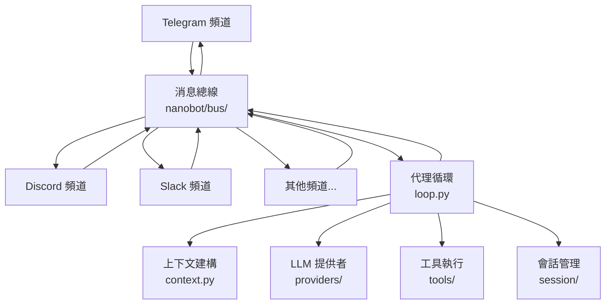

# Gateway 服務指南

## 什麼是 Gateway？

Gateway 是 nanobot 的長期運行服務，負責同時連接多個聊天平台（Telegram、Discord、Slack、飛書、釘釘等），並將所有傳入訊息路由至代理處理引擎。

啟動 Gateway 後，它會：

1. 載入配置文件並初始化所有啟用的頻道
2. 建立消息總線（Message Bus）
3. 為每個頻道啟動獨立的監聽協程
4. 持續等待訊息並將其交由代理循環處理
5. 將代理的回應透過對應頻道發送回用戶

## 架構概覽



消息流向：

```
頻道接收訊息
  → 消息總線（InboundMessage）
    → 代理循環（AgentLoop）
      → 上下文建構（歷史 + 記憶 + 技能）
      → LLM 呼叫
      → 工具執行（如需要）
      → 產生回應
  → 消息總線（OutboundMessage）
→ 頻道發送回應
```

## 啟動 Gateway

### 基本啟動

```bash
nanobot gateway
```

這會使用預設配置文件 `~/.nanobot/config.json` 啟動 Gateway，監聽預設埠 `18790`。

### 指定配置文件

```bash
nanobot gateway --config ~/.nanobot-telegram/config.json
```

### 指定埠號

```bash
nanobot gateway --port 18792
```

### 指定工作區

```bash
nanobot gateway --workspace /path/to/workspace
```

### 組合多個選項

```bash
nanobot gateway --config ~/.nanobot-feishu/config.json --port 18792
```

## 多實例部署

可以同時運行多個 Gateway 實例，每個實例負責不同的頻道組合：

```bash
# 實例 A — Telegram 機器人
nanobot gateway --config ~/.nanobot-telegram/config.json

# 實例 B — Discord 機器人
nanobot gateway --config ~/.nanobot-discord/config.json

# 實例 C — 飛書機器人（自訂埠）
nanobot gateway --config ~/.nanobot-feishu/config.json --port 18792
```

> **重要：** 每個實例必須使用不同的埠號（若同時運行）。

配置文件中的埠號設定：

```json
{
  "gateway": {
    "port": 18790
  }
}
```

## 心跳服務

Gateway 內建**心跳服務**，每隔 30 分鐘自動喚醒一次，檢查工作區中的 `HEARTBEAT.md` 文件。

### 運作方式

1. Gateway 每 30 分鐘讀取 `~/.nanobot/workspace/HEARTBEAT.md`
2. 若文件中有待執行的任務，代理會執行這些任務
3. 執行結果發送至您最近活躍的聊天頻道

### HEARTBEAT.md 任務格式

```markdown
- [ ] 每天早上 9 點報告今日天氣
- [ ] 每週五下午提醒週報撰寫
- [ ] 每小時檢查重要郵件
```

> **提示：** 您也可以直接向機器人說「新增一個定期任務」，代理會自動更新 `HEARTBEAT.md`。

### 使用前提

- Gateway 必須正在運行（`nanobot gateway`）
- 您至少與機器人對話過一次（讓系統記錄活躍頻道）

## 查看狀態

### 整體狀態

```bash
nanobot status
```

顯示 nanobot 版本、配置的提供者、工作區路徑等基本資訊。

### 頻道狀態

```bash
nanobot channels status
```

顯示所有頻道的啟用狀態、連線情況。

### 插件列表

```bash
nanobot plugins list
```

顯示所有內建頻道與外部插件的啟用狀態。

## 優雅關閉

在前台運行時，按 `Ctrl+C` 即可觸發優雅關閉：

1. Gateway 收到 SIGINT/SIGTERM 信號
2. 停止所有頻道的監聽
3. 等待當前處理中的訊息完成
4. 清理資源並退出

若使用 systemd 服務管理，可透過以下指令安全關閉：

```bash
systemctl --user stop nanobot-gateway
```

## 常用指令速查

| 指令 | 說明 |
|------|------|
| `nanobot gateway` | 啟動 Gateway |
| `nanobot gateway --port 18792` | 指定埠號啟動 |
| `nanobot gateway --config <path>` | 指定配置文件啟動 |
| `nanobot status` | 查看整體狀態 |
| `nanobot channels status` | 查看頻道狀態 |
| `nanobot plugins list` | 查看插件列表 |
| `nanobot onboard` | 執行互動式設定精靈 |
