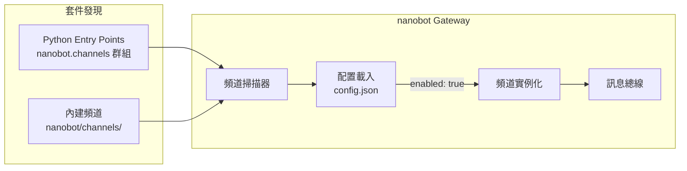

# 頻道插件開發

本指南說明如何為 nanobot 開發自訂聊天頻道插件，讓 nanobot 連接任何您需要的平台。

## 插件架構概覽

nanobot 透過 Python [Entry Points](https://packaging.python.org/en/latest/specifications/entry-points/) 機制發現頻道插件。當 `nanobot gateway` 啟動時，它會掃描：

1. **內建頻道**：`nanobot/channels/` 目錄中的頻道
2. **外部插件**：所有注冊在 `nanobot.channels` Entry Point 群組下的套件

若對應的配置區塊設定了 `"enabled": true`，該頻道就會被實例化並啟動。



## BaseChannel 介面

所有頻道插件必須繼承 `nanobot.channels.base.BaseChannel`。

### 必須實作的方法

| 方法 | 說明 |
|------|------|
| `async start()` | **必須永久阻塞。** 連接平台、監聽訊息，對每則訊息呼叫 `_handle_message()`。此方法返回即代表頻道已死亡。 |
| `async stop()` | 設定 `self._running = False` 並清理資源。Gateway 關閉時呼叫。 |
| `async send(msg: OutboundMessage)` | 將回應訊息發送至平台。 |

### 基底類別提供的方法

| 方法 / 屬性 | 說明 |
|------------|------|
| `_handle_message(sender_id, chat_id, content, media?, metadata?, session_key?)` | **收到訊息時呼叫此方法。** 檢查 `is_allowed()` 後將訊息發布至總線。 |
| `is_allowed(sender_id)` | 根據 `config["allowFrom"]` 驗證發送者；`"*"` 允許所有人，`[]` 拒絕所有人。 |
| `default_config()` (classmethod) | 返回預設配置字典，供 `nanobot onboard` 使用。覆寫以宣告您的配置欄位。 |
| `transcribe_audio(file_path)` | 透過 Groq Whisper 轉錄音頻（若已配置）。 |
| `is_running` | 返回 `self._running` 的布林值。 |

### OutboundMessage 資料結構

```python
@dataclass
class OutboundMessage:
    channel: str        # 您的頻道名稱
    chat_id: str        # 接收者（與 _handle_message 傳入的 chat_id 相同）
    content: str        # Markdown 文字 — 依需要轉換為平台格式
    media: list[str]    # 要附加的本地檔案路徑（圖片、音頻、文件）
    metadata: dict      # 可包含："_progress"（bool）表示串流片段，
                        #        "message_id" 用於回覆串
```

## 命名規範

| 項目 | 格式 | 範例 |
|------|------|------|
| PyPI 套件名稱 | `nanobot-channel-{name}` | `nanobot-channel-webhook` |
| Entry Point 鍵名 | `{name}` | `webhook` |
| 配置區塊 | `channels.{name}` | `channels.webhook` |
| Python 套件名稱 | `nanobot_channel_{name}` | `nanobot_channel_webhook` |

## 完整範例：Webhook 頻道

以下示範一個完整的 Webhook 頻道插件，透過 HTTP POST 接收訊息。

### 專案結構

```
nanobot-channel-webhook/
├── nanobot_channel_webhook/
│   ├── __init__.py          # 重新匯出 WebhookChannel
│   └── channel.py           # 頻道實作
└── pyproject.toml
```

### 步驟一：實作頻道

```python
# nanobot_channel_webhook/__init__.py
from nanobot_channel_webhook.channel import WebhookChannel

__all__ = ["WebhookChannel"]
```

```python
# nanobot_channel_webhook/channel.py
import asyncio
from typing import Any

from aiohttp import web
from loguru import logger

from nanobot.channels.base import BaseChannel
from nanobot.bus.events import OutboundMessage


class WebhookChannel(BaseChannel):
    name = "webhook"
    display_name = "Webhook"

    @classmethod
    def default_config(cls) -> dict[str, Any]:
        """宣告此頻道的預設配置欄位。
        nanobot onboard 會使用這些預設值自動填充 config.json。
        """
        return {"enabled": False, "port": 9000, "allowFrom": []}

    async def start(self) -> None:
        """啟動 HTTP 伺服器監聽傳入訊息。

        重要：start() 必須永久阻塞（或直到 stop() 被呼叫）。
        若此方法返回，頻道即被視為已死亡。
        """
        self._running = True
        port = self.config.get("port", 9000)

        app = web.Application()
        app.router.add_post("/message", self._on_request)
        runner = web.AppRunner(app)
        await runner.setup()
        site = web.TCPSite(runner, "0.0.0.0", port)
        await site.start()
        logger.info("Webhook 監聽於 :{}", port)

        # 阻塞直到停止
        while self._running:
            await asyncio.sleep(1)

        await runner.cleanup()

    async def stop(self) -> None:
        """停止頻道。Gateway 關閉時呼叫。"""
        self._running = False

    async def send(self, msg: OutboundMessage) -> None:
        """發送回應訊息至平台。

        msg.content  — Markdown 文字（依需要轉換為平台格式）
        msg.media    — 要附加的本地檔案路徑列表
        msg.chat_id  — 接收者（與 _handle_message 傳入的 chat_id 相同）
        msg.metadata — 可包含 "_progress": True 表示串流片段
        """
        logger.info("[webhook] -> {}: {}", msg.chat_id, msg.content[:80])
        # 實際插件中：POST 至回呼 URL、透過 SDK 發送等

    async def _on_request(self, request: web.Request) -> web.Response:
        """處理傳入的 HTTP POST 請求。"""
        body = await request.json()
        sender = body.get("sender", "unknown")
        chat_id = body.get("chat_id", sender)
        text = body.get("text", "")
        media = body.get("media", [])       # URL 列表

        # 關鍵呼叫：驗證 allowFrom，然後將訊息放入總線供代理處理
        await self._handle_message(
            sender_id=sender,
            chat_id=chat_id,
            content=text,
            media=media,
        )

        return web.json_response({"ok": True})
```

### 步驟二：注冊 Entry Point

```toml
# pyproject.toml
[project]
name = "nanobot-channel-webhook"
version = "0.1.0"
dependencies = ["nanobot", "aiohttp"]

[project.entry-points."nanobot.channels"]
webhook = "nanobot_channel_webhook:WebhookChannel"

[build-system]
requires = ["setuptools"]
build-backend = "setuptools.backends._legacy:_Backend"
```

Entry Point 的**鍵名**（`webhook`）成為配置文件中的區塊名稱，**值**指向您的 `BaseChannel` 子類別。

### 步驟三：安裝與配置

```bash
# 以開發模式安裝（源碼修改立即生效）
pip install -e .

# 或使用 uv
uv pip install -e .

# 驗證插件已被發現
nanobot plugins list
# 應顯示 "Webhook" 來源為 "plugin"
```

編輯 `~/.nanobot/config.json` 啟用頻道：

```json
{
  "channels": {
    "webhook": {
      "enabled": true,
      "port": 9000,
      "allowFrom": ["*"]
    }
  }
}
```

> **說明：** `allowFrom` 由基底類別的 `_handle_message()` 自動處理，不需要在插件中手動檢查。`"*"` 表示允許所有發送者。

### 步驟四：執行與測試

```bash
# 啟動 Gateway
nanobot gateway
```

在另一個終端測試：

```bash
curl -X POST http://localhost:9000/message \
  -H "Content-Type: application/json" \
  -d '{"sender": "user1", "chat_id": "user1", "text": "你好！"}'
```

代理接收到訊息後處理，回應會傳遞至您的 `send()` 方法。

## 配置存取

您的頻道透過 `self.config` 以純字典形式存取配置。使用 `.get()` 搭配預設值：

```python
async def start(self) -> None:
    port = self.config.get("port", 9000)
    token = self.config.get("token", "")
    webhook_url = self.config.get("webhookUrl", "")
```

覆寫 `default_config()` 讓 `nanobot onboard` 自動填充 `config.json`：

```python
@classmethod
def default_config(cls) -> dict[str, Any]:
    return {
        "enabled": False,
        "port": 9000,
        "token": "",
        "webhookUrl": "",
        "allowFrom": []
    }
```

若不覆寫，基底類別返回 `{"enabled": false}`。

## 本地開發工作流程

```bash
# 複製您的插件儲存庫
git clone https://github.com/you/nanobot-channel-myplugin
cd nanobot-channel-myplugin

# 以開發模式安裝
pip install -e .

# 驗證插件已被發現
nanobot plugins list
# 應顯示您的頻道為 "plugin" 來源

# 端對端測試
nanobot gateway
```

## 驗證插件狀態

```bash
$ nanobot plugins list

  Name       Source    Enabled
  telegram   builtin   yes
  discord    builtin   no
  webhook    plugin    yes
```

- **builtin**：nanobot 內建頻道
- **plugin**：透過 Entry Points 安裝的外部插件

## 進階：處理媒體訊息

```python
async def _on_request(self, request: web.Request) -> web.Response:
    body = await request.json()

    # 媒體可以是 URL 列表
    media_urls = body.get("media", [])

    # 下載媒體至臨時路徑（若需要本地處理）
    local_paths = []
    for url in media_urls:
        path = await self._download_media(url)
        local_paths.append(path)

    await self._handle_message(
        sender_id=body["sender"],
        chat_id=body["chat_id"],
        content=body.get("text", ""),
        media=local_paths,  # 傳入本地檔案路徑或 URL
    )
    return web.json_response({"ok": True})
```

## 進階：串流回應

`OutboundMessage.metadata` 中的 `"_progress": True` 表示這是一個串流片段（非最終回應）：

```python
async def send(self, msg: OutboundMessage) -> None:
    is_streaming = msg.metadata.get("_progress", False)

    if is_streaming:
        # 處理串流片段（例如即時更新訊息）
        await self._update_message(msg.chat_id, msg.content)
    else:
        # 最終回應
        await self._send_final_message(msg.chat_id, msg.content)
```

## 提交至主倉庫

若您的插件足夠通用，歡迎提交至 nanobot 主倉庫成為內建頻道：

1. 在 `nightly` 分支上建立 PR
2. 將頻道實作放置於 `nanobot/channels/your_channel.py`
3. 在 `nanobot/channels/__init__.py` 注冊
4. 新增對應的測試文件於 `tests/`
5. 更新 `README.md` 中的頻道列表

詳見 [貢獻指南](./contributing.md)。
