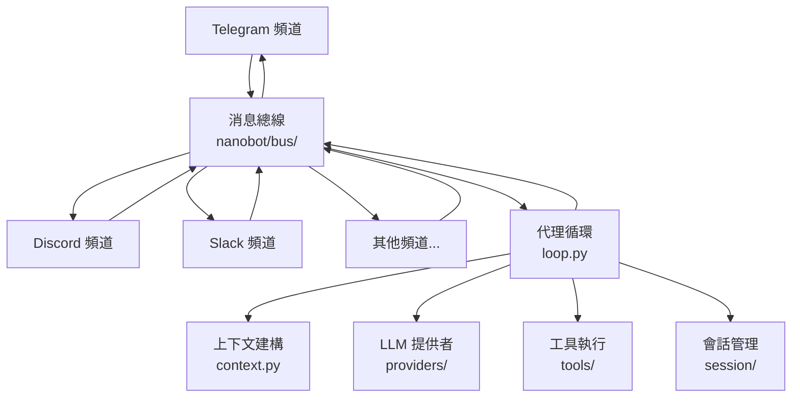

# Gateway サービスガイド

## Gateway とは？

Gateway は nanobot の常駐サービスで、複数のチャットプラットフォーム（Telegram / Discord / Slack / Feishu / DingTalk など）へ同時に接続し、すべての受信メッセージをエージェント処理エンジンへルーティングします。

Gateway を起動すると、次を行います。

1. 設定ファイルを読み込み、有効化されたチャンネルを初期化
2. メッセージバス（Message Bus）を作成
3. 各チャンネルの監視コルーチンを起動
4. メッセージを待ち受け、エージェントループへ渡して処理
5. 生成された返答を対応チャンネル経由でユーザーへ送信

## アーキテクチャ概要



メッセージの流れ:

```
チャンネルがメッセージを受信
  → メッセージバス（InboundMessage）
    → エージェントループ（AgentLoop）
      → コンテキスト構築（履歴 + メモリ + スキル）
      → LLM 呼び出し
      → ツール実行（必要な場合）
      → 返答生成
  → メッセージバス（OutboundMessage）
→ チャンネルが返答を送信
```

## Gateway を起動

### 基本

```bash
nanobot gateway
```

デフォルト設定ファイル `~/.nanobot/config.json` を使い、デフォルトポート `18790` で Gateway を起動します。

### 設定ファイルを指定

```bash
nanobot gateway --config ~/.nanobot-telegram/config.json
```

### ポートを指定

```bash
nanobot gateway --port 18792
```

### workspace を指定

```bash
nanobot gateway --workspace /path/to/workspace
```

### オプションを組み合わせる

```bash
nanobot gateway --config ~/.nanobot-feishu/config.json --port 18792
```

## 複数インスタンス運用

複数の Gateway インスタンスを同時に実行し、インスタンスごとに異なるチャンネル構成を担当させることができます。

```bash
# インスタンス A — Telegram bot
nanobot gateway --config ~/.nanobot-telegram/config.json

# インスタンス B — Discord bot
nanobot gateway --config ~/.nanobot-discord/config.json

# インスタンス C — Feishu bot（カスタムポート）
nanobot gateway --config ~/.nanobot-feishu/config.json --port 18792
```

> **重要:** 同時実行する場合、各インスタンスは異なるポートを使う必要があります。

設定ファイル内のポート設定:

```json
{
  "gateway": {
    "port": 18790
  }
}
```

## ハートビート（Heartbeat）

Gateway は **ハートビートサービス** を内蔵しており、30 分ごとに自動で起動して workspace 内の `HEARTBEAT.md` をチェックします。

### 動作

1. Gateway が 30 分ごとに `~/.nanobot/workspace/HEARTBEAT.md` を読む
2. 未実行のタスクがあれば、エージェントがそれらを実行
3. 結果を、最後にアクティブだったチャットチャンネルへ送信

### HEARTBEAT.md のタスク形式

```markdown
- [ ] 毎朝 9 時に今日の天気を報告
- [ ] 毎週金曜の午後に週報作成をリマインド
- [ ] 1 時間ごとに重要メールをチェック
```

> **ヒント:** bot に「定期タスクを追加して」と話しかけても構いません。エージェントが `HEARTBEAT.md` を自動更新します。

### 前提条件

- Gateway が稼働していること（`nanobot gateway`）
- bot と少なくとも 1 回会話していること（配送先チャンネルの記録のため）

## ステータスを見る

### 全体ステータス

```bash
nanobot status
```

nanobot のバージョン、設定済みプロバイダ、workspace パスなど基本情報が表示されます。

### チャンネルステータス

```bash
nanobot channels status
```

すべてのチャンネルの有効状態と接続状況を表示します。

### プラグイン一覧

```bash
nanobot plugins list
```

内蔵チャンネルと外部プラグインの有効状態を表示します。

## 優雅に停止

フォアグラウンド実行中は `Ctrl+C` で優雅な停止が行われます。

1. Gateway が SIGINT/SIGTERM を受信
2. すべてのチャンネル監視を停止
3. 処理中のメッセージ完了を待つ
4. リソースをクリーンアップして終了

systemd で管理している場合は、次で安全に停止できます。

```bash
systemctl --user stop nanobot-gateway
```

## よく使うコマンド

| コマンド | 説明 |
|------|------|
| `nanobot gateway` | Gateway を起動 |
| `nanobot gateway --port 18792` | ポートを指定して起動 |
| `nanobot gateway --config <path>` | 設定ファイルを指定して起動 |
| `nanobot status` | 全体ステータス |
| `nanobot channels status` | チャンネルステータス |
| `nanobot plugins list` | プラグイン一覧 |
| `nanobot onboard` | 対話式セットアップウィザード |
