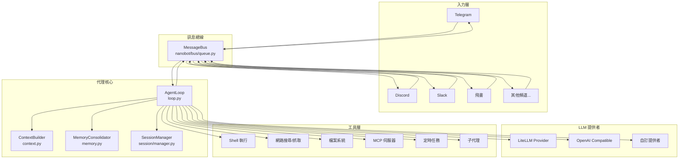
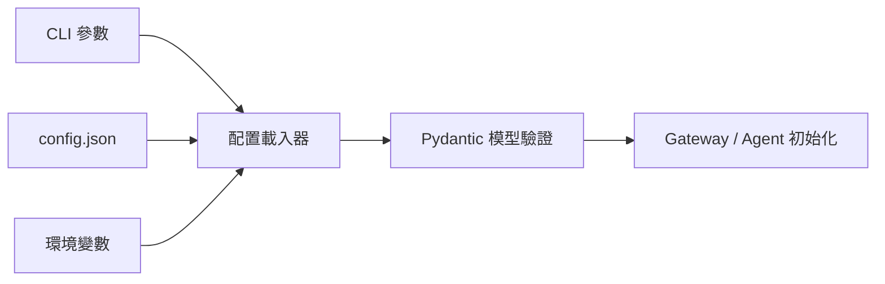

# アーキテクチャ

## 設計思想

nanobot は **イベント駆動** かつ **非同期優先** の設計を採用し、最小限のコードで完全なエージェント機能を実現しています。中核となる考え方は次の通りです。

- **メッセージバス** をコンポーネント間の統一インターフェースにする
- **非同期コルーチン** で高い並行性でも効率よくリソースを使う
- **疎結合** にして各コンポーネントが独立して進化できるようにする
- **単一責任** にして各モジュールは 1 つのことに集中する

## 全体構成



## メッセージデータフロー

ユーザーの 1 メッセージが受信され、返答が返るまでの一連の流れです。

```mermaid
sequenceDiagram
    participant CH as 頻道介面卡
    participant BUS as 訊息總線
    participant LOOP as 代理循環
    participant CTX as 上下文建構器
    participant LLM as LLM 提供者
    participant TOOLS as 工具執行器
    participant SESS as 會話管理器

    CH->>BUS: InboundMessage（訊息內容、發送者、頻道）
    BUS->>LOOP: 分發至代理循環
    LOOP->>SESS: 載入/建立會話
    LOOP->>CTX: 建構上下文
    CTX->>CTX: 載入系統提示詞\n（身份、AGENTS.md、記憶、技能）
    CTX->>CTX: 載入歷史對話
    LOOP->>LLM: 呼叫 LLM（系統提示 + 歷史 + 新訊息）
    LLM-->>LOOP: 回應（文字或工具呼叫）

    loop 工具執行循環（最多 40 次）
        LOOP->>TOOLS: 執行工具（shell/web/fs/mcp...）
        TOOLS-->>LOOP: 工具結果
        LOOP->>LLM: 繼續推理
        LLM-->>LOOP: 最終回應或下一個工具呼叫
    end

    LOOP->>SESS: 儲存對話紀錄
    LOOP->>BUS: OutboundMessage（回應內容）
    BUS->>CH: 發送回應至頻道
```

## コアモジュール

### CLI エントリポイント

**`nanobot/cli/commands.py`**

すべての CLI コマンドのエントリポイントです。コマンドライン引数を解析し、サブコマンド（`gateway` / `agent` / `status` など）に応じて必要なコンポーネントを初期化して起動します。

```bash
nanobot gateway   # Gateway を起動
nanobot agent     # ローカル CLI エージェントを起動
nanobot status    # 設定状態を表示
nanobot onboard   # セットアップウィザード
```

### メッセージバス

**`nanobot/bus/`**

メッセージバスは Gateway の中核ルーティング層で、次を担います。

- 各チャンネルからの `InboundMessage` を受け取る
- メッセージをエージェントループへ配信する
- エージェントの `OutboundMessage` を対応チャンネルへルーティングする

主要データ構造:

```python
@dataclass
class InboundMessage:
    channel: str        # 來源頻道名稱
    sender_id: str      # 發送者 ID
    chat_id: str        # 聊天室 ID
    content: str        # 訊息內容
    media: list[str]    # 媒體附件（URL 或本地路徑）
    metadata: dict      # 頻道特定的元資料

@dataclass
class OutboundMessage:
    channel: str        # 目標頻道名稱
    chat_id: str        # 接收者
    content: str        # 回應內容（Markdown）
    media: list[str]    # 附件檔案路徑
    metadata: dict      # 可包含 "_progress" 用於串流
```

### エージェントループ

**`nanobot/agent/loop.py`** — `AgentLoop`

エージェントの中核処理エンジンで、次のループを実行します。

1. bus からメッセージを受信
2. `ContextBuilder` でプロンプトを構築
3. LLM プロバイダを呼び出して返答を取得
4. LLM が要求するツール呼び出しを実行
5. 最終的なテキスト返答が得られるまで繰り返し
6. 返答を bus に publish

主なパラメータ:

```python
AgentLoop(
    bus=bus,                          # 訊息總線
    provider=provider,                # LLM 提供者
    workspace=workspace,              # 工作區路徑
    max_iterations=40,                # 最大工具呼叫輪次
    context_window_tokens=65_536,     # 上下文視窗大小
    restrict_to_workspace=False,      # 是否限制工作區範圍
)
```

### コンテキストビルダー

**`nanobot/agent/context.py`** — `ContextBuilder`

各 LLM 呼び出しのために完全なプロンプトを組み立てます。含まれる要素:

- **アイデンティティ情報**: エージェントの基本的な役割/能力
- **起動ファイル**: `AGENTS.md` / `SOUL.md` / `USER.md` / `TOOLS.md`（workspace に存在する場合）
- **メモリ要約**: 長期メモリを圧縮したサマリー
- **アクティブスキル**: 「常駐」に設定されたスキル
- **スキル一覧**: 利用可能なスキルのサマリー
- **会話履歴**: 現在セッションの履歴

### メモリ統合

**`nanobot/agent/memory.py`** — `MemoryConsolidator` / `MemoryStore`

Token を意識したメモリ管理システムです。

- **`MemoryStore`**: 長期メモリの読み書き（workspace にファイルとして保存）
- **`MemoryConsolidator`**: 履歴が Token 上限を超えたら、LLM を呼んで自動要約・統合

統合フロー:

```
對話歷史超過上下文視窗
  → MemoryConsolidator 提取舊對話
  → 呼叫 LLM 生成摘要
  → 摘要寫入 memory.md（工作區）
  → 舊對話從歷史中移除
```

### チャンネルアダプタ

**`nanobot/channels/`**

各チャットプラットフォームは `BaseChannel` を継承したアダプタとして実装されています。

```
channels/
├── base.py         # BaseChannel 抽象類別
├── telegram.py     # Telegram Bot API
├── discord.py      # Discord.py
├── slack.py        # Slack Bolt
├── feishu.py       # 飛書開放平台
├── dingtalk.py     # 釘釘
├── wechat.py       # 企業微信
├── qq.py           # QQ（botpy SDK）
├── email.py        # SMTP/IMAP
├── matrix.py       # Matrix 協定
├── whatsapp.py     # WhatsApp（Node.js Bridge）
└── mochat.py       # Mochat
```

各アダプタは次の 3 メソッドを実装する必要があります。

- `start()` — プラットフォームへ接続して監視開始（**永久にブロックする必要があります**）
- `stop()` — 優雅に停止
- `send(msg)` — プラットフォームへ送信

### LLM プロバイダ

**`nanobot/providers/`**

LLM 呼び出しの統一抽象レイヤです。

```
providers/
├── base.py              # LLMProvider 抽象類別
├── litellm_provider.py  # メイン実装（LiteLLM 経由で 100+ モデル）
└── ...                  # カスタムプロバイダ
```

`LiteLLMProvider` は、Anthropic Claude / OpenAI GPT / Google Gemini / DeepSeek / Qwen / VolcEngine など LiteLLM がサポートするモデル全般に対応します。

### ツール実行

**`nanobot/agent/tools/`**

エージェントが呼び出せるすべてのツールです。

| ツール | モジュール | 説明 |
|------|------|------|
| `exec` | `shell.py` | シェルコマンドを実行 |
| `web_search` | `web.py` | ウェブ検索 |
| `web_fetch` | `web.py` | ウェブ内容を取得 |
| `read_file` | `filesystem.py` | ファイルを読む |
| `write_file` | `filesystem.py` | ファイルへ書く |
| `edit_file` | `filesystem.py` | ファイルを編集 |
| `list_dir` | `filesystem.py` | ディレクトリ一覧 |
| `mcp_*` | `mcp.py` | MCP サーバーツール |
| `cron_*` | `cron.py` | スケジュールタスク管理 |
| `spawn` | `spawn.py` | サブエージェントを起動 |
| `message` | `message.py` | クロスチャンネル送信 |

### セッション管理

**`nanobot/session/manager.py`** — `SessionManager`

各チャットの会話状態を管理します。

- `chat_id` をキーに独立したセッションを維持
- 会話間で履歴を永続化
- セッション分離（異なるチャンネルで同じ `chat_id` は別セッション扱い）

## 設定ロードフロー



設定は `nanobot/config/schema.py` の Pydantic モデルで定義されており、次を提供します。

- 自動型検証
- デフォルト値管理
- 明確な設定構造

## nanobot の拡張

### 新しいチャンネルを追加

`BaseChannel` を継承し、Python Entry Points で登録します。詳しくは [チャンネルプラグイン開発](./channel-plugin.md)。

### 新しいスキルを追加

workspace の `skills/` に `SKILL.md` を作成すると、エージェントが自動的に検出して利用します。

### 新しい LLM プロバイダを追加

`LLMProvider` を継承し、`providers/` に必要なメソッドを実装します。

### 外部ツール（MCP）を接続

設定ファイルの `mcp` ブロックで MCP サーバーを定義すると、エージェントが自動でツールを利用可能にします。
