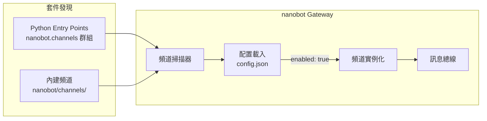

# チャンネルプラグイン開発

このガイドでは、nanobot 向けにカスタムチャットチャンネルプラグインを開発し、任意のプラットフォームへ接続できるようにする方法を説明します。

## プラグインの仕組み（概要）

nanobot は Python の [Entry Points](https://packaging.python.org/en/latest/specifications/entry-points/) によりチャンネルプラグインを検出します。`nanobot gateway` 起動時に次をスキャンします。

1. **内蔵チャンネル**: `nanobot/channels/` 配下
2. **外部プラグイン**: `nanobot.channels` Entry Point グループに登録されたパッケージ

対応する設定ブロックで `"enabled": true` が指定されていると、そのチャンネルがインスタンス化され起動します。



## BaseChannel インターフェース

すべてのチャンネルプラグインは `nanobot.channels.base.BaseChannel` を継承する必要があります。

### 必須実装メソッド

| メソッド | 説明 |
|------|------|
| `async start()` | **必ず永久にブロック。** プラットフォームへ接続し、メッセージを待ち受け、各メッセージで `_handle_message()` を呼びます。これが戻るとチャンネルは停止扱いです。 |
| `async stop()` | `self._running = False` を設定し、リソースをクリーンアップします。Gateway 停止時に呼ばれます。 |
| `async send(msg: OutboundMessage)` | 返信メッセージをプラットフォームへ送信します。 |

### ベースクラスが提供するもの

| メソッド/プロパティ | 説明 |
|------------|------|
| `_handle_message(sender_id, chat_id, content, media?, metadata?, session_key?)` | **受信時に呼び出します。** `is_allowed()` をチェック後、メッセージを bus に publish します。 |
| `is_allowed(sender_id)` | `config["allowFrom"]` で送信者を検証します。`"*"` は全許可、`[]` は全拒否。 |
| `default_config()`（classmethod） | `nanobot onboard` 用のデフォルト設定 dict を返します。フィールドを宣言するには override してください。 |
| `transcribe_audio(file_path)` | Groq Whisper（設定済みの場合）で音声を文字起こしします。 |
| `is_running` | `self._running`（bool）を返します。 |

### OutboundMessage 構造

```python
@dataclass
class OutboundMessage:
    channel: str        # チャンネル名
    chat_id: str        # 送信先（_handle_message に渡した chat_id と同じ値）
    content: str        # Markdown テキスト（必要に応じてプラットフォーム形式に変換）
    media: list[str]    # 添付するローカルファイルパス（画像/音声/ドキュメント）
    metadata: dict      # 例: "_progress"（bool）= ストリーミング片
                        #     "message_id" = スレッド返信
```

## 命名規約

| 対象 | 形式 | 例 |
|------|------|------|
| PyPI パッケージ名 | `nanobot-channel-{name}` | `nanobot-channel-webhook` |
| Entry Point キー | `{name}` | `webhook` |
| 設定セクション | `channels.{name}` | `channels.webhook` |
| Python パッケージ名 | `nanobot_channel_{name}` | `nanobot_channel_webhook` |

## 完全例: Webhook チャンネル

HTTP POST でメッセージを受け取る Webhook チャンネルプラグインの例です。

### プロジェクト構成

```
nanobot-channel-webhook/
├── nanobot_channel_webhook/
│   ├── __init__.py          # WebhookChannel を再エクスポート
│   └── channel.py           # チャンネル実装
└── pyproject.toml
```

### ステップ 1: チャンネルを実装

```python
# nanobot_channel_webhook/__init__.py
from nanobot_channel_webhook.channel import WebhookChannel

__all__ = ["WebhookChannel"]
```

```python
# nanobot_channel_webhook/channel.py
import asyncio
from typing import Any

from aiohttp import web
from loguru import logger

from nanobot.channels.base import BaseChannel
from nanobot.bus.events import OutboundMessage


class WebhookChannel(BaseChannel):
    name = "webhook"
    display_name = "Webhook"

    @classmethod
    def default_config(cls) -> dict[str, Any]:
        """このチャンネルのデフォルト設定フィールドを宣言する。
        nanobot onboard はこのデフォルト値を使って config.json を自動補完する。
        """
        return {"enabled": False, "port": 9000, "allowFrom": []}

    async def start(self) -> None:
        """受信メッセージを待ち受ける HTTP サーバーを起動する。

        重要: start() は永久にブロックし続ける（または stop() が呼ばれるまで）。
        戻ってしまうとチャンネルは停止扱いになる。
        """
        self._running = True
        port = self.config.get("port", 9000)

        app = web.Application()
        app.router.add_post("/message", self._on_request)
        runner = web.AppRunner(app)
        await runner.setup()
        site = web.TCPSite(runner, "0.0.0.0", port)
        await site.start()
        logger.info("Webhook listening on :{}", port)

        # stop されるまでブロック
        while self._running:
            await asyncio.sleep(1)

        await runner.cleanup()

    async def stop(self) -> None:
        """チャンネルを停止する。Gateway 停止時に呼ばれる。"""
        self._running = False

    async def send(self, msg: OutboundMessage) -> None:
        """返信メッセージをプラットフォームへ送信する。

        msg.content  — Markdown テキスト（必要に応じてプラットフォーム形式に変換）
        msg.media    — 添付するローカルファイルパスのリスト
        msg.chat_id  — 送信先（_handle_message に渡した chat_id と同じ値）
        msg.metadata — 例: "_progress": True（ストリーミング片）
        """
        logger.info("[webhook] -> {}: {}", msg.chat_id, msg.content[:80])
        # 実運用では、コールバック URL へ POST したり SDK 経由で送信したりする

    async def _on_request(self, request: web.Request) -> web.Response:
        """受信した HTTP POST を処理する。"""
        body = await request.json()
        sender = body.get("sender", "unknown")
        chat_id = body.get("chat_id", sender)
        text = body.get("text", "")
        media = body.get("media", [])       # URL のリスト

        # 重要: allowFrom を検証した上で、メッセージを bus に流す
        await self._handle_message(
            sender_id=sender,
            chat_id=chat_id,
            content=text,
            media=media,
        )

        return web.json_response({"ok": True})
```

### ステップ 2: Entry Point を登録

```toml
# pyproject.toml
[project]
name = "nanobot-channel-webhook"
version = "0.1.0"
dependencies = ["nanobot", "aiohttp"]

[project.entry-points."nanobot.channels"]
webhook = "nanobot_channel_webhook:WebhookChannel"

[build-system]
requires = ["setuptools"]
build-backend = "setuptools.backends._legacy:_Backend"
```

Entry Point の **キー**（`webhook`）は設定ファイル内のセクション名になり、**値**は `BaseChannel` サブクラスを指します。

### ステップ 3: インストールと設定

```bash
# 開発モードでインストール（ソース変更が即反映）
pip install -e .

# または uv を使う
uv pip install -e .

# プラグインが検出されることを確認
nanobot plugins list
# "Webhook" の source が "plugin" として表示されるはず
```

`~/.nanobot/config.json` を編集してチャンネルを有効化します。

```json
{
  "channels": {
    "webhook": {
      "enabled": true,
      "port": 9000,
      "allowFrom": ["*"]
    }
  }
}
```

> **補足:** `allowFrom` はベースクラスの `_handle_message()` が自動で処理します。`"*"` は全送信者を許可します。

### ステップ 4: 実行とテスト

```bash
# Gateway を起動
nanobot gateway
```

別ターミナルでテスト:

```bash
curl -X POST http://localhost:9000/message \
  -H "Content-Type: application/json" \
  -d '{"sender": "user1", "chat_id": "user1", "text": "こんにちは！"}'
```

エージェントがメッセージを受信して処理し、返信は `send()` メソッドに到達します。

## 設定へのアクセス

チャンネルは `self.config` で設定をプレーンな辞書として受け取ります。`.get()` とデフォルト値を使って参照します。

```python
async def start(self) -> None:
    port = self.config.get("port", 9000)
    token = self.config.get("token", "")
    webhook_url = self.config.get("webhookUrl", "")
```

`default_config()` を override すると、`nanobot onboard` が `config.json` を自動補完できます。

```python
@classmethod
def default_config(cls) -> dict[str, Any]:
    return {
        "enabled": False,
        "port": 9000,
        "token": "",
        "webhookUrl": "",
        "allowFrom": []
    }
```

override しない場合、ベースクラスは `{"enabled": false}` を返します。

## ローカル開発の流れ

```bash
# プラグインリポジトリを取得
git clone https://github.com/you/nanobot-channel-myplugin
cd nanobot-channel-myplugin

# 開発モードでインストール
pip install -e .

# 検出を確認
nanobot plugins list
# チャンネルが "plugin" source として表示されるはず

# エンドツーエンドテスト
nanobot gateway
```

## プラグイン状態の確認

```bash
$ nanobot plugins list

  Name       Source    Enabled
  telegram   builtin   yes
  discord    builtin   no
  webhook    plugin    yes
```

- **builtin**: nanobot 内蔵チャンネル
- **plugin**: Entry Points 経由でインストールされた外部プラグイン

## 上級: メディアメッセージを扱う

```python
async def _on_request(self, request: web.Request) -> web.Response:
    body = await request.json()

    # media は URL のリストとして受け取れる
    media_urls = body.get("media", [])

    # 必要なら一時パスへダウンロードしてローカル処理
    local_paths = []
    for url in media_urls:
        path = await self._download_media(url)
        local_paths.append(path)

    await self._handle_message(
        sender_id=body["sender"],
        chat_id=body["chat_id"],
        content=body.get("text", ""),
        media=local_paths,  # ローカルパスまたは URL を渡す
    )
    return web.json_response({"ok": True})
```

## 上級: ストリーミング返信

`OutboundMessage.metadata` の `"_progress": True` は、そのメッセージがストリーミング片（最終返信ではない）であることを示します。

```python
async def send(self, msg: OutboundMessage) -> None:
    is_streaming = msg.metadata.get("_progress", False)

    if is_streaming:
        # ストリーミング片を処理（例: 既存メッセージを逐次更新）
        await self._update_message(msg.chat_id, msg.content)
    else:
        # 最終返信
        await self._send_final_message(msg.chat_id, msg.content)
```

## 本体リポジトリへ取り込む

汎用性が高いプラグインであれば、nanobot 本体リポジトリへ取り込んで内蔵チャンネルにする提案も歓迎します。

1. `nightly` ブランチに向けて PR を作成
2. 実装を `nanobot/channels/your_channel.py` に配置
3. `nanobot/channels/__init__.py` に登録
4. `tests/` にテストを追加
5. `README.md` のチャンネル一覧を更新

詳細は [コントリビュートガイド](./contributing.md) を参照してください。
