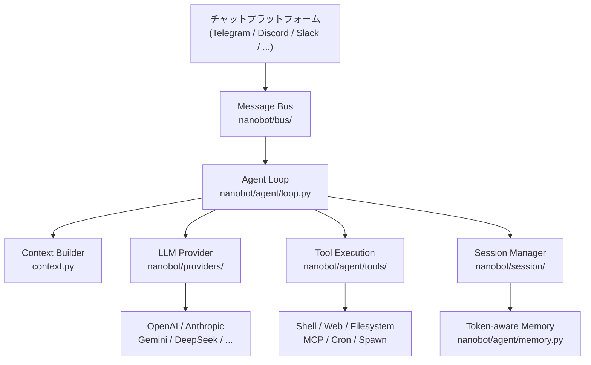

---
hide:
  - navigation
  - toc
---

<div class="hero-section">
  
  <h1 class="hero-title">Nanobot</h1>
  <p class="hero-subtitle">超軽量の個人向け AI アシスタントフレームワーク、16+ のチャットプラットフォーム、28+ の LLM プロバイダ、そして完全な MCP 統合をサポート</p>
  <div class="hero-badges">
    <span class="hero-badge">🐍 Python ≥ 3.11</span>
    <span class="hero-badge">📦 v0.1.4.post5</span>
    <span class="hero-badge">⚖️ MIT License</span>
    <span class="hero-badge">⚡ ~16k 行のコード</span>
    <span class="hero-badge">🔌 16+ プラットフォーム</span>
  </div>
  <div class="hero-buttons">
    <a href="getting-started/installation/" class="hero-btn hero-btn-primary">🚀 今すぐ始める</a>
    <a href="getting-started/quick-start/" class="hero-btn hero-btn-secondary">⚡ クイックスタート</a>
    <a href="https://github.com/HKUDS/nanobot" class="hero-btn hero-btn-secondary">★ GitHub</a>
  </div>
</div>

<div class="announcement-banner">
  🎉 <strong>最新バージョン v0.1.4.post5</strong> をリリースしました。信頼性、チャンネル対応、日常利用の体験をさらに強化しています。
  <a href="https://github.com/HKUDS/nanobot/releases/tag/v0.1.4.post5">リリースノートを見る →</a>
</div>

---

## 主な特徴

<div class="feature-grid">
  <div class="feature-card">
    <span class="feature-icon">🪶</span>
    <p class="feature-title">超軽量設計</p>
    <p class="feature-desc">約 16,000 行の Python コードのみで構成され、OpenClaw より 99% 小さいです。メモリ使用量が非常に少なく、起動も高速なので、いつでも個人 AI アシスタントを立ち上げられます。</p>
  </div>
  <div class="feature-card">
    <span class="feature-icon">🔌</span>
    <p class="feature-title">16+ チャットプラットフォーム</p>
    <p class="feature-desc">一度デプロイすれば、どこでも会話できます。Telegram、Discord、Slack、飛書、釘釘、企業微信、QQ、Email、Matrix、WhatsApp などを幅広くサポートします。</p>
  </div>
  <div class="feature-card">
    <span class="feature-icon">🧠</span>
    <p class="feature-title">28+ LLM プロバイダ</p>
    <p class="feature-desc">OpenAI、Anthropic、Gemini、DeepSeek、Qwen、Moonshot、MiniMax、VolcEngine、Azure OpenAI、ローカルモデル（Ollama/vLLM）など、主要プロバイダをサポートします。</p>
  </div>
  <div class="feature-card">
    <span class="feature-icon">🔧</span>
    <p class="feature-title">MCP 統合</p>
    <p class="feature-desc">Model Context Protocol（MCP）を完全サポート。標準インターフェース経由で任意の外部ツール、データベース、サービスを接続し、AI アシスタントの能力を大きく拡張できます。</p>
  </div>
  <div class="feature-card">
    <span class="feature-icon">⏰</span>
    <p class="feature-title">スケジュールと Cron</p>
    <p class="feature-desc">自然言語スケジューリングエンジンを内蔵し、定期リマインダーや周期タスクを設定できます。正しいタイミングで AI アシスタントが能動的に連絡します。</p>
  </div>
  <div class="feature-card">
    <span class="feature-icon">🎓</span>
    <p class="feature-title">研究フレンドリー</p>
    <p class="feature-desc">クリーンで読みやすいコード構造で、理解、修正、拡張が簡単です。過剰な設計を避けており、研究者と開発者が深く探索しやすい構成です。</p>
  </div>
  <div class="feature-card">
    <span class="feature-icon">🛡️</span>
    <p class="feature-title">Token メモリ管理</p>
    <p class="feature-desc">Token 認識型のメモリ統合システムでコンテキストウィンドウを自動管理し、長期対話の連続性と一貫性を保ちます。</p>
  </div>
  <div class="feature-card">
    <span class="feature-icon">🌐</span>
    <p class="feature-title">マルチインスタンス対応</p>
    <p class="feature-desc">複数の Nanobot インスタンスを同時に実行でき、各インスタンスで異なるモデル、チャンネル、スキルを独立して設定できます。多様な利用シーンに柔軟に対応できます。</p>
  </div>
  <div class="feature-card">
    <span class="feature-icon">💎</span>
    <p class="feature-title">ワンクリック導入</p>
    <p class="feature-desc">対話式セットアップウィザードで数分以内に設定を完了できます。Docker コンテナデプロイと Linux systemd サービスもサポートし、多様な運用環境に対応します。</p>
  </div>
</div>

---

## クイック統計

<div class="stats-bar">
  <div class="stat-item">
    <span class="stat-number">16+</span>
    <span class="stat-label">チャットプラットフォーム</span>
  </div>
  <div class="stat-item">
    <span class="stat-number">28+</span>
    <span class="stat-label">LLM プロバイダ</span>
  </div>
  <div class="stat-item">
    <span class="stat-number">~16k</span>
    <span class="stat-label">コード行数</span>
  </div>
  <div class="stat-item">
    <span class="stat-number">99%</span>
    <span class="stat-label">OpenClaw より軽量</span>
  </div>
  <div class="stat-item">
    <span class="stat-number">MIT</span>
    <span class="stat-label">オープンソースライセンス</span>
  </div>
  <div class="stat-item">
    <span class="stat-number">3.11+</span>
    <span class="stat-label">Python バージョン</span>
  </div>
</div>

---

## サポートするチャットチャンネル

<div class="channel-grid">
  <a href="channels/telegram/" class="channel-badge">
    <span class="channel-icon">✈️</span>
    Telegram
  </a>
  <a href="channels/discord/" class="channel-badge">
    <span class="channel-icon">🎮</span>
    Discord
  </a>
  <a href="channels/slack/" class="channel-badge">
    <span class="channel-icon">💼</span>
    Slack
  </a>
  <a href="channels/feishu/" class="channel-badge">
    <span class="channel-icon">🪶</span>
    飛書 Feishu
  </a>
  <a href="channels/dingtalk/" class="channel-badge">
    <span class="channel-icon">🔔</span>
    釘釘 DingTalk
  </a>
  <a href="channels/wecom/" class="channel-badge">
    <span class="channel-icon">💬</span>
    企業微信 WeCom
  </a>
  <a href="channels/qq/" class="channel-badge">
    <span class="channel-icon">🐧</span>
    QQ
  </a>
  <a href="channels/email/" class="channel-badge">
    <span class="channel-icon">📧</span>
    Email
  </a>
  <a href="channels/matrix/" class="channel-badge">
    <span class="channel-icon">🔢</span>
    Matrix
  </a>
  <a href="channels/whatsapp/" class="channel-badge">
    <span class="channel-icon">📱</span>
    WhatsApp
  </a>
  <a href="channels/mochat/" class="channel-badge">
    <span class="channel-icon">🗨️</span>
    Mochat
  </a>
  <a href="cli-reference/" class="channel-badge">
    <span class="channel-icon">💻</span>
    CLI 終端機
  </a>
</div>

---

## サポートする LLM プロバイダ

<div class="provider-grid">
  <div class="provider-badge">
    <span>🤖</span>
    <span class="provider-name">OpenAI</span>
    <span>GPT-4o, o1, o3</span>
  </div>
  <div class="provider-badge">
    <span>🧠</span>
    <span class="provider-name">Anthropic</span>
    <span>Claude 3.5/3.7</span>
  </div>
  <div class="provider-badge">
    <span>✨</span>
    <span class="provider-name">Gemini</span>
    <span>2.0 Flash, Pro</span>
  </div>
  <div class="provider-badge">
    <span>🌊</span>
    <span class="provider-name">DeepSeek</span>
    <span>V3, R1</span>
  </div>
  <div class="provider-badge">
    <span>🌙</span>
    <span class="provider-name">Moonshot / Kimi</span>
    <span>k1.5, k2</span>
  </div>
  <div class="provider-badge">
    <span>☁️</span>
    <span class="provider-name">Qwen</span>
    <span>Qwen2.5, QwQ</span>
  </div>
  <div class="provider-badge">
    <span>🚀</span>
    <span class="provider-name">VolcEngine</span>
    <span>Doubao シリーズ</span>
  </div>
  <div class="provider-badge">
    <span>🔵</span>
    <span class="provider-name">Azure OpenAI</span>
    <span>エンタープライズ向け OpenAI</span>
  </div>
  <div class="provider-badge">
    <span>🔀</span>
    <span class="provider-name">OpenRouter</span>
    <span>200+ モデルルーティング</span>
  </div>
  <div class="provider-badge">
    <span>🦙</span>
    <span class="provider-name">Ollama</span>
    <span>ローカル OSS モデル</span>
  </div>
  <div class="provider-badge">
    <span>⚡</span>
    <span class="provider-name">vLLM</span>
    <span>高効率ローカル推論</span>
  </div>
  <div class="provider-badge">
    <span>💎</span>
    <span class="provider-name">MiniMax</span>
    <span>ABAB シリーズ</span>
  </div>
</div>

---

## 3 ステップで素早く開始

=== "pip / uv でインストール"

    ```bash
    # uv（推奨）
    uv tool install nanobot-ai

    # もしくは pip
    pip install nanobot-ai
    ```

=== "対話式セットアップウィザード"

    ```bash
    # セットアップウィザードを起動し、ステップに沿って設定
    nanobot onboard
    ```

=== "nanobot と会話を始める"

    ```bash
    # 対話型 CLI エージェントを起動
    nanobot agent

    # 特定の設定ファイルを使う
    nanobot agent --config ~/.nanobot/config.json

    # 単発メッセージモード
    nanobot agent -m "Hello!"
    ```

---

## アーキテクチャ概要



---

## 最新動向

<ul class="news-timeline">
  <li class="news-item">
    <div class="news-date">2026-03-16</div>
    <div class="news-text">🚀 <strong>v0.1.4.post5</strong> をリリース、信頼性、チャンネル対応、日常利用の体験を強化</div>
  </li>
  <li class="news-item">
    <div class="news-date">2026-03-15</div>
    <div class="news-text">🧩 釘釘のリッチメディア、より賢い組み込みスキル、より整理されたモデル互換性</div>
  </li>
  <li class="news-item">
    <div class="news-date">2026-03-14</div>
    <div class="news-text">💬 チャンネルプラグイン、飛書返信、安定した MCP、QQ とメディア処理</div>
  </li>
  <li class="news-item">
    <div class="news-date">2026-03-13</div>
    <div class="news-text">🌐 マルチプロバイダのウェブ検索、LangSmith 統合、幅広い信頼性改善</div>
  </li>
  <li class="news-item">
    <div class="news-date">2026-03-08</div>
    <div class="news-text">🚀 <strong>v0.1.4.post4</strong> をリリース、より安全なデフォルト値、より良いマルチインスタンス対応</div>
  </li>
  <li class="news-item">
    <div class="news-date">2026-02-17</div>
    <div class="news-text">🎉 <strong>v0.1.4</strong> をリリース、MCP 対応、進捗ストリーミング、新プロバイダと多チャンネル改善</div>
  </li>
</ul>

<div style="text-align:center; margin-top: 1rem;">
  <a href="https://github.com/HKUDS/nanobot/releases" style="font-size:0.9rem; color: var(--md-primary-fg-color);">すべてのリリース履歴を見る →</a>
</div>

---

## コミュニティとサポート

<div class="feature-grid">
  <div class="feature-card">
    <span class="feature-icon">💬</span>
    <p class="feature-title">Discord コミュニティ</p>
    <p class="feature-desc">Discord コミュニティに参加して、他のユーザーと交流し、リアルタイムサポートと最新情報を受け取れます。</p>
    <br>
    <a href="https://discord.gg/MnCvHqpUGB">Discord に参加 →</a>
  </div>
  <div class="feature-card">
    <span class="feature-icon">🐛</span>
    <p class="feature-title">問題報告</p>
    <p class="feature-desc">バグを見つけた、または機能提案がありますか。GitHub Issues でお知らせください。積極的に対応します。</p>
    <br>
    <a href="https://github.com/HKUDS/nanobot/issues">Issue を送信 →</a>
  </div>
  <div class="feature-card">
    <span class="feature-icon">🤝</span>
    <p class="feature-title">コード貢献</p>
    <p class="feature-desc">Pull Request でのコード、ドキュメント、または新しいチャンネルとプロバイダ統合への貢献を歓迎します。</p>
    <br>
    <a href="development/contributing/">貢献ガイド →</a>
  </div>
</div>
