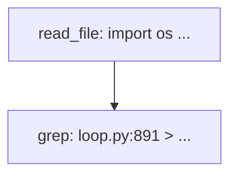

# Layered Memory

Layered Memory adds **structured short-term memory** for long agent tasks: tool outputs are indexed as **nodes**, summarized on a **Task canvas**, and recalled on demand with `read_memory_node`.

It complements — but does not replace — the existing memory stack described in [Memory](./memory.md):

| Layer | What it is | When it helps |
|-------|------------|---------------|
| **Session replay** | Live `session.messages` in the prompt | Recent turns and tool calls |
| **Consolidator / Dream** | `history.jsonl` → `SOUL.md` / `USER.md` / `MEMORY.md` | Durable facts and voice over days |
| **Layered Memory (LM1)** | Per-session `nodes.json` + `canvas.mmd` | Long SWE-style tasks with many large tool results |

**LM1 (shipped in this branch)** covers short-term offload only: Task Canvas, `node_id` registry, and `read_memory_node`.

**LM2+** (not yet in user docs scope) will add L0 capture, L1 atoms, recall injection, and search tools. See `.agent/layered-memory/design.md` for the full roadmap.

---

## Quick start

Layered Memory is **off by default**. Enable both the master switch and offload:

```json
{
  "agents": {
    "defaults": {
      "layeredMemory": {
        "enable": true,
        "offload": {
          "enable": true
        }
      }
    }
  }
}
```

Restart the gateway or CLI session after changing config.

Requirements for LM1 behavior:

- `layeredMemory.enable` **and** `layeredMemory.offload.enable` must be `true`.
- The agent must run tools (`read_file`, `grep`, `exec`, etc.). Pure chat turns do not create nodes.
- Subagents keep offload **disabled** by default (`layeredMemory.subagent.enableOffload: false`).

---

## What gets stored

### On disk

```text
{workspace}/.nanobot/canvas/{safe_session_key}/
  nodes.json      # node index (metadata only)
  canvas.mmd      # Mermaid task graph (rule-generated)

{workspace}/.nanobot/tool-results/{session_bucket}/{tool_call_id}.txt
                  # full tool output (only when output exceeds maxToolResultChars)
```

Session keys like `cli:direct` or `websocket:abc123` are sanitized for directory names by replacing `:` with `_` (for example `cli_direct`, `websocket_abc123`).

### Each node (`nodes.json`)

| Field | Meaning |
|-------|---------|
| `node_id` | Same as the tool call id (`tool_call_id`) |
| `tool` | Tool name (`read_file`, `grep`, …) |
| `path` | Relative path to spilled output, or `null` if under the persist threshold |
| `summary` | One-line rule-based summary (truncated; see `maxNodeSummaryChars`) |
| `chars` | Character count of the original tool output at registration time |
| `ts` | Unix timestamp of last update |

**Important:** A node is an **index card**, not a full copy of the tool result. The `summary` is capped (default 120 characters). Full text exists only when:

1. The output was spilled to `.nanobot/tool-results/…` (`path` is set), or
2. The content is still present in session replay (not yet microcompacted).

---

## How it works (LM1)

```text
Tool executes
    │
    ▼
runner._normalize_tool_result
    ensure_nonempty → maybe_persist (if > maxToolResultChars)
    → register_tool_result → nodes.json
    │
    ▼
LayeredMemoryHook.after_tools
    sync_tool_nodes (batch upsert) + optional canvas refresh
    │
    ▼
Next user message
    loop injects [Task canvas] + Mermaid + node index into runtime lines
    │
    ▼
Model calls read_memory_node(node_id) when it needs spilled full text
```

### Tool result persist (`maybe_persist`)

When a tool returns more characters than `agents.defaults.maxToolResultChars` (default `16000`), nanobot:

1. Writes the full output to `.nanobot/tool-results/…`
2. Replaces the in-prompt tool message with a short reference that includes `node_id: …`
3. Registers the node with a non-null `path`

Smaller outputs are still registered (for the canvas index) but `path` stays `null`. `read_memory_node` cannot load them; the model must rely on replay or call the original tool again.

### Task canvas injection

Before each turn, nanobot appends runtime lines similar to:

```text
[Task canvas]

Nodes: call_abc (grep), call_xyz (read_file)
```

The block is truncated to `offload.maxCanvasChars` (default `1500`). The model uses `node_id` values from the `Nodes:` line or from `[tool output persisted]` references.

### `read_memory_node`

Registered only when `layeredMemory.offload.enable` is true (core agent scope).

| Argument | Default | Description |
|----------|---------|-------------|
| `node_id` | required | Tool call id from the canvas or persist reference |
| `offset` | `1` | 1-based start line (same as `read_file`) |
| `limit` | `2000` | Max lines to return |

Behavior:

- Looks up `node_id` in the **current session's** `nodes.json`.
- If `path` is set, reads that file under the workspace (same boundary as `read_file`).
- If `path` is `null`, returns an error with the stored `summary`.

Direct `read_file` on a persist path and `read_memory_node` for the same spill file return equivalent content.

---

## Relationship to persist and Context Budget

### `maxToolResultChars`

Configured under `agents.defaults.maxToolResultChars`. This threshold controls **when** full tool output is written to disk and referenced in the prompt. Layered Memory reuses those spill files; `node_id` always equals `tool_call_id`.

Typical tuning for long coding tasks:

```json
{
  "agents": {
    "defaults": {
      "maxToolResultChars": 16000,
      "layeredMemory": {
        "enable": true,
        "offload": {
          "enable": true,
          "maxCanvasChars": 2000,
          "updateCanvasEveryNTools": 5
        }
      }
    }
  }
}
```

### Context Budget / tool-result filtering (CB2)

The layered-memory design reserves this order when tool-result filtering is enabled:

```text
filter (CB2) → persist → register node
```

Filtering shrinks what enters session replay; persist keeps oversized bodies on disk; nodes give the model a stable map (`node_id`) back to those bodies. Canvas injection adds **task structure** on top — it does not replace filtering or consolidation.

### Runner microcompact

The runner may replace old tool messages in replay with one-line placeholders such as `[read_file result omitted from context]`. That reduces prompt size but means:

- Nodes registered from compacted replay may carry degraded summaries.
- `read_memory_node` only helps when the original output was **spilled** (`path` non-null).

For auditability of raw tool trails, see [Auto Compact](./configuration.md#auto-compact) vs token-driven consolidation in `configuration.md`.

---

## Configuration reference (LM1)

All keys live under `agents.defaults.layeredMemory` (camelCase in JSON).

### Master switch

| Key | Default | Description |
|-----|---------|-------------|
| `enable` | `false` | Master switch for layered memory |

### Offload (LM1 — Task Canvas)

| Key | Default | Description |
|-----|---------|-------------|
| `offload.enable` | `false` | Node registry, canvas, runtime injection, `read_memory_node` |
| `offload.maxCanvasChars` | `1500` | Max characters injected for the canvas block |
| `offload.maxNodeSummaryChars` | `120` | Max characters per node summary in `nodes.json` |
| `offload.updateCanvasEveryNTools` | `0` | Regenerate `canvas.mmd` every N tools; `0` = only at turn end |

### Subagent defaults

| Key | Default | Description |
|-----|---------|-------------|
| `subagent.enableOffload` | `false` | Subagents do not pollute the main session canvas |
| `subagent.enableRecall` | `false` | LM2 recall (placeholder until LM2) |
| `subagent.enableCapture` | `false` | LM2 L0 capture (placeholder until LM2) |

LM2 keys (`capture`, `pipeline`, `recall`, `embedding`) exist in schema but are no-ops until LM2 is implemented. Do not enable them expecting behavior yet.

Full config tables: [Configuration — Layered Memory](./configuration.md#layered-memory).

---

## Inspecting on disk

After a session with several tool calls (CLI example `cli:direct`):

```bash
# Canvas directory (session key cli:direct → cli_direct)
ls ~/.nanobot/workspace/.nanobot/canvas/cli_direct/

# Node index
cat ~/.nanobot/workspace/.nanobot/canvas/cli_direct/nodes.json | head

# Mermaid graph
cat ~/.nanobot/workspace/.nanobot/canvas/cli_direct/canvas.mmd

# Spilled tool bodies (only when outputs exceeded maxToolResultChars)
ls ~/.nanobot/workspace/.nanobot/tool-results/
```

WebUI / WebSocket sessions use keys like `websocket:{chat_id}` → directory `websocket_{chat_id}`.

---

## Tuning tips (LM1)

| Scenario | Suggestion |
|----------|------------|
| Long repo exploration | `offload.enable: true`, keep `maxToolResultChars` at 8k–16k so large reads spill and `read_memory_node` works |
| Very chatty tool loops | `updateCanvasEveryNTools: 5` so `canvas.mmd` stays fresh mid-turn |
| Tight prompt budget | Lower `maxCanvasChars`; rely on `Nodes:` line if Mermaid is truncated |
| Subagent research tasks | Leave `subagent.enableOffload: false` unless you explicitly want a separate canvas |

---

## Boundaries

| Component | Layered Memory (LM1) | Existing memory |
|-----------|---------------------|-----------------|
| Writes | `nodes.json`, `canvas.mmd` | `sessions/*.jsonl`, `memory/history.jsonl`, `USER.md`, … |
| Reads in prompt | Task canvas runtime block | Session replay, bootstrap files, consolidator summaries |
| Search | `read_memory_node` only | Dream, `/dream-log`, grep on `history.jsonl` |
| Subagents | Off by default | Same session files unless isolated workspace |

---

## Further reading

- Design spec: `.agent/layered-memory/design.md`
- Implementation plan: `.agent/layered-memory/plan.md`
- Classic long-term memory: [Memory](./memory.md)
- All config keys: [Configuration](./configuration.md#layered-memory)
