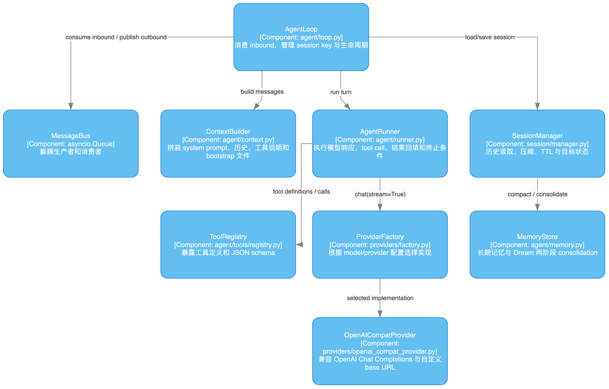
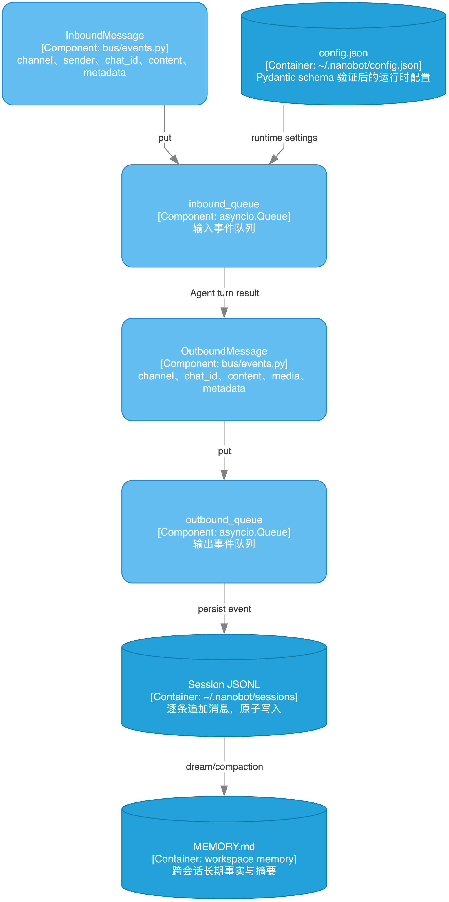

# nanobot 架构图集与源码导读

这份文档是正式学习八章课程前的“地图”。不要试图先读完所有文件；先用图建立边界，再沿着一条消息的调用链回到源码。

## 推荐展示方式

一张超级大图无法同时表达系统边界、运行时顺序、状态变化和安全约束。因此图集采用四种互补视角：

1. **结构视角**：C4 多页图回答“系统由什么组成、谁依赖谁”。
2. **时间视角**：时序图回答“一条消息在一次 turn 中按什么顺序流动”。
3. **控制视角**：流程图回答“模型响应、工具循环、重试和终止条件如何分支”。
4. **边界视角**：安全、部署、插件图回答“哪些东西在进程外、哪些地方可以扩展、哪里必须拦截”。

## 图集与阅读顺序

| 顺序 | 图 | 先回答的问题 | 主要源码证据 |
| --- | --- | --- | --- |
| 1 | [C4 多页架构图](diagrams/01-c4.html) | nanobot 与用户、模型、工具、渠道的系统边界是什么？ | `nanobot/cli/commands.py`、`nanobot/gateway/` |
| 2 | [主消息 Turn 时序图](diagrams/02-main-turn.drawio.png) | 一条消息如何从 Channel 走到模型，再回到 WebUI？ | `nanobot/bus/events.py`、`nanobot/bus/queue.py`、`nanobot/agent/loop.py` |
| 3 | [Agent Turn 控制流程](diagrams/03-agent-turn-flow.drawio.png) | tool call、重试、持久化和终止条件在哪里发生？ | `nanobot/agent/runner.py`、`nanobot/providers/base.py` |
| 4 | [Provider 路由与错误治理](diagrams/04-provider-routing.drawio.png) | 配置怎样选择 Provider，502/429 为什么会重试？ | `nanobot/providers/registry.py`、`factory.py`、`openai_compat_provider.py` |
| 5 | [工具与安全边界](diagrams/05-tools-security.drawio.png) | LLM 参数如何变成文件、Shell、HTTP 或 MCP 副作用？ | `nanobot/agent/tools/loader.py`、`registry.py`、`nanobot/security/` |
| 6 | [Session、Memory 与自动化](diagrams/06-memory-automation.drawio.png) | JSONL 历史怎样压缩成摘要并进入长期记忆？ | `nanobot/session/manager.py`、`nanobot/agent/memory.py`、`nanobot/templates/HEARTBEAT.md` |
| 7 | [WebUI / Gateway 部署拓扑](diagrams/07-webui-deployment.drawio.png) | Vite、WebSocket、API 和 gateway 的端口/进程关系是什么？ | `webui/vite.config.ts`、`nanobot/channels/websocket/`、`nanobot/api/server.py` |
| 8 | [插件与扩展架构](diagrams/08-plugin-extension.drawio.png) | Channel、Tool、Skill、MCP 怎样被发现并装载？ | `nanobot/channels/registry.py`、`nanobot/agent/tools/loader.py`、`nanobot/skills/` |
| 9 | [Python 包级依赖图](diagrams/09-module-packages.drawio.png) | 入口层、核心运行时、状态和边界适配的依赖方向是什么？ | `nanobot/` 一级子包与关键模块 |

每张图都有同名 `.drawio` 源文件；专题图旁边的 `.json` 是可重复生成的输入。`09-python-imports.json` 是完整的 354 模块机器分析结果，故意不直接展示，以免破坏可读性。

## C4 架构展开

### System Context


### Containers


### Agent Components



### Runtime Internals



## 一条消息的架构解释

### 1. 边界适配层产生事件

WebSocket 或任意聊天 Channel 把平台特有的 payload 转成 `InboundMessage`。事件只携带路由所需的 `channel`、`chat_id`、发送者和内容，不把 Telegram/Discord 的细节泄漏给 Agent 核心。`MessageBus` 用两个 `asyncio.Queue` 将生产者和消费者解耦。

### 2. AgentLoop 管理生命周期和会话

`AgentLoop` 消费输入事件，生成稳定的 session key，读取历史，调用 `ContextBuilder` 构造本轮消息，然后把控制权交给 `AgentRunner`。它负责“这一轮属于谁、何时保存、如何发布结果”，不负责具体的 HTTP 模型协议。

### 3. ContextBuilder 形成模型可见世界

上下文由 system prompt、workspace bootstrap 文件、会话历史、工具 JSON Schema 和本轮用户消息组成。这个边界很关键：工具实现可以很多，但模型只能看到注册后的名称、描述和参数契约；状态压缩也在进入 Provider 前完成。

### 4. AgentRunner 驱动有限循环

Runner 调用 Provider 并消费流式事件。如果响应包含 tool call，就通过 `ToolRegistry` 校验并执行，把 `tool` 消息追加回对话后继续请求；如果没有 tool call 且 `finish_reason` 表示结束，就产出最终文本。最大迭代次数和不可恢复异常是硬终止条件。

### 5. Provider 层隔离供应商差异

Factory 根据配置选择 OpenAI-compatible、Responses、Anthropic、Bedrock 等实现，BaseProvider 对外提供统一接口。429、5xx 和 timeout 属于 transient error，按退避策略重试；认证失败、请求 schema 错误等不可恢复错误直接返回上层。自定义 `OPENAI_BASE_URL` 只改变传输端点，不改变 AgentLoop 的职责。

### 6. 工具执行是最重要的信任边界

模型给出的参数先进入 registry，再经过 schema、workspace 路径、Shell sandbox、URL/SSRF 和 MCP allowlist 检查。工具可以触发文件、进程和网络副作用，但这些副作用不能绕过统一的安全入口；执行结果必须重新文本化为 `ToolResult` 回填模型。

### 7. 状态最终落到可恢复介质

Session 历史以 JSONL 追加保存，MemoryStore 管理长期记忆。达到 token/TTL/空闲阈值时，SessionManager 触发 compact；Dream 流程从历史提取稳定事实、合并到 `MEMORY.md`。Cron、heartbeat 和 long task 只是额外的事件生产者，最终仍回到同一条 MessageBus -> AgentLoop 链路。

## 如何打开与再生成

浏览器直接打开 [C4 交互查看器](diagrams/01-c4.html)，可以缩放、搜索节点并点击父级节点钻取到下一页。需要编辑时打开 `01-c4.drawio`；需要重新生成某张专题图，执行：

```bash
uv run python /Users/lijiaxin/codex-skills/skills/local/drawio-skill/scripts/autolayout.py \
  docs/nanobot-learning/diagrams/04-provider-routing.json \
  --tune -o docs/nanobot-learning/diagrams/04-provider-routing.drawio
```

生成或修改 `.drawio` 后先做结构检查：

```bash
python3 /Users/lijiaxin/codex-skills/skills/local/drawio-skill/scripts/validate.py \
  docs/nanobot-learning/diagrams/04-provider-routing.drawio --score
```

## 从图进入课程

看完 1-3 图后进入第 01-03 章，重点追踪 `commands.py -> gateway_runtime.py -> AgentLoop -> AgentRunner`。第 04-06 章分别对应 Provider、工具安全和状态治理；第 07-08 章再看 WebUI、插件、测试和部署。这样每章都有一张“导航图”和一条可以在本地断点调试的真实调用链。
