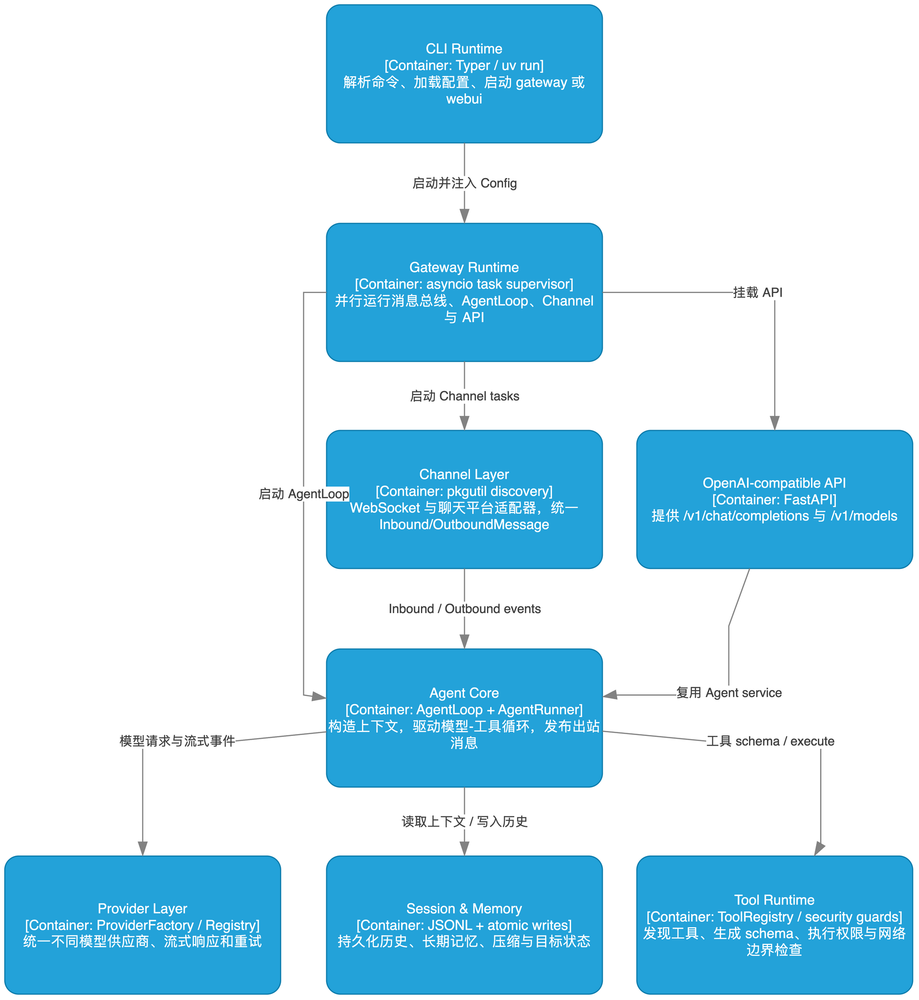

# 01 运行时与配置

## 学习目标

学完后，你能解释 `uv run --env-file .env nanobot webui` 如何变成一个加载了模型、工作区和 Channel 的进程，并能安全修改配置。

## 本章架构图



这张图从 `CLI Runtime` 开始读：配置进入 Gateway，再分别启动 Channel、Agent Core 和 API。第 01 章只追踪 `CLI Runtime -> Gateway Runtime -> Provider Layer` 这条配置路径。

## 概念全解

`uv` 负责项目环境和依赖，不污染系统 Python。`pyproject.toml` 的 `[project.scripts]` 把 `nanobot` 映射到 Typer 应用。CLI 只负责入口和生命周期；真正的业务配置由 Pydantic 模型承载。

配置有三层：

| 层 | 作用 | 证据 |
| --- | --- | --- |
| `Config` | 根配置、环境前缀、模型校验 | `nanobot/config/schema.py:430` |
| `agents.defaults` | 默认工作区、模型、温度、重试模式 | `schema.py:117` |
| `providers.<name>` | API Key、Base URL、API 类型和额外字段 | `schema.py:203` |

配置文件使用 camelCase 别名，环境变量引用使用 `${VAR}`。`loader.py` 会在运行前遍历配置；引用缺失时应该报配置错误，而不是悄悄调用错误的默认模型。`.env` 不是 nanobot 自动读取的文件，是 `uv run --env-file` 先加载后交给进程。

## 源码证据与完整路径

```text
uv run --env-file .env
  -> nanobot.cli.commands:app
  -> cli/webui.py
  -> config.loader.load_config()
  -> loader.resolve_config_env_vars()
  -> Config.resolve_preset()
  -> providers.factory.make_provider()
```

CLI 声明在 `nanobot/cli/commands.py`；Provider 匹配由 `Config._match_provider()` 完成。设计约束要求配置显式声明，自动匹配也必须能追踪回具体 Provider。

## 最小可运行示例

```bash
uv run --env-file .env python docs/nanobot-learning/examples/01_inspect_config.py
```

预期输出包含 `model=gpt-5.6-terra`、`provider=openai` 和工作区路径。

## 真实验证记录

已执行 `uv run --env-file .env nanobot status --config "$HOME/.nanobot/config.json"`，输出 Config、Workspace、Agent 均为可用；不会在 status 阶段调用模型。

## 常见误区与反例

1. 只设置 `AISUITE_MODEL` 就期待 nanobot 改模型。该变量属于另一套 SDK；nanobot 使用 `modelPresets` 和 `agents.defaults.modelPreset`。
2. 把真实 Key 直接写入 `config.json` 或提交 `.env`。配置引用应使用 `${OPENAI_API_KEY}`，`.env` 必须被忽略并限制权限。
3. 修改配置后不重启 Gateway。长进程已加载旧配置，必须重启。

## 扩展边界

项目外可学习 12-factor config、Pydantic Settings、Secret Manager 和配置热加载。不要先引入复杂配置中心；当前本地 JSON 加环境引用已覆盖主要需求。

## 检查题与改造练习

1. 追踪 `Config.resolve_preset()` 到 `make_provider()`，写出模型名和 Provider 名各自影响哪一步。
2. 将 `primary` 预设的 `temperature` 改为 0.2，运行 status 并说明为什么 status 不会验证模型行为。
3. 写一个测试：缺少 `${OPENAI_API_KEY}` 时，配置加载应返回明确错误。
