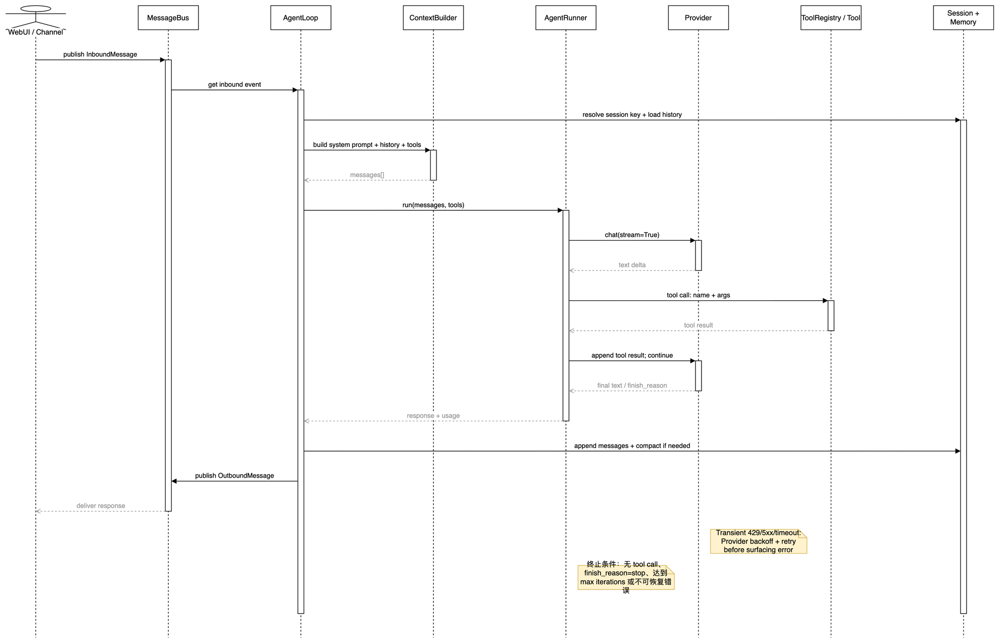

# 02 异步消息、Channel 与 Gateway

## 学习目标

学完后，你能解释 Channel 为什么不直接调用 Agent，以及 Gateway 如何同时托管 WebUI、聊天渠道、Heartbeat 和自动化。

## 本章架构图



先只看左半部分：`WebUI / Channel -> MessageBus -> AgentLoop` 是输入路径；最后两条箭头是 AgentLoop 发布 `OutboundMessage` 并由 Channel 回送的输出路径。第 03 章再展开中间的 ContextBuilder 和 AgentRunner。

## 概念全解

`InboundMessage` 和 `OutboundMessage` 是稳定的数据契约；`MessageBus` 用两条 `asyncio.Queue` 解耦生产者和消费者。Channel 只关心平台协议，AgentLoop 只关心统一消息。这个边界允许 Telegram、WebSocket 和 Email 共用 Agent 核心。

消息路径：

```text
Channel.receive -> publish_inbound -> AgentLoop.consume_inbound
AgentLoop -> publish_outbound -> Channel.send
```

`InboundMessage.session_key` 默认是 `channel:chat_id`，因此消息路由和 Session 隔离天然绑定。Gateway 负责启动/停止 ChannelManager、AgentLoop、Cron 和健康检查；前台模式适合学习，后台模式适合长期运行。

本项目没有 LangGraph 式的全局 state schema、reducer、条件边或 `Command` 图跳转。它选择了 dataclass 消息契约加显式 async 函数调用：路由条件藏在 `AgentLoop`、CommandRouter 和 Channel adapter 的普通 Python 控制流中。学习时不要硬套图工作流术语。

## 源码证据与完整路径

- 数据类型：`nanobot/bus/events.py:24`。
- 队列实现：`nanobot/bus/queue.py:8`。
- Channel 生命周期：`nanobot/channels/manager.py:79`、`start_all()` 和 `stop_all()`。
- Agent 消费入口：`nanobot/agent/loop.py:1134`、`_dispatch()`。

Gateway 不应该把 WebUI wire 细节塞进 AgentLoop；`.agent/design.md` 明确要求这些细节留在 Channel 或 `session/webui_turns.py`。

## 最小可运行示例

```bash
uv run --env-file .env python docs/nanobot-learning/examples/02_bus_roundtrip.py
```

示例会发布一条本地消息，再从 outbound 队列取出响应，证明队列本身不依赖网络。

## 真实验证记录

本地 `MessageBus` round-trip 已验证；`nanobot webui` 的完整 Gateway 依赖真实端口和浏览器，因此课程只记录 CLI help、WebUI build 和配置检查，不把一次构建冒充完整线上会话。

## 常见误区与反例

1. 在 Channel 里直接调用 Provider，结果每个平台都重复实现 Session、重试和工具循环。
2. 把 `chat_id` 当全局 Session Key，忽略 `channel` 前缀，会让不同平台的同名会话串线。
3. 把 WebSocket `_turn_end` 事件写进 AgentLoop，破坏核心与传输层边界。

## 扩展边界

高吞吐场景可把 `asyncio.Queue` 换成 Redis Streams 或 Kafka，但必须保留事件字段和幂等策略。先学本地队列背压、取消和任务生命周期，再考虑分布式队列。

## 检查题与改造练习

1. 给 `InboundMessage` 增加一个 `session_key_override` 的使用案例，并说明何时需要它。
2. 在示例中同时放入两个不同 Channel 的消息，验证 Session Key 不相同。
3. 阅读 `ChannelManager.start_all()`，列出启动失败时哪些 Channel 可以继续运行，哪些错误必须阻断。
