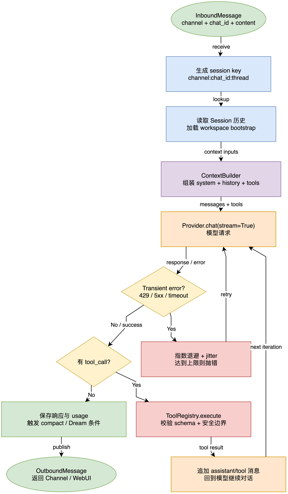

# 03 上下文、AgentLoop 与 AgentRunner

## 学习目标

学完后，你能区分“业务编排”和“模型工具循环”，并能追踪一次 Agent turn 的消息、上下文和状态变化。

## 本章架构图



图中纵向主干是一次正常 turn；右侧回路表示 transient error 的退避重试，工具分支则将执行结果追加回上下文并再次请求 Provider。这里的循环由 `AgentRunner` 驱动，Session 写入由 `AgentLoop` 协调。

## 概念全解

`ContextBuilder` 将身份模板、工作区引导文件、Memory、Skills 摘要、最近历史和当前用户消息组合成模型消息。它不负责调用模型。`AgentLoop` 负责 Session Key、命令路由、Hook、上下文构造和结果发布。`AgentRunner` 负责重复请求模型、解析 tool calls、执行工具、把 tool result 追加回消息，直到模型结束或达到迭代上限。

一次 turn 的状态变化：

| 阶段 | `messages` | 外部副作用 |
| --- | --- | --- |
| 初始 | system + history + user | 无 |
| 模型返回文本 | 追加 assistant | 流式事件 |
| 模型返回工具调用 | 追加 assistant tool call | 执行工具 |
| 工具完成 | 追加 tool result | 可能写文件/执行命令 |
| 终止 | 保存可见历史 | outbound 消息 |

## 源码证据与完整路径

```text
AgentLoop._process_message (loop.py:1404)
  -> ContextBuilder.build_messages (context.py:211)
  -> AgentRunner.run (runner.py:371)
  -> provider.chat_stream_with_retry / chat_with_retry
  -> ToolRegistry.execute
  -> AgentLoop 发布 OutboundMessage
```

`AgentRunner` 的设计注释明确要求它不携带产品层职责；核心路径因此保持小而稳定。工具执行错误由 `ToolResult.error()` 返回，并由 Runner 决定继续还是终止。

## 最小可运行示例

```bash
uv run --env-file .env python docs/nanobot-learning/examples/03_context_prompt.py
```

示例从临时工作区构造 system prompt，只打印角色列表、消息数量和 prompt 长度，不调用外部模型。

## 真实验证记录

已用当前 `.env` 配置执行短 Agent 请求；模型曾返回“连接成功”。由于上游网关偶发 Cloudflare 502，真实模型验证的可重复性受外部服务影响，不能把偶发成功当作稳定性保证。

## 常见误区与反例

1. 认为 system prompt 只是静态字符串。工作区文件、Skills 和历史会改变它，任何写入都可能污染后续 turn。
2. 让工具直接修改 `messages`。工具只返回结果，消息编排由 Runner 统一完成。
3. 把 `max_tool_iterations` 当 token 限制。它限制工具循环次数，token 上限来自模型预设和 Context Governance。

## 扩展边界

项目外可学习 LangGraph、状态机、ReAct、Plan-and-Execute 和结构化输出。nanobot 当前没有使用 LangGraph；先掌握现有显式 async loop，再对比框架抽象的收益和代价。

## 检查题与改造练习

1. 在 `ContextBuilder` 中定位工作区 `AGENTS.md` 的加载位置，说明为什么它会影响模型行为。
2. 给示例增加一条 history，观察它如何进入 system/user 消息。
3. 在 Runner 迭代结束条件旁添加一个只读计数日志，并写一个不会泄露消息正文的测试。
