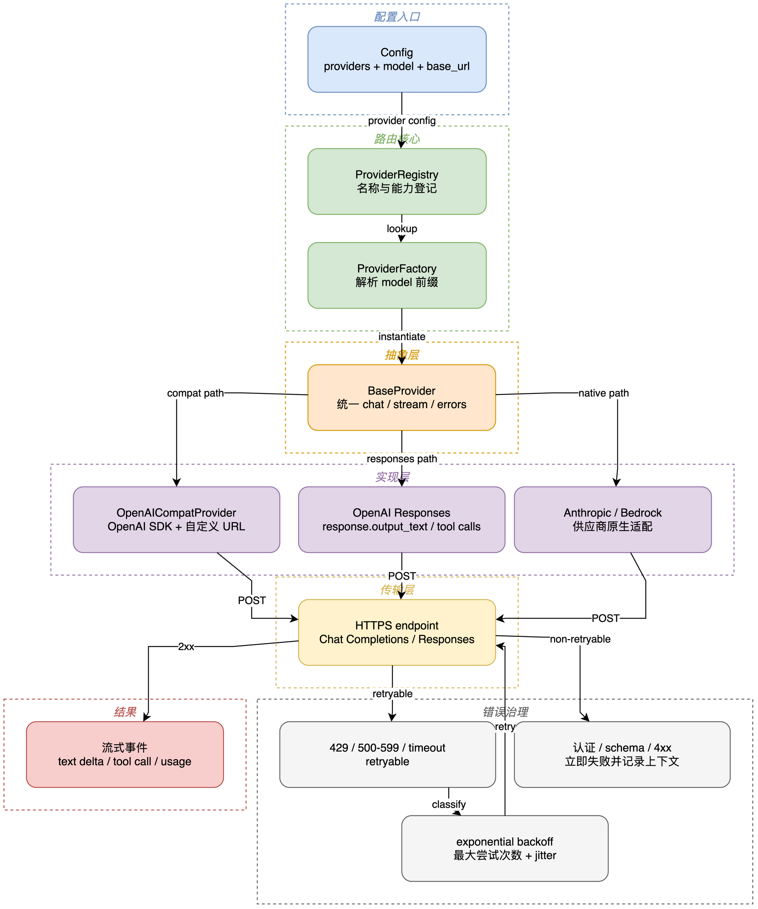

# 04 Provider、流式响应与重试

## 学习目标

学完后，你能从 Provider 工厂追踪到具体适配器，理解 Chat Completions/Responses 的边界，并判断 401、429、5xx 和超时为什么处理不同。

## 本章架构图



从左到右读配置解析、Registry/Factory 选择和具体协议适配；最右侧分出流式成功、可重试错误和不可重试错误。Cloudflare 502 位于 transient 分支，属于重试策略能处理但不能根治的上游故障。

可编辑源图：[04-provider-routing.drawio](diagrams/04-provider-routing.drawio)。这张图描述的是源码事实：nanobot 不训练、推理或托管模型权重；它把 Agent 内部数据翻译为厂商协议，并把厂商响应还原成统一对象。

## 问题 01：model 部分的代码是怎么工作的？

先建立一个边界：这里的“model 部分”不是一个模型实现，而是 **模型调用层**。真正的 GPT、Claude 或其他模型运行在远端服务；nanobot 负责配置选择、请求转换、流式接收、重试、工具循环和结果回填。

| 层 | 解决的问题 | 不负责什么 |
| --- | --- | --- |
| `ModelPresetConfig` | 决定模型名、`max_tokens`、温度、上下文窗口 | 不发 HTTP 请求 |
| `ProviderConfig` | 提供 API Key、Base URL、代理和供应商专属字段 | 不控制 Agent 循环 |
| Provider Factory | 根据配置选择适配器 | 不构造 Prompt，不执行工具 |
| `LLMProvider` | 统一 `chat`、stream、重试和 `LLMResponse` | 不理解具体聊天渠道 |
| `OpenAICompatProvider` | 将内部消息转换为 OpenAI-compatible 请求 | 不保存 Session，不执行本地工具 |
| `AgentRunner` | 根据模型返回的文本或 tool call 决定下一步 | 不直接知道 HTTP 协议细节 |

### 1. 配置如何变成具体 Provider

入口在 `AgentLoop.from_config()`：它调用 `make_provider(config)`，并把得到的 Provider 放进 Agent Runtime。工厂先解析当前 `modelPreset`，再通过 `config.get_provider_name()` 和 `config.get_provider()` 找到 Provider 配置，最后根据 Registry 中的 `backend` 创建具体实现。

```text
agents.defaults.modelPreset
  -> Config.resolve_preset()
  -> model + generation settings
  -> Config.get_provider_name()/get_provider()
  -> ProviderRegistry backend
  -> OpenAICompatProvider / AnthropicProvider / BedrockProvider / ...
```

源码映射：

| 图元素 | 源码 | 关键行为 |
| --- | --- | --- |
| Config | `config/schema.py` | 解析预设、Provider、环境变量引用 |
| ProviderFactory | `providers/factory.py:_resolve_provider_setup()` | 校验 Key、Base URL、backend 约束 |
| Adapter selection | `providers/factory.py:_make_provider_core()` | 选择 OpenAI-compatible、Anthropic、Bedrock 等类 |
| Runtime assembly | `agent/loop.py:AgentLoop.from_config()` | 创建 Provider 并注入 AgentLoop |

对当前这种“自定义 `OPENAI_BASE_URL` + OpenAI-compatible 模型”的配置，工厂通常选择 `OpenAICompatProvider`。`api_base` 并不是硬编码的 OpenAI 地址，而是从配置解析后传入适配器；因此同一个 AgentLoop 可以连接直连 OpenAI、兼容网关或本地兼容服务。

### 2. Agent 如何把内部消息交给模型

`AgentRunner` 持有的是 `LLMProvider` 抽象，而不是 `AsyncOpenAI`。它每轮从 ContextBuilder 得到 `messages`，从 ToolRegistry 得到 OpenAI function schema，再调用 Provider 的带重试接口。

```text
ContextBuilder
  -> messages: [{role, content}, ...]
ToolRegistry
  -> tools: [{type: "function", function: {...}}, ...]
AgentRunner
  -> provider.chat_stream_with_retry(...)
LLMProvider
  -> chat_stream(...) 或 chat(...)
OpenAICompatProvider
  -> AsyncOpenAI(base_url=..., api_key=...)
  -> /chat/completions 或 /responses
```

对应源码：`agent/runner.py` 在每次迭代中准备上下文和 `ProviderCallContext`，调用 `chat_stream_with_retry()`；`providers/base.py:LLMProvider.chat_stream_with_retry()` 统一管理 transient error 的退避与恢复；`providers/openai_compat_provider.py:OpenAICompatProvider._ensure_client()` 首次真正调用时才延迟创建 OpenAI SDK 客户端。

简化后的真实控制流如下。变量名和分支方向与源码一致，但省略了 Hook、usage 统计和 checkpoint 样板：

```python
# AgentLoop.from_config(...) 已把 make_provider(config) 的结果放入 spec.runtime.provider。
# 以下是 AgentRunner.run() 内的一轮抽象。

for iteration in range(max_tool_iterations):
    messages_for_model = context_governor.prepare_for_model(messages)
    response = await spec.runtime.provider.chat_stream_with_retry(
        messages=messages_for_model,
        tools=spec.tools.get_definitions(),
        model=spec.runtime.model,
        on_content_delta=emit_stream,
    )

    if response.should_execute_tools:
        messages.append(assistant_message_with_tool_calls(response))
        results, _, _ = await self._execute_tools(
            spec, response.tool_calls, external_lookup_counts,
            workspace_violation_counts, hook, context,
        )
        for tool_call, result in zip(response.tool_calls, results):
            messages.append({
                "role": "tool", "tool_call_id": tool_call.id,
                "name": tool_call.name, "content": normalize(result),
            })
        continue

    return response.content
```

关键点是：模型只收到 JSON 消息和工具 schema，不能直接读文件或执行命令；模型返回的 tool call 也只是数据。只有 Runner 将其交给 ToolRegistry 后，才可能发生本地副作用。

### 3. OpenAI-compatible 适配器到底做了什么

`OpenAICompatProvider` 的职责不是简单 `POST` 一次：它处理供应商差异后，才调用 OpenAI SDK。

1. `_ensure_client()` 懒加载 `openai.AsyncOpenAI`，使用配置中的 `api_key`、`base_url`、headers、query、timeout 和可选 proxy。
2. `_build_kwargs()` 清洗空消息和不兼容字段，选择 `max_tokens` 或 `max_completion_tokens`，并按模型能力决定是否发送 `temperature`、`reasoning_effort`、`tools` 与 `tool_choice`。
3. `chat()` / `chat_stream()` 决定调用 Chat Completions 还是 Responses API，解析普通响应或 SSE chunk，统一成 `LLMResponse` 和 `ToolCallRequest`。
4. 适配器捕获 SDK/HTTP 异常并转成内部错误响应；基类再按 429、5xx、连接错误、超时和 `Retry-After` 决定是否重试。

这也解释了为什么兼容网关会有协议差异：`_should_use_responses_api()` 对非直连 OpenAI 的 Base URL 默认保守，通常回落到 Chat Completions。若网关只部分兼容 Responses、工具流式或特定 GPT-5 字段，失败发生在 nanobot 之外的协议边界。

### 4. 模型响应如何重新进入 Agent

Provider 不直接把结果发给 WebUI。它返回统一的 `LLMResponse`，里面包含文本、`finish_reason`、usage、reasoning 内容和结构化 `tool_calls`。Runner 根据响应分两路：

| 模型响应 | Runner 行为 |
| --- | --- |
| 普通文本，且没有 tool call | 清理内容、结束本轮、交由 AgentLoop 发布 OutboundMessage |
| `tool_calls` | 追加 assistant tool-call message，执行 ToolRegistry，把 tool result 追加回消息，再请求模型 |
| `finish_reason=error` | 由 Provider 的错误/重试策略决定是否已耗尽；Runner 生成可见错误结果 |
| `finish_reason=length` | 追加 continuation prompt，在允许的恢复次数内继续生成 |

因此“模型调用”与“Agent 行为”之间的分界非常清晰：Provider 负责 **远端协议正确性**；Runner 负责 **对话和工具控制流正确性**。

### 5. 最小验证与阅读顺序

本节不需要实际调用模型。以下测试覆盖重试、Responses 解析与工具参数协议，已在本地通过 `154 passed`：

```bash
uv run --no-sync pytest \
  tests/providers/test_provider_retry.py \
  tests/providers/test_openai_responses.py \
  tests/providers/test_provider_tool_arguments.py -q
```

推荐按此顺序阅读，别一上来扎进两千行兼容逻辑：

1. `providers/factory.py:_resolve_provider_setup()` 和 `_make_provider_core()`，先弄清“选谁”。
2. `providers/base.py:LLMProvider.chat_stream_with_retry()`，再弄清“失败怎么办”。
3. `openai_compat_provider.py:_ensure_client()`、`_build_kwargs()`、`chat_stream()`，最后看“请求怎么变形”。
4. `agent/runner.py` 中 `response.should_execute_tools` 分支，确认“返回后怎么回到循环”。

常见误区：把 `OPENAI_BASE_URL` 当成模型本体；它只是 HTTP 端点。把 `ToolRegistry` 当成模型能力；它是模型请求的受控执行器。把 502 当成 Runner bug；若请求已出现在远端网关，优先检查网关与模型协议兼容性。

## 概念全解

Provider 层把外部模型协议归一成 `LLMResponse`。`ProviderConfig` 描述凭据和 endpoint；`registry.py` 描述能力；`factory.py` 根据 Config 选择实现。OpenAI 兼容 Provider 会构造请求、解析工具调用和流式 chunk；原生 Anthropic、Bedrock 等 Provider 保留自己的协议。

流式路径是：

```text
chat_stream()
  -> client.chat.completions.create(stream=True)
  -> chunk delta
  -> on_content_delta / on_tool_call_delta
  -> WebSocket 或 Channel 事件
```

`LLMProvider.is_transient_response()` 把 5xx、连接错误和部分 429 视作瞬态错误。默认退避是 1、2、4 秒；如果上游带 `Retry-After`，会优先使用它，所以日志里的 61 秒通常来自上游 60 秒提示加缓冲。

## 源码证据与完整路径

- 抽象 Provider：`nanobot/providers/base.py:504`、`base.py:780`。
- 重试判定：`base.py:531`、`base.py:541`。
- 重试等待：`base.py:1168`。
- OpenAI 兼容请求：`nanobot/providers/openai_compat_provider.py:1866`。
- Responses 自动选择：`openai_compat_provider.py:982`；通用网关不会强行当作直连 OpenAI。

## 最小可运行示例

```bash
uv run --env-file .env python docs/nanobot-learning/examples/04_retry_policy.py
```

它用真实的 `LLMResponse` 错误结构验证 502 会重试、401 不应按 5xx 规则处理。

## 真实验证记录

使用当前 `.env` 对 `gpt-5.6-terra` 发过短 Chat Completions 和 Responses 请求，均曾得到 HTTP 200。通过完整 Agent 请求时，`wawapii.com` 曾返回 Cloudflare `origin_bad_gateway` 502；这属于外部网关稳定性/兼容性风险，nanobot 的重试行为本身符合设计。

## 常见误区与反例

1. 看到 61 秒就认为 nanobot 卡死。实际上它在等待上游给出的 Retry-After。
2. 把所有 429 都无限重试。余额不足、账单关闭等 429 需要立即暴露给用户。
3. 把任意 OpenAI 兼容 endpoint 当作完整 OpenAI API。某些网关只支持 Chat Completions，不支持 Responses、工具流式或特定字段。

## 扩展边界

下一步可学习 Circuit Breaker、Fallback Provider、请求幂等、SSE 背压和 OpenTelemetry。先用 Provider 测试锁定 wire payload，再引入更复杂的可靠性组件。

## 检查题与改造练习

1. 追踪 `_should_use_responses_api()`，说明为什么通用网关默认回到 Chat Completions。
2. 为 `Retry-After: 10` 写一个测试，验证最终等待时间包含缓冲而不是固定 1 秒。
3. 为一个自定义 Provider 添加最小 `LLMResponse` 解析测试，禁止打印完整 API Key。
