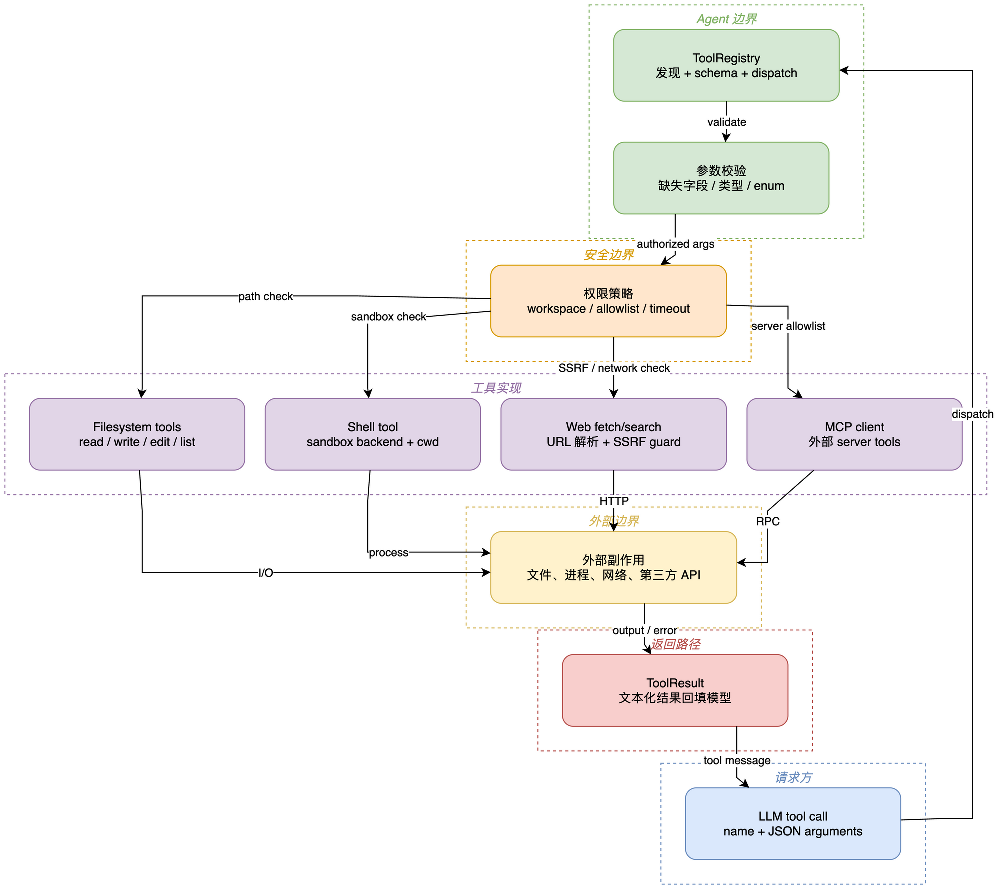

# 05 工具系统与安全边界

## 学习目标

学完后，你能新增一个最小工具、读懂 JSON Schema 工具调用协议，并解释工作区限制、命令沙箱和 SSRF 防护为什么必须在边界处实现。

## 本章架构图



从 `LLM tool call` 顺时针读：参数先经过 Registry 和 schema，再经过权限策略，最后才到文件、Shell、Web 或 MCP 实现。底部 `ToolResult` 把副作用结果收束回模型，不允许工具绕过这条返回路径。

## 概念全解

工具是模型可调用的能力，不是普通函数列表。每个 `Tool` 提供名称、描述、JSON Schema 和 async `execute()`；`ToolRegistry` 把它们转成 OpenAI function schema，并在执行前做参数转换和验证。`ToolLoader` 通过 `pkgutil` 和 entry point 自动发现内置/插件工具。

安全边界分三层：

1. 文件路径必须经过 workspace resolver，限制读写能力。
2. Shell 可以开启 `restrict_to_workspace`，但这不是进程级隔离；需要 bwrap 才有更强沙箱。
3. Web/MCP 请求必须经过 `security/network.py` 的 SSRF 检查，阻止私网、回环和云元数据地址。

## 源码证据与完整路径

```text
ToolLoader.load (agent/tools/loader.py:92)
  -> ToolRegistry.register()
  -> Tool.to_schema()
  -> 模型 tool_call
  -> ToolRegistry.prepare_call()
  -> cast_params / validate_params
  -> Tool.execute()
```

核心证据：`agent/tools/base.py`、`agent/tools/registry.py:8`、`loader.py:26`、`security/network.py`、`agent/tools/path_utils.py`。

## 最小可运行示例

```bash
uv run --env-file .env python docs/nanobot-learning/examples/05_tool_registry.py
```

示例注册一个只做加法的工具，打印其 schema 和执行结果，不接触文件、网络或 Shell。

## 真实验证记录

已从当前配置装配 AgentLoop，验证内置工具自动发现 20 个工具、schema 总大小约 25 KB。没有调用真实搜索、MCP 或 Shell 外部目标；这些能力受权限和外部副作用规则约束。

## 常见误区与反例

1. 只写 `execute()` 不写严格 schema，模型会产生无法验证的参数。
2. 在工具里直接 `requests.get()`，绕过共享 SSRF guard，可能访问内网或元数据服务。
3. 看到 `restrict_to_workspace` 就以为有容器隔离；它只是应用层检查，不能替代 bwrap。

## 扩展边界

项目外可学习 JSON Schema、能力型权限、容器运行时、OPA 和 MCP tool/resource/prompt 三类能力。先复用现有 ToolLoader，再考虑插件市场和远程执行器。

## 检查题与改造练习

1. 修改示例，让负数参数返回 `ToolResult.error()`，并验证错误不会抛到队列外。
2. 追踪 `path_utils.py` 的 containment check，解释符号链接为什么需要额外处理。
3. 为一个只读 Web 工具设计 SSRF 测试：回环、RFC1918 和公网地址各应得到什么结果？
