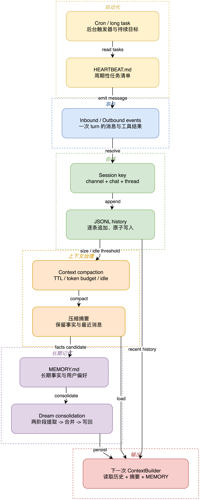

# 06 Session、Memory、压缩与自动化

## 学习目标

学完后，你能解释历史为什么按 Session 隔离、Memory 为什么使用 JSONL 和原子写入，以及 Dream、Cron、长任务和子 Agent 如何复用同一个运行时。

## 本章架构图



从顶部事件向下追踪 Session Key、JSONL、压缩摘要和长期记忆；左侧 Cron/Heartbeat 不是独立核心，而是重新向同一事件入口投递内部 turn。

## 概念全解

Session 保存某个 `channel:chat_id` 的可见对话和元数据；MemoryStore 保存跨 turn 的长期记忆、`history.jsonl` 和 Dream 游标。上下文治理在发送模型前限制最近历史、工具结果和 token 预算，必要时压缩，而不是无限把历史塞进 Prompt。

自动化不是另一个 Agent 核心：Cron 产生一个带 session key 的内部 turn，Gateway 负责投递；Dream 是定期的两阶段记忆整理；长期目标和子 Agent 通过工具注册到同一 Runner 能力面。

## 源码证据与完整路径

- `MemoryStore`：`nanobot/agent/memory.py:73`。
- JSONL 追加和游标：`memory.py:280`。
- 压缩：`memory.py:442`、`memory.py:1157`。
- Session：`nanobot/session/manager.py:981`。
- AgentLoop 的 compact turn：`agent/loop.py:1622`。
- Cron/目标/子 Agent 工具：`agent/tools/cron.py`、`long_task.py`、`spawn.py`。

## 最小可运行示例

```bash
uv run --env-file .env python docs/nanobot-learning/examples/06_memory_store.py
```

示例在临时目录写入一条 session history，再重新读取文件，验证持久化不依赖 Gateway。

## 真实验证记录

已通过 `onboard` 创建真实工作区模板和 `history.jsonl`；本课程示例使用临时目录，避免污染用户的长期记忆。没有启动长时间 Dream 或 Cron，因为那会产生持续外部模型调用。

## 常见误区与反例

1. 把 Memory 当作完整聊天记录。Memory 是长期上下文；Session 才负责某个会话的可见历史。
2. 用普通 `open(..., "w")` 重写 history。项目使用临时文件、fsync 和 rename，避免崩溃时丢失或写坏记录。
3. 认为 compact 只删旧消息。它还要保持 tool call/result 配对、游标和可恢复状态。

## 扩展边界

下一步可对比 Redis、SQLite、Postgres checkpoint、向量数据库和事件溯源。先掌握当前文件协议和恢复不变量，再替换存储后端。

## 检查题与改造练习

1. 给 history 追加两个不同 session key，验证读取时的隔离。
2. 找到压缩入口，说明为什么工具结果比普通文本更容易破坏消息配对。
3. 设计一个 Cron 任务的幂等 key，保证 Gateway 重启后不会重复执行有副作用的操作。
