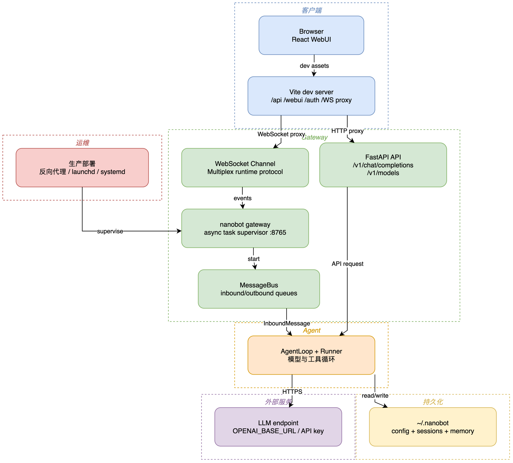
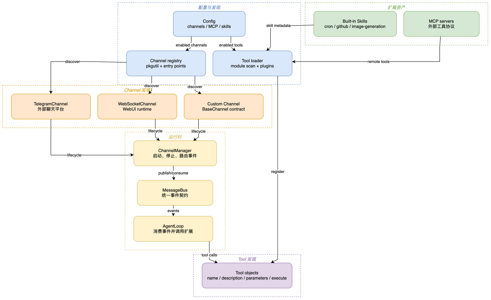

# 07 WebUI、OpenAI API 与插件边界

## 学习目标

学完后，你能区分 WebUI 开发服务器、Gateway、WebSocket Channel 和 OpenAI-compatible API，并知道如何添加 Channel/Tool 插件而不侵入核心。

## 本章架构图





第一张图区分浏览器、Vite、Gateway、API 和持久化边界；第二张图解释 Channel、Tool、Skill 和 MCP 如何通过 registry/loader 汇入同一 MessageBus 与 AgentLoop。

## 概念全解

WebUI 是 React/Vite SPA；开发时 Vite 代理 `/api`、`/webui`、`/auth` 和 WebSocket 到 Gateway，生产构建写入 `nanobot/web/dist`。浏览器通过 WebSocket 多路复用聊天、状态、工具活动和会话事件。

`nanobot serve` 是给程序调用的 OpenAI-compatible HTTP API；它不是 WebUI Gateway，也不会自动替代聊天 Channel。Channel 插件则由 `channels/registry.py` 和 `pkgutil` 发现，Manifest 描述配置和 WebUI 元数据。

默认可观测性是 Loguru 日志、Gateway 状态和 WebUI runtime events。`langfuse` 在 `pyproject.toml` 中是可选依赖，不应假设所有部署都有分布式 tracing、指标平台或生产告警。

## 源码证据与完整路径

```text
React App.tsx
  -> lib/nanobot-client.ts
  -> websocket channel runtime.py:362
  -> MessageBus
```

其它证据：`nanobot/api/server.py`、`nanobot/cli/commands.py:serve`、`nanobot/channels/registry.py`、`webui/vite.config.ts`、`webui/src/lib/nanobot-client.ts:156`。

## 最小可运行示例

```bash
uv run --env-file .env python docs/nanobot-learning/examples/07_plugin_contract.py
```

示例只读取已发现的 Channel 插件名称和 websocket Manifest，不启动网络服务。

开发前端：

```bash
cd webui
npm run dev
```

## 真实验证记录

`npm ci` 和 `npm run build` 已成功。WebUI 的完整浏览器交互未用 Playwright 在本课程中重复执行；Gateway/WebSocket 端到端测试由 `tests/channels` 和 `tests/gateway` 覆盖。

## 常见误区与反例

1. 把 Vite dev server 当成 Agent 进程；它只服务前端并代理请求，Gateway 仍必须运行。
2. 直接在 `webui/src` 写平台特定逻辑，绕过 Channel Plugin Registry，导致每个平台构建耦合。
3. 把内部 `_turn_end` 字符串散落在 AgentLoop；wire 事件应该由 WebUI coordinator 或 Channel adapter 负责。

## 扩展边界

项目外可学习 SSE、WebSocket multiplex、OpenAPI、消息代理和前端状态机。先读现有事件 envelope 和 reconnect 测试，再做协议演进。

## 检查题与改造练习

1. 找到 WebUI 发送一条 chat turn 的 envelope，画出 request id、chat id 和 turn id 的关系。
2. 阅读 `nanobot serve` 的 API key 校验，说明为什么非 loopback host 必须设置认证。
3. 新增一个假的 Channel Manifest（不接平台），让 registry 发现它并写一个 validation 测试。
