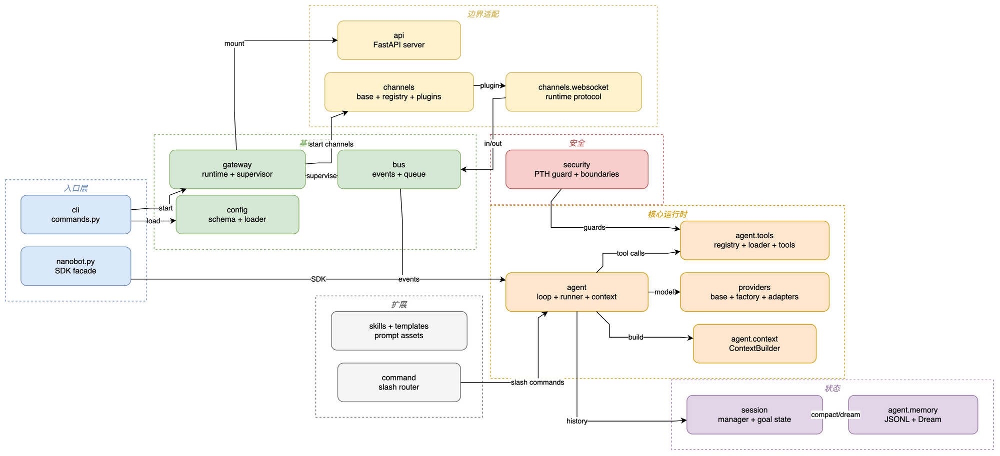

# 08 测试、部署与综合案例

## 学习目标

学完后，你能用项目自己的测试习惯保护边界，选择前台/后台 Gateway 部署方式，并把前七章的机制串成一个可调试流程。

## 本章架构图



这张图是从完整 import 图裁剪出的可读版本。测试和部署时优先沿箭头寻找边界：入口层启动基础设施，基础设施把事件交给核心运行时，状态与边界适配保持在核心之外。

## 概念全解

测试按边界组织：`tests/config` 锁定 schema 和环境展开，`tests/providers` 锁定 wire payload 和错误策略，`tests/security` 锁定路径/SSRF，`tests/gateway` 和 WebSocket 测试锁定生命周期与协议。`pyproject.toml` 要求 asyncio pytest、ruff 和 strict basedpyright。

部署选择：

| 方式 | 用途 |
| --- | --- |
| `nanobot agent` | 单次/终端调试，不托管 Channel |
| `nanobot webui` | 本地浏览器工作台，同时启动 Gateway |
| `nanobot gateway` | 长期运行、聊天平台、Cron、Dream |
| `--background`/service | 关闭终端后继续运行 |

## 源码证据与完整路径

综合流程：

```text
InboundMessage
 -> MessageBus
 -> AgentLoop._process_message
 -> ContextBuilder.build_messages
 -> AgentRunner
 -> ToolRegistry
 -> MemoryStore / OutboundMessage
```

测试入口见 `pyproject.toml:175`，部署说明见 `docs/deployment.md` 和 `docs/cli-reference.md`。核心修改应遵守 `.agent/design.md`：优先在 Channel、Tool、Skill、MCP 边缘扩展，尽量不改 loop/runner。

## 最小可运行示例

```bash
uv run --env-file .env python docs/nanobot-learning/examples/08_project_smoke.py
uv run --env-file .env python docs/nanobot-learning/examples/09_composite_flow.py
uv run --no-sync pytest tests/config/test_model_presets.py tests/providers/test_provider_retry.py -q
```

## 真实验证记录

已完成依赖同步、WebUI 构建、CLI 导入、配置 status 和最小模型调用。完整测试套件、所有聊天平台和生产服务没有在课程中全部执行；它们需要更长时间、平台凭据或外部服务。

## 综合案例：本地摘要工具

1. Channel 把用户的“总结这段文本”发布为 `InboundMessage`。
2. AgentLoop 用 `session_key` 取历史并由 ContextBuilder 形成 Prompt。
3. Runner 给模型绑定只读 `summarize_text` 工具；工具参数由 JSON Schema 验证。
4. 模型返回结果后，MemoryStore 只追加摘要和 session cursor。
5. AgentLoop 发布 `OutboundMessage`；WebSocket Channel 将它转换成 WebUI 事件。
6. 测试分别验证 schema、工具错误、history 原子写入和 WebSocket envelope。

`examples/09_composite_flow.py` 是可运行版本。它故意不调用真实模型、不写真实工作区、不访问网络；真实项目只需把局部编排替换成已经存在的 AgentLoop/Runner 和 Provider。

## 常见误区与反例

1. 只跑单元测试就宣布 Gateway 可部署；生命周期、端口和外部 Channel 仍需要集成验证。
2. 为修一个 Provider 502 去重写 AgentLoop；应先锁定 wire payload 和上游兼容性。
3. 生产环境直接暴露 `0.0.0.0` 而不设置 API key 或 WebSocket token。

## 扩展边界

继续学习 service manager、Docker、Kubernetes、指标/Tracing、评测集和回归成本控制。部署前先把 Provider、配置和安全测试跑稳。

## 检查题与改造练习

1. 为综合流程画一张时序图，标出每个 async await 和持久化点。
2. 写一个测试模拟 Provider 502，验证重试后错误仍能形成用户可见的 outbound 事件。
3. 选择前台、后台或 LaunchAgent 部署，说明你的选择对日志、重启和密钥加载的影响。
