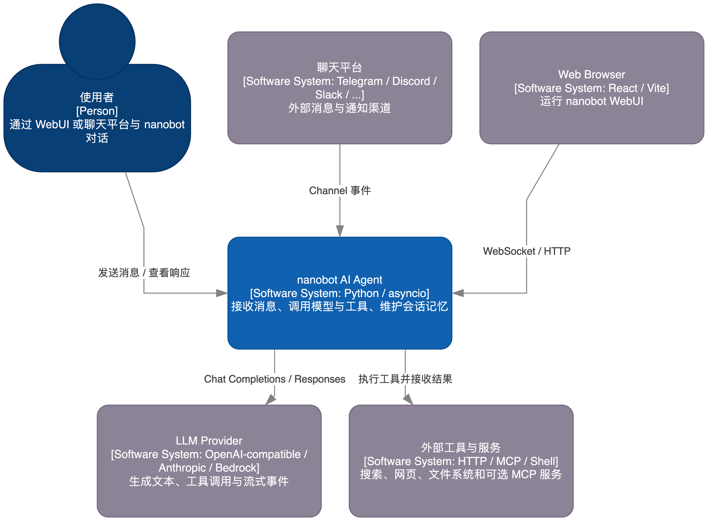

# nanobot 项目深度学习课程

## 课程目标

本课程把当前仓库当作真实案例，目标是能够：

- 从 CLI 启动 nanobot，并解释配置如何解析到 Provider。
- 追踪一条消息从 Channel、MessageBus、AgentLoop、AgentRunner 到模型和工具的完整路径。
- 理解工具注册、安全边界、Session、Memory、压缩、Gateway 和 WebUI 的职责边界。
- 能够用测试和最小实验修改一个 Provider、工具或 Channel。

## 先看架构图

正式学习前先阅读 [00-architecture-map.md](00-architecture-map.md)。它把整体架构拆成 C4 结构、主链路时序、Agent Turn 控制流、Provider 错误治理、工具安全、状态自动化、WebUI 部署、插件扩展和 Python 包依赖九张图；每张图都对应源码文件和后续课程章节。



权威源码范围：`nanobot/`、`webui/`、`tests/`、`pyproject.toml` 及 `.agent/` 约束文件。`graphify-out/` 是诊断缓存，不属于课程源码。

## 前置条件

当前环境已验证：Python 由 `uv` 管理，项目环境为 CPython 3.13.9；nanobot 0.3.0；Python 和 WebUI 依赖已经安装。模型配置位于 `~/.nanobot/config.json`，密钥通过项目根目录 `.env` 注入。不要把 `.env` 内容复制到代码、日志或 Git。

启动命令：

```bash
cd /Users/lijiaxin/PyCharmMiscProject/research/nanobot
uv run --env-file .env nanobot webui --config "$HOME/.nanobot/config.json"
```

## 章节

| 章节 | 学习目标 |
| --- | --- |
| 01 运行时与配置 | 看懂 `uv`、Typer CLI、Pydantic 配置和环境变量展开 |
| 02 异步消息与 Gateway | 看懂 Channel、MessageBus、AgentLoop 的解耦方式 |
| 03 上下文与 AgentRunner | 看懂 system prompt、会话消息、工具循环和终止条件 |
| 04 Provider、流式与重试 | 看懂 Provider 工厂、OpenAI 兼容层、流式事件和 5xx 重试 |
| 05 工具系统与安全 | 看懂 JSON Schema 工具协议、自动发现、工作区和 SSRF 边界 |
| 06 Session、Memory 与自动化 | 看懂持久化、上下文压缩、Dream、Cron、目标和子 Agent |
| 07 WebUI、API 与插件边界 | 看懂 WebSocket 多路复用、OpenAI API、Channel 插件发现 |
| 08 测试、部署与综合案例 | 用测试保护边界，并把各模块串成一个可维护流程 |

## 覆盖矩阵

| 知识点 | 源码证据 | 课程章节 | 真实验证 | 项目外扩展 | 状态 |
| --- | --- | --- | --- | --- | --- |
| 入口、配置、状态 | `cli/commands.py`、`config/schema.py`、`config/loader.py` | 01 | `nanobot status` 已完成 | 12-factor 配置、Secrets Manager | 真实验证完成 |
| 消息类型与异步队列 | `bus/events.py`、`bus/queue.py` | 02 | 本地队列示例 | Kafka、Redis Streams | 真实验证完成 |
| 状态图、reducer、条件边 | 源码未使用；以 dataclass 消息和显式 async loop 编排 | 02-03 | 静态核对 | LangGraph、Temporal | 不适用 |
| 路由与生命周期 | `agent/loop.py`、`gateway_runtime.py` | 02-03 | CLI Agent 已完成 | 工作流引擎、Supervisor | 真实验证完成 |
| 上下文与提示词 | `agent/context.py`、`templates/` | 03 | 本地上下文构造 | RAG、结构化 Prompt | 真实验证完成 |
| 模型、工具调用、重试 | `providers/base.py`、`openai_compat_provider.py` | 04 | 实际模型请求；上游 502 已记录 | Circuit Breaker、Fallback | 真实验证完成 |
| 工具绑定与权限 | `agent/tools/loader.py`、`security/` | 05 | ToolRegistry 本地验证 | 容器沙箱、OPA | 真实验证完成 |
| Session、Memory、压缩 | `session/manager.py`、`agent/memory.py` | 06 | 文件持久化本地验证 | Redis/SQL 检查点 | 真实验证完成 |
| 搜索、MCP、外部副作用 | `agent/tools/web.py`、`agent/tools/mcp.py` | 05-06 | 未调用真实搜索/MCP | MCP OAuth、审计账本 | 受外部条件阻塞 |
| WebUI、API、插件 | `channels/websocket/`、`api/`、`channels/registry.py` | 07 | WebUI 构建完成 | 独立前端、消息代理 | 真实验证完成 |
| 可观测性与 tracing | `loguru` 日志、WebUI runtime events；Langfuse 为可选 extra | 04、07 | 日志与构建验证 | OpenTelemetry、Langfuse | 受外部条件阻塞 |
| 测试与部署 | `tests/`、`gateway/`、`docs/deployment.md` | 08 | 依赖安装、构建、导入检查 | Kubernetes、Tracing | 真实验证完成 |

## 统一验证命令

```bash
uv run --env-file .env python docs/nanobot-learning/examples/01_inspect_config.py
uv run --env-file .env python docs/nanobot-learning/examples/02_bus_roundtrip.py
uv run --env-file .env python docs/nanobot-learning/examples/03_context_prompt.py
uv run --env-file .env python docs/nanobot-learning/examples/04_retry_policy.py
uv run --env-file .env python docs/nanobot-learning/examples/05_tool_registry.py
uv run --env-file .env python docs/nanobot-learning/examples/06_memory_store.py
uv run --env-file .env python docs/nanobot-learning/examples/07_plugin_contract.py
uv run --env-file .env python docs/nanobot-learning/examples/08_project_smoke.py
uv run --env-file .env python docs/nanobot-learning/examples/09_composite_flow.py
```

## 真实验证记录

- `uv sync --all-extras --dev`：成功，Python 依赖进入 `.venv`。
- `cd webui && npm ci && npm run build`：成功，产物写入 `nanobot/web/dist`。
- `uv run --env-file .env nanobot status`：配置和 Provider 可解析。
- `uv run --env-file .env nanobot agent -m "只回复：连接成功"`：曾成功返回；同一网关也曾对完整 Agent 请求返回 Cloudflare 502，说明外部源站稳定性/兼容性仍有风险。

## 综合案例

第 08 章会实现一个本地“消息进入 -> 构造上下文 -> 注册工具 -> 记录记忆 -> 产生出站事件”的小流程。它保留真实项目的边界，但不发起外部模型请求，适合反复调试。接通模型时，只需把 Runner 的 Provider 替换为当前配置并限制 `max_tokens`。

## 差距清单

已真实验证：配置解析、CLI、模型最小请求、工具装载、WebUI 构建、消息队列和本地持久化。

仅本地验证：完整 Gateway 生命周期、所有 Channel、MCP 连接、搜索工具、Dream 长时间压缩和生产部署。

未覆盖：多实例远程部署、真实聊天平台凭据、付费搜索/图片/语音服务、Langfuse 观测、Kubernetes 运维。

项目外路线：先学 asyncio 和 Pydantic，再学 OpenAI tool calling 与 SSE，最后看 MCP、队列系统和分布式检查点。
