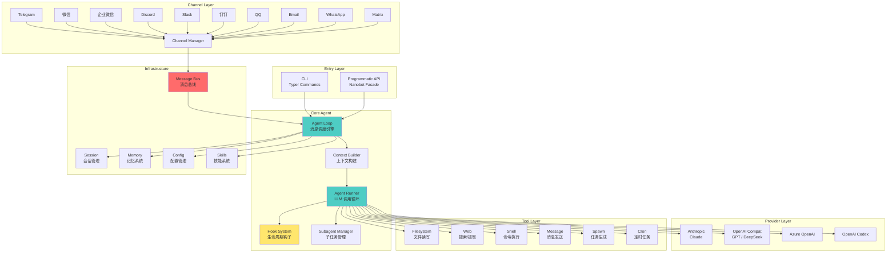
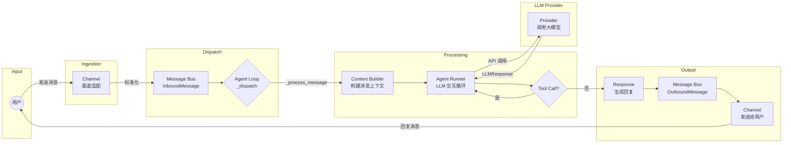
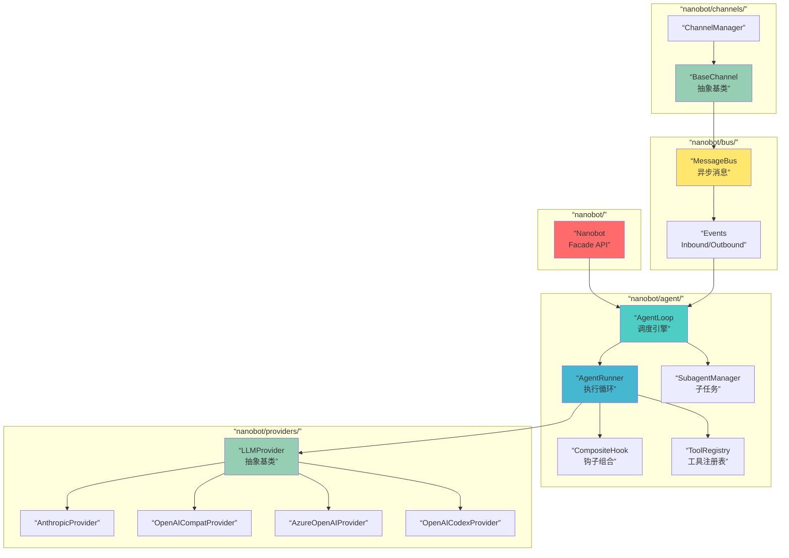

# 项目结构

这份文档用于快速理解 `nanobot` 仓库的目录、入口、模块职责和主要数据流。

## 项目定位

`nanobot` 是一个轻量的个人 AI 助手框架，当前仓库以 Python CLI、消息总线、渠道适配器和 LLM provider 为核心。

## 目录结构

```text
.
├── .github/              # CI 工作流
├── bridge/               # WhatsApp bridge / Node 侧桥接代码
├── case/                 # 演示动图与素材
├── docs/                 # 文档
├── nanobot/              # Python 源码
│   ├── agent/            # 核心 agent 循环、工具、记忆、子任务
│   ├── bus/              # 消息总线
│   ├── channels/         # 各聊天平台适配器
│   ├── cli/              # 命令行入口
│   ├── config/           # 配置 schema、加载、路径
│   ├── cron/             # 定时任务
│   ├── heartbeat/        # 心跳与周期性任务
│   ├── providers/        # LLM provider 适配器
│   ├── session/          # 会话管理
│   ├── skills/           # 内置技能
│   ├── templates/        # workspace 模板
│   └── utils/            # 辅助工具
├── tests/                # 测试
├── Dockerfile
├── docker-compose.yml
├── pyproject.toml
└── README.md
```

## 启动入口

- `nanobot onboard`: 初始化 `~/.nanobot/config.json` 和 `~/.nanobot/workspace`
- `nanobot agent`: 启动本地 CLI 对话
- `nanobot gateway`: 启动网关，把渠道接入到 agent
- `nanobot status`: 查看配置与工作区状态
- `nanobot provider login openai-codex`: Codex OAuth 登录

这些入口都定义在 `nanobot/cli/commands.py` 中。

## 核心模块及职责

- `nanobot/cli/commands.py`: 所有 CLI 命令入口与交互流程
- `nanobot/config/schema.py`: 配置结构、默认值、校验规则
- `nanobot/config/loader.py`: 配置加载、保存、迁移
- `nanobot/agent/loop.py`: 代理主循环，负责消息、工具和 provider 的协作
- `nanobot/providers/`: 不同模型提供方的适配器，包括 Codex
- `nanobot/channels/`: Telegram、Slack、Feishu、WhatsApp、MoChat 等渠道适配
- `nanobot/bus/`: 内部消息路由
- `nanobot/session/`: 会话与上下文持久化
- `nanobot/cron/`: 定时任务调度
- `nanobot/heartbeat/`: 周期性唤醒与任务执行
- `nanobot/skills/`: 随仓库分发的内置技能
- `nanobot/templates/`: 初始化 workspace 时写入的模板文件

## 主要调用关系 / 请求流 / 数据流

```text
用户输入 / 外部平台消息
        |
        v
nanobot agent / nanobot gateway
        |
        +--> config.loader -> Config
        +--> session / workspace
        +--> AgentLoop
        |       |
        |       +--> provider
        |       +--> tools (web / exec / mcp / cron / filesystem / spawn)
        |       +--> bus
        |
        +--> gateway 模式下：
              ChannelManager -> 各 channels -> bus -> AgentLoop -> outbound -> channels
```

```text
nanobot onboard
   |
   +--> ~/.nanobot/config.json
   +--> ~/.nanobot/workspace
   +--> 同步 workspace templates
```

## Mermaid 架构图

以下三张图用 Mermaid 语法绘制，可在支持 Mermaid 渲染的 Markdown 查看器中直接查看。

### 系统架构图（System Architecture）



### 数据流图（Data Flow）



### 核心模块关系图（Component）



### 图说明

| 图 | 侧重点 |
|---|--------|
| **系统架构图** | 完整模块分层——入口层、渠道层、核心 Agent、Provider、工具、基础设施 |
| **数据流图** | 一条消息从用户发出到收到回复的完整流转路径 |
| **核心模块关系图** | 关键类之间的依赖和继承关系 |

## 行为控制层

这一层不直接实现业务功能，但会决定 nanobot 在运行时”应该怎么想、怎么说、怎么用工具、怎么记忆、怎么做周期任务”。

### 会影响 agent 行为的 md

| 文件 | 作用 |
| --- | --- |
| `nanobot/templates/SOUL.md` | 人设、价值观、表达风格 |
| `nanobot/templates/USER.md` | 用户画像与偏好 |
| `nanobot/templates/TOOLS.md` | 工具使用边界与限制 |
| `nanobot/templates/AGENTS.md` | 提醒与周期任务规则 |
| `nanobot/templates/HEARTBEAT.md` | 周期任务内容，heartbeat 会定期读取 |
| `nanobot/templates/memory/MEMORY.md` | 长期记忆 |
| `nanobot/skills/README.md` 与 `nanobot/skills/*/SKILL.md` | 可扩展技能说明 |

### 图 A：仓库自带的运行时文件

```text
nanobot/
├── templates/
│   ├── AGENTS.md
│   ├── SOUL.md
│   ├── USER.md
│   ├── TOOLS.md
│   ├── HEARTBEAT.md
│   └── memory/MEMORY.md
├── skills/*/SKILL.md
└── utils/helpers.py: sync_workspace_templates()
          |
          v
workspace/
├── AGENTS.md
├── SOUL.md
├── USER.md
├── TOOLS.md
├── HEARTBEAT.md
├── memory/MEMORY.md
├── memory/HISTORY.md
└── skills/
```

### 图 1：md 文件如何进入 prompt

```text
workspace/
├── AGENTS.md
├── SOUL.md
├── USER.md
├── TOOLS.md
├── memory/MEMORY.md
└── skills/*/SKILL.md
          |
          v
ContextBuilder.build_system_prompt()
          |
   ┌──────┼────────────────────────────────────┐
   │      │                                    │
   v      v                                    v
bootstrap  MemoryStore.get_memory_context()  SkillsLoader
files      -> MEMORY.md                        -> always skills
AGENTS     -> HISTORY.md                       -> skills summary
SOUL       -> long-term memory
USER
TOOLS
          |
          v
AgentLoop / LLM
```

### 说明

- `sync_workspace_templates()` 会把仓库自带的模板同步到 workspace，运行时主要读取 workspace 里的文件。
- `ContextBuilder` 会把 bootstrap 文件、memory 和技能摘要拼进 system prompt。
- `MemoryStore` 负责把重要信息落到 `MEMORY.md` 和 `HISTORY.md`。
- `SkillsLoader` 负责加载内置和 workspace 里的 `SKILL.md`。
- `HeartbeatService` 会定期读取 `HEARTBEAT.md`，决定是否执行周期任务。

### 图 2：主 agent 如何 spawn 子 agent

```text
用户消息
   |
   v
AgentLoop
   |
   | 解析消息并进入工具调用阶段
   v
SpawnTool(manager=self.subagents)
   |
   | 模型选择 spawn
   v
SubagentManager.spawn()
   |
   | 创建后台任务
   v
_run_subagent()
   |
   | 子 agent 使用更小的工具集
   | - read/write/edit/list
   | - exec
   | - web_search/web_fetch
   | - 不带 message tool
   | - 不带 spawn tool
   v
provider.chat_with_retry() + tool loop
   |
   v
任务完成 / 失败
   |
   v
_announce_result()
   |
   | sender_id = "subagent"
   v
MessageBus.inbound
   |
   v
AgentLoop.run()
   |
   | 识别 subagent 结果并继续整理
   v
返回给用户
```

- 子 agent 是后台任务，不是独立的常驻入口。
- 子 agent 的结果会通过 `sender_id="subagent"` 回到主 agent。
- `spawn` 适合拆分短任务、收集信息、跑独立工具链。

## 运行图示

### Agent / Gateway 与停止方式

```text
┌──────────────────────────┐
│        你 / 外部平台      │
│  终端输入 / Telegram 等   │
└────────────┬─────────────┘
             │
   ┌─────────┴──────────┐
   │                    │
   v                    v
┌──────────────┐   ┌──────────────┐
│ nanobot agent│   │nanobot gateway│
│ 本地聊天会话  │   │ 常驻网关服务   │
└──────┬───────┘   └──────┬───────┘
       │                  │
       │                  ├─ MessageBus
       │                  ├─ SessionManager
       │                  ├─ CronService
       │                  ├─ HeartbeatService
       │                  └─ ChannelManager
       │                            │
       │                            v
       │                   ┌─────────────────┐
       │                   │ 已启用的 channels│
       │                   │ TG / Slack / ... │
       │                   └───────┬─────────┘
       │                           │
       └──────────────┬────────────┘
                      v
              ┌─────────────────┐
              │    AgentLoop    │
              │ 模型 + 工具调用  │
              └──────┬──────────┘
                     │
         ┌───────────┼───────────┐
         │           │           │
         v           v           v
   ┌──────────┐ ┌──────────┐ ┌────────────┐
   │Provider   │ │  Tools   │ │ Workspace  │
   │Codex/LLM  │ │web/exec  │ │session/log │
   └──────────┘ │mcp/cron   │ └────────────┘
                │fs/spawn   │
                └───────────┘

停止方式

nanobot agent
  - 输入 `exit`
  - 输入 `quit`
  - 输入 `/exit`
  - 输入 `/quit`
  - 输入 `:q`
  - 按 `Ctrl+C`
  - 进程退出后，不会留后台常驻

nanobot gateway
  - 按 `Ctrl+C`
  - 收到中断信号后，依次停止：
    1. 关闭 cron
    2. 停止 heartbeat
    3. 停止 agent
    4. 停止所有 channels
    5. 退出进程
  - 如果用 Docker / systemd 启动，则用对应的 stop / restart / service 管理命令
```

### Gateway 总图

```text
启动阶段
┌──────────────────────────────┐
│ nanobot gateway              │
│ 读取 config                  │
│ 创建 MessageBus              │
│ 创建 provider                │
│ 创建 SessionManager          │
│ 创建 CronService             │
│ 创建 AgentLoop               │
│ 创建 ChannelManager          │
│ 创建 HeartbeatService        │
└──────────────┬───────────────┘
               │
               v
        ┌──────────────┐
        │ cron.start() │
        └──────┬───────┘
               │
               v
   ┌──────────────────────┐
   │ heartbeat.start()     │
   └─────────┬────────────┘
             │
             v
   ┌──────────────────────────────────────┐
   │ asyncio.gather(                      │
   │   agent.run(),                       │
   │   channels.start_all()               │
   │ )                                    │
   └──────────────┬───────────────────────┘
                  │
                  v
        ┌──────────────────────┐
        │ 常驻运行，等待消息     │
        └──────────┬───────────┘
                   │
                   │ 外部平台消息 / 定时任务 / 心跳任务
                   v
        ┌──────────────────────┐
        │ ChannelManager / bus │
        │ AgentLoop 处理消息    │
        └──────────────────────┘

停止阶段
┌──────────────────────────────┐
│ 用户按 Ctrl+C                │
└──────────────┬───────────────┘
               │
               v
     ┌────────────────────┐
     │ 捕获 KeyboardInterrupt │
     └─────────┬──────────┘
               │
               v
         ┌──────────────────┐
         │ finally 清理阶段 │
         └──────┬───────────┘
                │
                ├─ await agent.close_mcp()
                ├─ heartbeat.stop()
                ├─ cron.stop()
                ├─ agent.stop()
                └─ await channels.stop_all()
                       ├─ cancel outbound dispatcher
                       ├─ await dispatcher 退出
                       └─ 逐个 channel.stop()

结果
┌──────────────────────────────┐
│ gateway 进程退出              │
└──────────────────────────────┘
```

### Channel -> Agent 消息流

```text
外部平台消息进入
┌──────────────────────────────┐
│ Telegram / Slack / CLI / ... │
└──────────────┬───────────────┘
               │
               v
┌──────────────────────────────┐
│ 具体 Channel 的接收逻辑        │
│ 例如 webhook / websocket /    │
│ polling / stdin               │
└──────────────┬───────────────┘
               │
               v
┌──────────────────────────────┐
│ BaseChannel._handle_message() │
│                              │
│ 1. 检查 allowFrom             │
│ 2. 组装 InboundMessage        │
│ 3. await bus.publish_inbound()│
└──────────────┬───────────────┘
               │
               v
┌──────────────────────────────┐
│ MessageBus.inbound 队列       │
│ InboundMessage                │
│ - channel                     │
│ - sender_id                   │
│ - chat_id                     │
│ - content                     │
│ - media / metadata            │
│ - session_key_override        │
└──────────────┬───────────────┘
               │
               v
┌──────────────────────────────┐
│ AgentLoop.run()               │
│ while self._running:          │
│   msg = await bus.consume_... │
│   if /stop -> _handle_stop    │
│   if /restart -> _handle...   │
│   else -> create_task(...)    │
└──────────────┬───────────────┘
               │
               v
┌──────────────────────────────┐
│ AgentLoop._dispatch(msg)      │
│ 1. 加全局处理锁               │
│ 2. 调用 _process_message()    │
│ 3. 把返回值发回 outbound 队列  │
└──────────────┬───────────────┘
               │
               v
┌──────────────────────────────┐
│ AgentLoop._process_message()   │
│                              │
│ 1. 找 session                 │
│ 2. 读历史 / 合并记忆          │
│ 3. 构造上下文 messages        │
│ 4. 调用模型 / 工具链          │
│ 5. 生成 OutboundMessage       │
│ 6. 处理进度消息 / 系统消息    │
└──────────────┬───────────────┘
               │
               v
┌──────────────────────────────┐
│ MessageBus.outbound 队列      │
│ OutboundMessage               │
│ - channel                     │
│ - chat_id                     │
│ - content                     │
│ - reply_to                    │
│ - media                       │
│ - metadata                    │
└──────────────┬───────────────┘
               │
               v
┌──────────────────────────────┐
│ ChannelManager._dispatch_...   │
│ 循环消费 outbound 队列         │
│ 1. 取 msg.channel              │
│ 2. 找到对应 channel            │
│ 3. 调用 await channel.send()   │
│ 4. 根据进度开关过滤提示消息    │
└──────────────┬───────────────┘
               │
               v
┌──────────────────────────────┐
│ 具体 Channel.send()           │
│ 把回复发回 Telegram / Slack /  │
│ CLI / 其他平台                │
└──────────────────────────────┘
```

### 单条消息时序图

```text
User / 外部平台
    |
    | 1. 发送消息
    v
具体 Channel
(telegram / slack / cli / webhook / ...)
    |
    | 2. 接收原始消息
    v
BaseChannel._handle_message()
    |
    | 3. 检查 allowFrom
    |    - 不允许：直接丢弃
    |    - 允许：继续
    v
构造 InboundMessage
    |
    | 4. await bus.publish_inbound(msg)
    v
MessageBus.inbound 队列
    |
    | 5. AgentLoop.run()
    |    await bus.consume_inbound()
    v
AgentLoop
    |
    | 6. 分支判断
    |    - /stop     -> _handle_stop()
    |    - /restart  -> _handle_restart()
    |    - 其他消息   -> create_task(_dispatch)
    v
AgentLoop._dispatch(msg)
    |
    | 7. 加全局处理锁
    | 8. 调用 _process_message(msg)
    v
AgentLoop._process_message()
    |
    | 9. 找 session
    | 10. 读历史 / 合并记忆
    | 11. 构造上下文 messages
    | 12. 调用模型 / 工具链
    | 13. 生成 OutboundMessage
    v
await bus.publish_outbound(response)
    |
    | 14. 进入 outbound 队列
    v
MessageBus.outbound 队列
    |
    | 15. ChannelManager._dispatch_outbound()
    |     await bus.consume_outbound()
    v
取出 msg.channel
    |
    | 16. 找到对应 channel
    |     await channel.send(msg)
    v
具体 Channel.send()
    |
    | 17. 回复发回外部平台
    v
User / 外部平台收到回复
```

### Feishu 群消息进入 session

下面这两张图只说明 `nanobot` 当前飞书实现里，群消息在 `groupPolicy` 不同取值下会怎样进入 session。

### 图 3：`groupPolicy = "mention"`

```text
群里消息流

普通消息 A
  -> 不是 @bot
  -> 丢弃
  -> 不进入 session

普通消息 B
  -> 不是 @bot
  -> 丢弃
  -> 不进入 session

@bot 消息 C
  -> 进入 FeishuChannel._on_message()
  -> 通过 _is_group_message_for_bot()
  -> 写入 session(feishu:群chat_id)
  -> AgentLoop 处理
  -> bot 回复
  -> 回复也进入这个群的 session
```

如果 `C` 是“回复某条消息”的 `@bot`，则只会额外补一条父消息文本作为上下文，不会拉整个群历史：

```text
被回复的上一条消息 X
  -> 不会整段历史都拉下来
  -> 只尝试取这 1 条父消息文本

@bot 回复消息 C
  -> 当前主输入
  -> 和 X 一起进入本轮上下文
```

在 `mention` 模式下，同一个群的 session 更接近下面这类内容：

```text
session(feishu:群chat_id)
  =
  bot 以前参与过的消息
  + 历史上的 @bot 消息
  + 历史上的 bot 回复
  + 当前这条 @bot 消息
  + 可选的一条 parent message
```

### 图 4：`groupPolicy = "open"`

```text
群里消息流

普通消息 A
  -> 进入 session
  -> AgentLoop 处理
  -> bot 回复

普通消息 B
  -> 进入 session
  -> AgentLoop 处理
  -> bot 回复

@bot 消息 C
  -> 也进入 session
  -> AgentLoop 处理
  -> bot 回复
```

在 `open` 模式下，同一个群的 session 更接近：

```text
session(feishu:群chat_id)
  =
  群里所有“新进来的消息”
  + bot 所有回复
```

### 说明

- `mention` 模式下，只有 `@机器人` 的群消息会进入 agent；普通群聊消息不会进入 session。
- `open` 模式下，群里的每条新消息都会进入 session，但这依然只是新事件，不是回放历史记录。
- 两种模式都不会主动补抓整个群历史；当前实现只会处理新收到的事件。
- 如果一条 `@bot` 消息是“回复某条消息”，当前实现只会额外取那一条父消息文本作为上下文。

### SkillHub 安装到 nanobot workspace

下面这几张图只说明外部 `SkillHub CLI` 的默认安装路径，以及它和 `nanobot workspace/skills/` 的关系。核心结论只有一条：如果想让 `nanobot` 直接加载某个 SkillHub skill，安装具体 skill 时要先切到 `nanobot` 的 workspace 再执行。

### 图 5：先安装 SkillHub CLI

```text
curl -fsSL https://skillhub-1388575217.cos.ap-guangzhou.myqcloud.com/install/install.sh | bash
                                   |
                                   v
                         SkillHub 安装器启动
                                   |
        ┌──────────────────────────┼──────────────────────────┐
        │                          │                          │
        v                          v                          v
~/.skillhub/               ~/.local/bin/skillhub      ~/.local/bin/oc-skills
CLI 脚本、版本、配置            主命令入口                  兼容入口

另外，默认还会给 OpenClaw 放两个 workspace skill：
~/.openclaw/workspace/skills/find-skills/SKILL.md
~/.openclaw/workspace/skills/skillhub-preference/SKILL.md
```

### 图 6：安装具体 skill 的默认目录

```text
skillhub install ontology
        |
        v
默认不是装到 ~/.skillhub
而是装到“当前目录”下的 ./skills/ontology
```

### 图 7：目录由执行命令的位置决定

```text
你在哪个目录执行
        |
        v
当前目录 = X
        |
        v
X/
└── skills/
    └── ontology/
        ├── SKILL.md
        ├── scripts/        (可能有)
        ├── references/     (可能有)
        └── assets/         (可能有)
```

### 图 8：给 nanobot 用的推荐路径

```text
推荐先切到 nanobot workspace
        |
        v
cd ~/.nanobot/workspace
        |
        v
skillhub install ontology
        |
        v
~/.nanobot/workspace/
└── skills/
    └── ontology/
        └── SKILL.md
                |
                v
        nanobot 下次启动 / 新会话时可加载
```

### 图 9：如果在不同目录执行，结果分别是

```text
在 ~/.nanobot/workspace 执行
-> ~/.nanobot/workspace/skills/ontology

在 D:\nanobot 执行
-> D:\nanobot\skills\ontology

在任意别的目录执行
-> 那个目录\skills\ontology
```

### 说明

- `skillhub install <slug>` 的默认安装根目录是当前目录下的 `./skills/`，不是 `~/.skillhub/`。
- `~/.skillhub/` 保存的是 SkillHub CLI 本体、版本和配置，不是具体 skill 的默认安装目录。
- 对 `nanobot` 来说，只要最终目录形态是 `workspace/skills/<skill-name>/SKILL.md`，`SkillsLoader` 就能扫描到它。
- `SkillHub` 安装脚本还会默认给 `OpenClaw` 放两个 workspace skill；这部分不是 `nanobot` 自己的安装逻辑。

### system prompt 真实组成

下面这张图对应的是你当前这台机器、当前 workspace 和当前 skill 状态下，一条普通消息（例如只发一句 `你好`）进入 `nanobot` 时，`system prompt` 和 `user message` 的真实组成。

```text
你发送："你好"
   |
   v
AgentLoop.build_messages()
   |
   v
ContextBuilder.build_system_prompt()
   |
   +--> # Identity / Runtime / Workspace
   |    ├── Windows 运行环境
   |    ├── workspace 路径
   |    ├── 平台策略
   |    └── nanobot 通用行为规则
   |
   +--> # Bootstrap Files
   |    ├── AGENTS.md    -> 全文加载
   |    ├── SOUL.md      -> 全文加载
   |    ├── USER.md      -> 全文加载
   |    └── TOOLS.md     -> 全文加载
   |
   +--> # Memory
   |    └── memory/MEMORY.md -> 全文加载
   |
   +--> # Active Skills
   |    └── memory -> 全文加载
   |
   +--> # Skills Summary
   |    ├── self-improving -> 只放摘要
   |    ├── skill-vetter   -> 只放摘要
   |    ├── skillhub       -> 只放摘要
   |    ├── clawhub        -> 只放摘要
   |    ├── cron           -> 只放摘要
   |    ├── github         -> 只放摘要
   |    ├── skill-creator  -> 只放摘要
   |    ├── summarize      -> 只放摘要
   |    ├── tmux           -> 只放摘要
   |    └── weather        -> 只放摘要
   |
   v
system prompt 完成

同时：

user message
   |
   +--> [Runtime Context — metadata only, not instructions]
   |    ├── Current Time: ...
   |    ├── Channel: ...
   |    └── Chat ID: ...
   |
   +--> "你好"
```

### 说明

- 普通对话时，不会把所有 `SKILL.md` 全文都塞进上下文；默认只有 `always: true` 的 skill 会以全文进入 `# Active Skills`。
- 在你当前这台机器上，`memory` 是唯一的 `always` skill，因此 [memory](D:/nanobot/nanobot/skills/memory/SKILL.md) 会全文进入上下文。
- 你当前 workspace 里的 [AGENTS.md](C:/Users/jj/.nanobot/workspace/AGENTS.md)、[SOUL.md](C:/Users/jj/.nanobot/workspace/SOUL.md)、[USER.md](C:/Users/jj/.nanobot/workspace/USER.md)、[TOOLS.md](C:/Users/jj/.nanobot/workspace/TOOLS.md) 会作为 bootstrap files 全文进入上下文。
- [MEMORY.md](C:/Users/jj/.nanobot/workspace/memory/MEMORY.md) 会进入上下文，但 [HISTORY.md](C:/Users/jj/.nanobot/workspace/memory/HISTORY.md) 不会自动进入普通问答上下文。
- 其它 skill 默认只以 `name + description + location + available` 的摘要形式进入 `# Skills Summary`；只有模型判断需要时，才会再用 `read_file` 去读取具体的 `SKILL.md`。

## 建议阅读顺序

1. `README.md` 的 Quick Start、CLI Reference、Chat Apps
2. `nanobot/cli/commands.py`
3. `nanobot/config/schema.py` 和 `nanobot/config/loader.py`
4. `nanobot/agent/loop.py`
5. `nanobot/providers/registry.py` 和 `nanobot/providers/openai_codex_provider.py`
6. `nanobot/channels/manager.py` 和任意一个具体 channel 实现
7. `docs/CHANNEL_PLUGIN_GUIDE.md`
8. `tests/`
