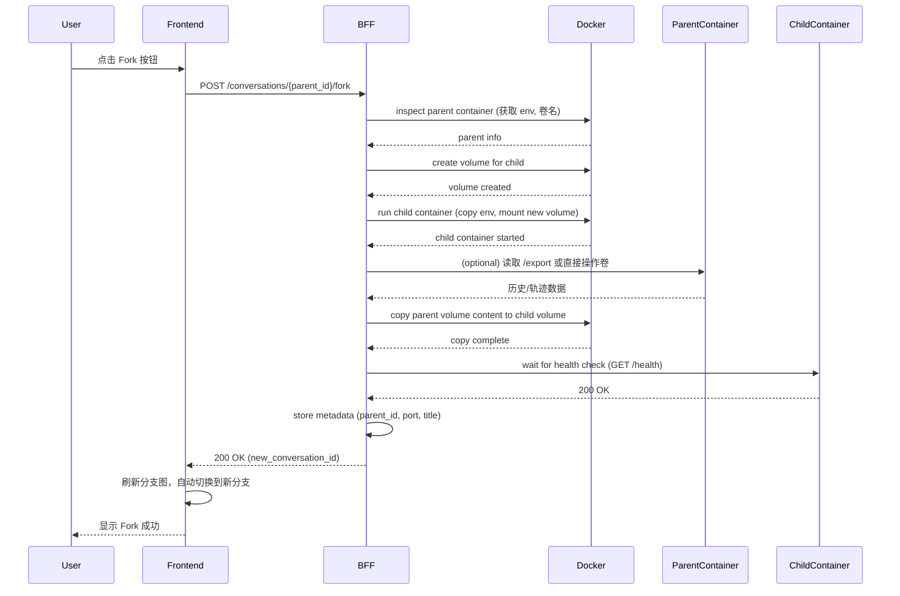

## Fork 分支技术方案

### 一、核心语义

- **Fork 节点**：从父对话的**当前节点**（即用户点击 Fork 的那一轮对话）创建全新分支。
- **传递内容**：子节点应继承父节点**在该轮对话之前的所有状态**（包括环境配置、对话历史、轨迹记录、工作空间文件），然后从此节点之后开始独立发展。

### 二、传递内容详细定义

| 类别 | 内容 | 来源 | 传递方式 |
|------|------|------|----------|
| **环境配置** | `TASK`, `MODEL`, `API_KEY`, `WORKSPACE_DIR` 等环境变量 | 父容器环境变量 | 读取父容器 env，传递给子容器 |
| **对话历史** | 父容器中直到 fork 点的所有 `session.messages`（用户消息 + Agent 回复） | 父容器 `/history` 接口或 workspace 中的 `sessions/container_{id}.jsonl` | 复制整个 `sessions/` 目录 |
| **轨迹数据** | 父容器中直到 fork 点的所有 `(s_t,a_t,o_t,r_t)` 记录 | 父容器 `/trajectory` 接口或 `trajectory.jsonl` | 复制 `trajectory.jsonl` 文件 |
| **工作空间文件** | 父容器 workspace 下除会话/轨迹外的其他文件（如 memory/、代码文件等） | 父容器挂载卷 | 使用 `docker cp` 或卷复制工具 |
| **Agent 内部状态**（可选） | 当前 `AgentLoop` 实例中的 `session` 对象（含 `updated_at` 等元数据） | 父容器内存（不持久化） | 暂不传递，依赖文件恢复 |

**关键原则**：子节点完全独立于父节点，但拥有父节点 fork 时刻的完整快照。

### 三、系统设计

#### 1. 组件职责

- **前端**：提供 Fork 按钮，调用 BFF 的 `/conversations/{id}/fork` 接口，传递 `parent_conversation_id` 和新分支名称。
- **BFF**：
  - 调用父容器的 `/export`（或直接读取父容器卷）获取需要复制的数据。
  - 创建新容器，挂载新的独立卷。
  - 将父容器的数据复制到新卷中。
  - 启动新容器，并等待健康检查通过。
  - 返回新 `conversation_id` 给前端。
- **Agent 容器**：提供 `/export` 接口（可选），允许导出当前会话的快照数据；或者 BFF 直接通过 Docker 卷操作复制文件。

#### 2. 数据结构

- **父容器环境变量**：通过 `docker inspect` 获取。
- **对话历史**：存储在 `workspace/sessions/container_{id}.jsonl`，每行一个 JSON 对象（包含 `role`, `content`, `timestamp` 等）。
- **轨迹数据**：存储在 `workspace/trajectory.jsonl`，每行一个 JSON 对象（包含 `step`, `s_t`, `a_t`, `o_t`, `r_t`）。
- **长期记忆**：存储在 `workspace/memory/MEMORY.md` 等文件。

#### 3. 接口设计

##### 3.1 前端 → BFF

```
POST /conversations/{parent_conversation_id}/fork
Request Body:
{
  "new_branch_name": "string"   // 可选，默认 "分支-时间戳"
}

Response:
{
  "new_conversation_id": "uuid",
  "parent_conversation_id": "uuid",
  "status": "active",
  "message": "Fork successful"
}
```

##### 3.2 BFF → Agent 容器（可选，用于导出）

```
GET /export
Response:
{
  "environment": { "TASK": "...", "MODEL": "...", "API_KEY": "..." },
  "history": [...],   // 会话历史 JSON 数组
  "trajectory": [...]  // 轨迹 JSON 数组
}
```

但推荐 BFF 直接通过 Docker API 读取容器卷，避免增加 Agent 接口。

#### 4. 实现步骤（BFF 侧）

```python
async def fork_container(parent_id: str, child_id: str, new_name: str):
    # 1. 获取父容器信息
    parent_container = docker_client.containers.get(f"nanobot_conv_{parent_id}")
    parent_env = parent_container.attrs['Config']['Env']
    parent_workspace_volume = ...  # 获取挂载卷名称

    # 2. 创建子容器（使用相同的镜像，新卷）
    child_volume_name = f"nanobot_workspace_{child_id}"
    docker_client.volumes.create(name=child_volume_name)
    child_container = docker_client.containers.run(
        image="nanobot-agent:latest",
        name=f"nanobot_conv_{child_id}",
        environment=parent_env,   # 复制环境变量
        volumes={child_volume_name: {"bind": "/app/workspace", "mode": "rw"}},
        detach=True,
        ports={'8080/tcp': None}  # 随机端口
    )

    # 3. 复制父容器工作空间文件到子卷
    # 方法：临时运行一个 busybox 容器，将父卷内容复制到子卷
    # 或使用 docker cp 从父容器复制到本地再复制到子卷
    await copy_workspace(parent_container, child_volume_name)

    # 4. 等待子容器就绪
    await wait_until_ready(child_container)

    # 5. 存储元数据（conversation_id, parent_id, title, port）
    store_conversation_metadata(child_id, parent_id, new_name, child_container.ports['8080/tcp'][0]['HostPort'])

    return {"new_conversation_id": child_id, ...}
```

### 四、时序图



### 五、关键注意事项

1. **数据一致性**：复制过程中父容器可能仍在写入文件，建议在复制前调用父容器的 `/freeze` 接口（可选），或接受最终一致性（fork 时短暂暂停用户输入）。
2. **卷复制性能**：如果 workspace 很大（如包含大文件），复制可能耗时，需异步处理并在前端显示 loading。
3. **API Key 安全**：环境变量中的 `API_KEY` 应原样传递，但需确保子容器不会泄漏（日志脱敏）。
4. **端口分配**：BFF 应维护端口池或让 Docker 自动分配，避免冲突。
5. **清理**：删除父对话时，应级联删除所有子容器和卷（或提示用户确认）。

### 六、优势

- **完全独立**：子容器拥有独立的 workspace 卷，对话历史、轨迹、记忆均与父容器解耦。
- **语义清晰**：Fork 点之后的分支发展互不影响。
- **易于扩展**：未来可支持更细粒度的状态传递（如 AgentLoop 内部会话状态）。

如果需要，我可以进一步提供 `copy_workspace` 的具体实现代码。