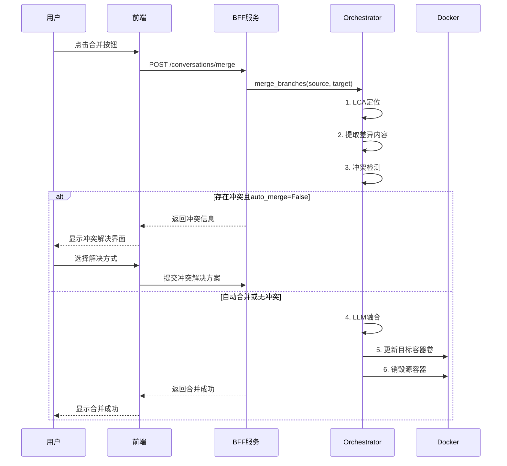

智能体分支合并技术方案（树形结构版）
一、设计目标
保持树形结构：合并后不引入多父节点，分支图仍为树。

语义融合：将源分支的对话历史、轨迹、记忆智能合并到目标分支中。

新容器承载：合并结果放入目标分支的现有容器（或新建容器替换目标分支），源分支容器被销毁。

用户可控：支持自动合并（LLM 融合）和手动冲突解决。

二、整体流程

三、数据模型
3.1 对话元数据（保持不变）
每个对话节点已有字段：

conversation_id

title

parent_id（单父，保证树形）

workspace_volume

created_at

status

合并后，目标分支 T 的内容更新，源分支 S 被删除（status = "deleted"，并从活跃列表移除）。

3.2 合并记录（可选）
为了追溯，可在 T 的元数据中增加 merged_from 字段，记录源分支 ID。

四、详细设计
4.1 公共祖先（LCA）定位
由于树结构，LCA 可通过向上追溯父链找到。

python
def find_lca(conv_a, conv_b):
    path_a = set()
    while conv_a:
        path_a.add(conv_a["conversation_id"])
        conv_a = conversations.get(conv_a.get("parent_id"))
    while conv_b:
        if conv_b["conversation_id"] in path_a:
            return conv_b
        conv_b = conversations.get(conv_b.get("parent_id"))
    return None  # 理论上同一棵树必有LCA
4.2 提取差异内容
从 LCA 之后，两个分支各自产生了一系列对话轮次。我们需要提取：

对话历史：从 sessions/container_{id}.jsonl 中读取 LCA 之后的所有消息。

轨迹记录：从 trajectory.jsonl 中读取对应轮次。

长期记忆：读取 memory/MEMORY.md，但长期记忆是全局的，不按轮次分割，需整体合并。

提取方式：通过临时容器读取文件，或使用 Docker API get_archive。

4.3 合并策略
4.3.1 对话历史与轨迹合并
目标：将 S 分支从 LCA 之后的对话轮次插入到 T 分支的对应位置（或按时间顺序融合）。

算法：

将 S 和 T 的消息序列按时间戳排序（若无时间戳，按索引顺序）。

使用最长公共子序列（LCS） 找到两个序列的公共前缀，之后的部分视为差异。

差异部分可能有两种情况：

仅一方有额外轮次：直接追加到合并后的序列末尾。

双方都有额外轮次且轮次交错：需要 LLM 判断如何交织或合并。

简化策略（推荐）：

将 S 的所有轮次整体追加到 T 的末尾（保持 T 原有历史不变，将 S 的新内容作为后续对话）。

这样不会打乱 T 原有的时序，用户可在合并后继续与 T 对话，S 的内容被当作“历史插入”。

冲突极少，实现简单。

如果希望更智能的融合：将 S 的轮次按时间戳穿插到 T 中，遇到时间相近的轮次（冲突）则调用 LLM 生成统一回复。

4.3.2 LLM 融合 Prompt（冲突解决）
当两个分支在同一时间点附近（或同一语义位置）都有回复时，需要 LLM 合并：

text
你是一个对话合并助手。两个分支从同一个祖先节点分叉后，各自产生了一段对话。请将这两个对话片段合并为一个连贯的对话历史。

分支A的对话片段（JSON数组）：
{messages_a}

分支B的对话片段（JSON数组）：
{messages_b}

要求：
1. 保留两个片段中的所有有用信息，避免重复。
2. 对于同一轮次出现不同回复的情况，请综合双方内容，生成一个更完整、更合理的回答。
3. 输出合并后的消息列表（JSON数组），每条消息格式为 {"role": "user"/"assistant", "content": "..."}。
4. 保持对话的时序逻辑，不得改变用户提问的顺序。
4.3.3 轨迹合并
对于每一轮对话，对应的 (s_t, a_t, o_t, r_t) 也需要合并。合并后的轨迹写入目标分支的 trajectory.jsonl，轮次编号从 T 原有轮次之后继续累加。

若采用“追加”策略，直接将 S 的轨迹记录追加到 T 的轨迹文件末尾，并调整 step 字段（step = len(T原有轨迹) + 1 + i）。

若采用穿插策略，则需重新排序并调整所有 step。

4.3.4 长期记忆合并
读取 S 和 T 的 memory/MEMORY.md，使用 LLM 进行去重和摘要融合：

text
请合并以下两个长期记忆文档，去除重复内容，保留关键信息，输出一个 Markdown 格式的记忆文档。
--- 记忆A ---
{memory_a}
--- 记忆B ---
{memory_b}
合并后的内容写入目标分支的 memory/MEMORY.md。

4.4 新容器承载
方案选择：直接更新目标分支 T 的现有容器卷（就地修改），而不是创建新容器。原因：

保持树形结构，T 的 ID 不变，前端无需切换。

避免额外容器开销。

实现简单：将合并后的文件通过临时容器写回 T 的卷即可。

步骤：

停止目标容器（可选，为保证数据一致性）：

python
docker_client.containers.get(T_container_name).stop()
通过临时 alpine 容器挂载 T 的卷，写入合并后的文件。

重启目标容器（若之前停止了）。

销毁源分支 S 的容器和卷。

注意：如果目标分支正在被用户使用，合并操作可能需要用户确认（强制停止或等待用户退出）。

4.5 源分支清理
python
async def destroy_branch(conv_id):
    container_name = f"nanobot_conv_{conv_id}"
    volume_name = f"nanobot_workspace_{conv_id}"
    try:
        container = docker_client.containers.get(container_name)
        container.stop()
        container.remove()
    except docker.errors.NotFound:
        pass
    try:
        volume = docker_client.volumes.get(volume_name)
        volume.remove()
    except docker.errors.NotFound:
        pass
    # 从 BFF 内存中删除元数据
    if conv_id in conversations:
        del conversations[conv_id]
    if conv_id in container_ports:
        del container_ports[conv_id]
    if conv_id in branches:
        del branches[conv_id]
4.6 接口设计
在 bff_service.py 中新增或修改合并接口。注意：当前已有 /merge 接口（合并并销毁源分支），但未实现 LLM 融合。现需增强。

python
class MergeRequest(BaseModel):
    source_conversation_id: str
    target_conversation_id: str
    auto_merge: bool = True  # 若为False，则返回冲突信息等待用户手动解决

class MergeResponse(BaseModel):
    status: str  # "merged", "conflict", "error"
    message: str
    conflicts: Optional[list] = None  # 冲突详情

@app.post("/conversations/merge", response_model=MergeResponse)
async def merge_conversations(req: MergeRequest):
    # 1. 验证两个分支存在且状态为 active
    # 2. 定位 LCA
    # 3. 提取差异内容
    # 4. 检测冲突（如两个分支都有独立轮次且时间重叠）
    # 5. 若 auto_merge 为 True 且存在冲突，调用 LLM 合并
    # 6. 否则返回冲突列表，让前端处理
    # 7. 执行合并：将合并后的内容写入目标卷，销毁源分支
    # 8. 返回成功
冲突列表格式：

json
{
  "conflicts": [
    {
      "position": "after_step_3",
      "branch_a_messages": [{"role": "user", "content": "..."}, ...],
      "branch_b_messages": [...]
    }
  ]
}
前端收到冲突后，可展示对比 UI，让用户选择保留哪一侧或手动编辑。

4.7 前端交互
当前前端已有合并对话框，用户选择目标分支。需增强：

合并前调用接口，若返回 conflicts，则弹出冲突解决窗口。

用户解决冲突后，提交 conflict_resolutions 再次调用合并接口。

修改 handleMerge 函数：

javascript
async function handleMerge() {
  if (!currentConvId.value || !mergeTargetId.value) return;
  loading.value = true;
  try {
    const res = await mergeConversation({
      source_conversation_id: currentConvId.value,
      target_conversation_id: mergeTargetId.value,
      auto_merge: true   // 或先尝试自动合并
    });
    if (res.data.status === 'conflict') {
      // 显示冲突解决对话框
      showConflictResolver(res.data.conflicts);
    } else if (res.data.status === 'merged') {
      ElMessage.success('合并成功');
      showMergeDialog.value = false;
      // 刷新当前对话为目标分支
      store.setCurrentConv(mergeTargetId.value);
      await loadConversations();
      await loadHistory(mergeTargetId.value);
      drawGraph();
    }
  } catch (e) {
    ElMessage.error('合并失败');
  } finally {
    loading.value = false;
  }
}
4.8 前端冲突解决界面
可复用 Element Plus 的 el-dialog 和 el-tabs，左右对比显示两个分支的消息，用户选择保留哪一侧。

五、错误处理与回滚
若合并过程中写入文件失败，应恢复目标分支原卷内容（可先备份关键文件）。

若 LLM 调用超时，应降级为简单追加策略，并提示用户。

六、总结
本方案在保持树形结构的前提下，实现了分支合并功能：

语义融合：利用 LLM 智能合并对话历史、轨迹和记忆。

容器操作：直接更新目标分支卷，销毁源分支，保持 ID 不变。

用户交互：支持自动合并和手动冲突解决。

工程简单：复用现有 Fork 的卷操作和容器管理逻辑。

该方案与现有前端树形布局完全兼容，无需修改 drawGraph 函数，因为合并后目标分支的 parent_id 不变，只是内容更新，源分支被删除后图形自动更新。

具体问题回答：
Q1:合并的具体方式？
明确回答：推荐将源分支（A）的内容合并到目标分支（B）的现有容器中，然后销毁 A。这样 B 的 ID 不变，分支图保持树形（B 的父节点不变，A 被删除），前端无需任何改动。

如果创建全新的 C 容器，C 将拥有两个父节点（A 和 B），分支图会变成 DAG（有向无环图），而你的前端 drawGraph 使用的是 d3.tree 布局，它只支持单父节点。虽然可以通过修改为 d3.dag 或力导向图支持多父，但工作量较大。因此，在当前树形结构下，直接合并到目标容器是最简单、最可靠的方案。

合并到目标容器的具体步骤
停止目标容器 B（可选，避免写入冲突）。

提取源容器 A 从公共祖先（LCA）之后的所有内容（对话历史、轨迹、记忆）。

使用 LLM 将 A 的内容融合到 B 的现有内容中（追加或智能合并）。

将融合后的文件写回 B 的 Docker 卷。

重启目标容器 B（若之前停止）。

销毁源容器 A 及其卷。

更新 BFF 元数据：将 A 标记为已删除，B 的 merged_from 字段记录 A 的 ID（可选）。

这样，合并后的 B 容器仍然使用原 ID，前端对话历史和分支图自动刷新，用户无感知。

