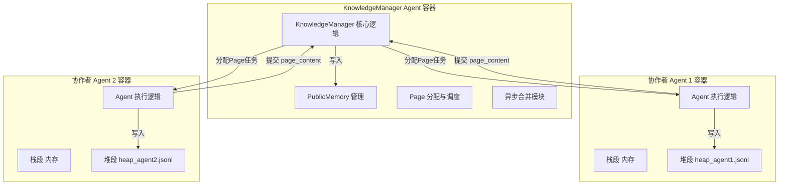
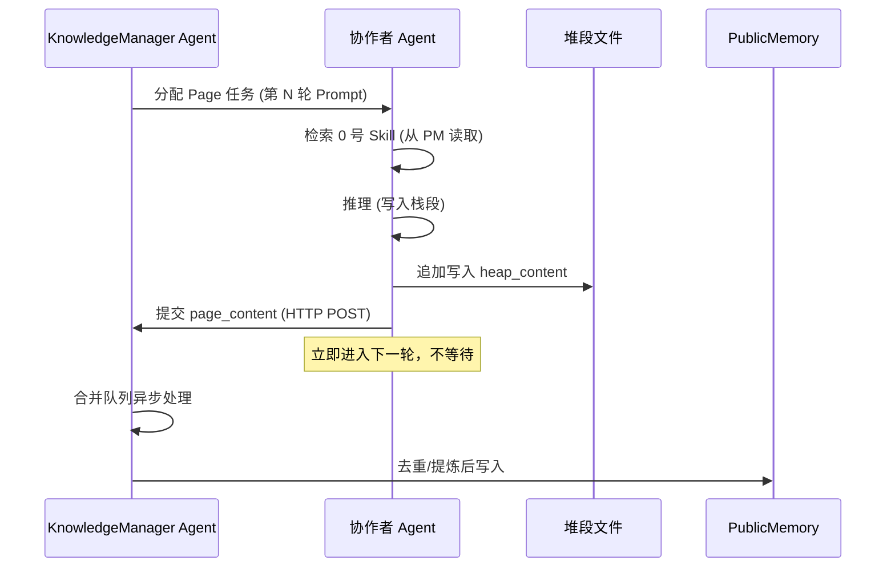

```markdown
# SAyG‑Mem 多 Agent 三段内存学习与 CWW 写入验证方案

## 1. 解决的问题

验证在多 Agent 协作场景下，**发布者 Agent（KnowledgeManager）** 能否智能地管理 PublicMemory、分配 Page、接收协作者产出并异步合并（CWW），同时**协作者 Agent** 能否正确理解 SAyG‑Mem 三段内存语义并按规则写入栈段、堆段和提交长期知识。

## 2. 架构设计：独立的 KnowledgeManager Agent

### 2.1 角色定义

| 组件 | 运行形态 | 职责 |
| :--- | :--- | :--- |
| **KnowledgeManager Agent** | 独立 Nanobot 容器 | ① 预置 0 号 Skill 到 PublicMemory；② 智能切分任务，为每个学习轮次创建 Page；③ 接收协作者 Agent 产出的 `page_content`，决策是否合并写入 PublicMemory；④ 管理 PublicMemory 的读写与版本；⑤ 实现 CWW：在接收协作者提交时，后台异步合并，不阻塞协作者继续执行下一轮。 |
| **协作者 Agent（学习 Agent）** | 独立 Nanobot 容器（可多个） | ① 接收 KnowledgeManager 分配的 Page 任务；② 执行学习/推理，将中间步骤写入栈段（内存）；③ 将最终结论写入自己的堆段文件；④ 将值得长期沉淀的核心知识提交给 KnowledgeManager（通过 HTTP API）。 |
| **堆段文件** | 挂载到各协作者容器的独立 JSONL | 每个协作者 Agent 拥有独立的 `heap_{agent_id}.jsonl`，无锁追加写入。 |
| **PublicMemory** | 挂载到 KnowledgeManager 容器的 JSONL | 全局只读知识库，仅 KnowledgeManager 拥有写入权限。 |

### 2.2 架构图



### 2.3 CWW 机制在 KnowledgeManager 中的实现

- **协作者写入**：协作者 Agent 完成任务后，立即将 `heap_content` 写入自己的堆段（极速无锁追加），同时将 `page_content` 通过 HTTP 发送给 KnowledgeManager。
- **协作者不等待**：发送完成后，协作者立即进入下一轮任务，无需等待 KnowledgeManager 的合并操作。
- **KnowledgeManager 异步合并**：KnowledgeManager 在后台维护一个合并队列，接收到的 `page_content` 先入队，由独立线程定期（或达到阈值）执行去重、提炼、写入 PublicMemory。这样合并耗时完全不阻塞协作者的关键路径。

## 3. 单 Agent 学习场景（最小验证）

为快速验证，本次任务启动 **1 个 KnowledgeManager Agent** 和 **1 个协作者 Agent**（两者均为独立容器）。协作者 Agent 执行 5 轮学习 Prompt，KnowledgeManager 负责分配 Page 和合并沉淀。

### 3.1 任务目标

1. **0 号 Skill 预置**：KnowledgeManager 预先在 PublicMemory 中存入三段内存定义与写入规则。
2. **Agent 对规则的理解与执行**：协作者 Agent 能否按规则区分“该写入栈段、堆段还是提交给 KnowledgeManager”的内容。
3. **文件变更检测**：每轮 Prompt 前后，检测协作者堆段文件和 PublicMemory 的变化并记录日志。
4. **最终知识沉淀**：生成一份包含 5 轮学习成果的结构化 Markdown 文档。

### 3.2 交互流程（单轮）



### 3.3 5 轮 Prompt 设计

每轮 Prompt 由 KnowledgeManager 生成并发送给协作者 Agent。协作者 Agent 需返回结构化 JSON。

| 轮次 | Prompt 内容 |
| :--- | :--- |
| **第 1 轮** | “请检索 0 号 Skill，并结合其内容解释 SAyG‑Mem 系统中**栈段**的语义、存储内容、写入方式和生命周期。将推理过程写入栈段，最终答案写入堆段，并将核心定义提炼为 Page 提交给 KnowledgeManager。请严格以 JSON 格式返回：`{"stack_content": "...", "heap_content": "...", "page_content": "...", "page_title": "栈段语义"}`” |
| **第 2 轮** | “请解释 SAyG‑Mem 系统中**堆段**的语义、与栈段的区别、以及它如何支持多 Agent 并发写入。推理→栈段，结论→堆段，核心定义→提交 KnowledgeManager。page_title 为‘堆段语义’。” |
| **第 3 轮** | “请解释 SAyG‑Mem 系统中**数据段**的语义、写入权限和设计意图。推理→栈段，结论→堆段，核心定义→提交 KnowledgeManager。page_title 为‘数据段语义’。” |
| **第 4 轮** | “请综合前三轮学习，用对比表格总结**栈段、堆段、数据段**在归属、内容、写入方式、生命周期、设计意图上的区别。推理→栈段，表格→堆段，表格精简版→提交 KnowledgeManager。page_title 为‘三段内存对比’。” |
| **第 5 轮** | “请用一句话概括 SAyG‑Mem 设计三种段的核心价值，并阐述其对多 Agent 协作的意义。推理→栈段，结论→堆段，核心阐述→提交 KnowledgeManager。page_title 为‘设计价值总结’。” |

### 3.4 协作者 Agent 响应格式

```json
{
  "stack_content": "我在推理过程中认为栈段应该存储短期噪声...",
  "heap_content": "栈段在 SAyG‑Mem 中的语义是：私有短期记忆...",
  "page_content": "栈段 (Stack Segment) 归属 Agent 私有，存储推理噪声，任务结束清空。",
  "page_title": "栈段语义"
}
```

### 3.5 文件变更检测

| 检测目标 | 文件路径 | 检测方式 | 日志输出格式 |
| :--- | :--- | :--- | :--- |
| 协作者堆段 | `data/heaps/heap_{collaborator_id}.jsonl` | 行数 + MD5 | `[Round X] heap: N → M lines, MD5: A → B` |
| PublicMemory | `data/public_memory/public_memory.jsonl` | 行数 + MD5 | `[Round X] public_memory: N → M lines, MD5: A → B` |
| 栈段 | 无文件 | 仅打印 `stack_content` 摘要 | `[Round X] stack push: "...(前50字符)..."` |

### 3.6 执行流程伪代码

```python
async def main():
    # 1. 创建 KnowledgeManager Agent 和协作者 Agent 容器
    km_conv = await create_conversation("knowledge_manager", "deepseek-chat")
    collab_conv = await create_conversation("collaborator", "deepseek-chat")
    
    km_agent_id = km_conv["conversation_id"]
    collab_agent_id = collab_conv["conversation_id"]
    
    await wait_for_container_ready(km_agent_id)
    await wait_for_container_ready(collab_agent_id)

    # 2. KnowledgeManager 预置 0 号 Skill (通过调用其内部接口)
    await preset_skill_0(km_agent_id, SKILL_0_CONTENT)

    # 3. 初始化协作者堆段 (挂载共享卷)
    heap = HeapSegment(collab_agent_id, HEAP_DIR)

    # 4. 5 轮对话
    for round_idx, prompt in enumerate(PROMPTS, 1):
        heap_before = get_file_state(heap.heap_path)
        pm_before = get_file_state(PUBLIC_MEMORY_PATH)

        # 协作者执行任务
        resp = await chat_with_agent(collab_agent_id, prompt)
        data = parse_json_response(resp["content"])

        if data:
            print(f"[Round {round_idx}] stack push: {data['stack_content'][:50]}...")
            # 写入协作者堆段
            heap.append(data["heap_content"], task_id=f"learn_r{round_idx}")
            # 提交给 KnowledgeManager
            await submit_page_to_km(km_agent_id, data["page_content"], data.get("page_title", ""))

        heap_after = get_file_state(heap.heap_path)
        pm_after = get_file_state(PUBLIC_MEMORY_PATH)
        log_file_changes(round_idx, heap_before, heap_after, pm_before, pm_after)

    # 5. 生成最终报告
    generate_final_report(km_agent_id, collab_agent_id)
```

### 3.7 产出物清单

| 文件 | 说明 |
| :--- | :--- |
| `learn_segments_collab.py` | 完整可执行脚本 |
| `logs/learn_segments_YYYYMMDD_HHMMSS.md` | 最终验证报告 |
| `data/heaps/heap_{collaborator_id}.jsonl` | 协作者堆段文件（5 条记录） |
| `data/public_memory/public_memory.jsonl` | PublicMemory（1 条 0 号 Skill + 5 条 Page） |

## 4. 0 号 Skill 预置内容

在启动 5 轮对话前，KnowledgeManager 将以下内容写入 PublicMemory 作为 0 号 Skill：

```markdown
# SAyG‑Mem 三段内存写入规则（0 号 Skill）

## 栈段 (Stack Segment)
- **语义**：Agent 私有的短期噪声隔离区。
- **存储内容**：单轮推理步骤、临时假设、中间计算、可能被推翻的观点。
- **写入方式**：内存追加（`stack.push`），任务结束自动清空。
- **禁止行为**：不得将栈段内容写入堆段或数据段。

## 堆段 (Heap Segment)
- **语义**：Agent 独立的中期协作缓冲区。
- **存储内容**：阶段性结论、可共享的中间共识、任务最终输出。
- **写入方式**：无锁追加到 `heap_{agent_id}.jsonl`，携带 `task_id` 和 `quality_score`。
- **并发特性**：每个 Agent 独立堆段，消除写入竞争。

## 数据段 (Data Segment) / PublicMemory
- **语义**：全局只读的长期知识库。
- **存储内容**：经过验证的 Skill、方法论、多轮共识、Page 处理结果。
- **写入权限**：仅 KnowledgeManager（合并了 PageManager 与 Consolidator）拥有。
- **读取方式**：Agent 执行任务前检索相关 Skill 注入上下文。

## 写入规则总结
- 推理噪声 → 栈段（不持久化）
- 任务产出 → 堆段（持久化，待合并）
- 长期知识 → 数据段（由 KnowledgeManager 写入 PublicMemory）
```

## 5. 附件：PublicMemory 最终内容示例

```jsonl
{"id": "mem_20250415_001", "agent_id": "system", "timestamp": "2025-04-15T10:00:00Z", "type": "data", "content": "# SAyG‑Mem 三段内存写入规则（0 号 Skill）\n\n## 栈段 (Stack Segment)\n- **语义**：Agent 私有的短期噪声隔离区。\n- **存储内容**：单轮推理步骤、临时假设、中间计算、可能被推翻的观点。\n- **写入方式**：内存追加（`stack.push`），任务结束自动清空。\n- **禁止行为**：不得将栈段内容写入堆段或数据段。\n\n## 堆段 (Heap Segment)\n- **语义**：Agent 独立的中期协作缓冲区。\n- **存储内容**：阶段性结论、可共享的中间共识、任务最终输出。\n- **写入方式**：无锁追加到 `heap_{agent_id}.jsonl`，携带 `task_id` 和 `quality_score`。\n- **并发特性**：每个 Agent 独立堆段，消除写入竞争。\n\n## 数据段 (Data Segment) / PublicMemory\n- **语义**：全局只读的长期知识库。\n- **存储内容**：经过验证的 Skill、方法论、多轮共识、Page 处理结果。\n- **写入权限**：仅 KnowledgeManager（合并了 PageManager 与 Consolidator）拥有。\n- **读取方式**：Agent 执行任务前检索相关 Skill 注入上下文。\n\n## 写入规则总结\n- 推理噪声 → 栈段（不持久化）\n- 任务产出 → 堆段（持久化，待合并）\n- 长期知识 → 数据段（由 KnowledgeManager 写入 PublicMemory）", "metadata": {"page_id": "page_0_skill", "skill_version": "1.0"}}
{"id": "mem_20250415_002", "agent_id": "agent_collaborator_1", "timestamp": "2025-04-15T10:05:12Z", "type": "data", "content": "栈段 (Stack Segment) 在 SAyG‑Mem 中是 Agent 私有的短期噪声隔离区，存储单轮推理步骤、临时假设和中间计算，生命周期绑定单次任务，任务结束自动清空，从根本上杜绝上下文污染。", "metadata": {"page_id": "page_agent_collaborator_1_20250415100512_0", "page_title": "栈段语义", "merged_at": "2025-04-15T10:05:12Z"}}
{"id": "mem_20250415_003", "agent_id": "agent_collaborator_1", "timestamp": "2025-04-15T10:09:35Z", "type": "data", "content": "堆段 (Heap Segment) 是 Agent 独立的中期协作缓冲区，存储阶段性结论和可共享的中间共识。与栈段的核心区别在于：堆段持久化（JSONL 文件），支持无锁追加写入，每个 Agent 独立堆段消除写入竞争，而栈段是纯内存临时存储。", "metadata": {"page_id": "page_agent_collaborator_1_20250415100935_1", "page_title": "堆段语义", "merged_at": "2025-04-15T10:09:35Z"}}
{"id": "mem_20250415_004", "agent_id": "agent_collaborator_1", "timestamp": "2025-04-15T10:14:02Z", "type": "data", "content": "数据段 (Data Segment) / PublicMemory 是 SAyG‑Mem 的全局只读长期知识库，存储经过验证的 Skill、方法论和多轮共识。仅 KnowledgeManager 拥有写入权限，Agent 只能只读检索。这种设计保证了知识库的纯净性和全局一致性。", "metadata": {"page_id": "page_agent_collaborator_1_20250415101402_2", "page_title": "数据段语义", "merged_at": "2025-04-15T10:14:02Z"}}
{"id": "mem_20250415_005", "agent_id": "agent_collaborator_1", "timestamp": "2025-04-15T10:20:47Z", "type": "data", "content": "| 内存段 | 归属 | 存储内容 | 写入方式 | 生命周期 | 设计意图 |\n|--------|------|----------|----------|----------|----------|\n| 栈段 | Agent 私有 | 单轮推理噪声 | 内存追加 | 任务结束清空 | 隔离短期污染 |\n| 堆段 | Agent 独立文件 | 阶段性共识 | 无锁追加 JSONL | 跨任务持久化 | 支持高并发写入 |\n| 数据段 | 全局共享 | 长期 Skill | KnowledgeManager 独占写入 | 永久持久化 | 保证知识纯净 |", "metadata": {"page_id": "page_agent_collaborator_1_20250415102047_3", "page_title": "三段内存对比", "merged_at": "2025-04-15T10:20:47Z"}}
{"id": "mem_20250415_006", "agent_id": "agent_collaborator_1", "timestamp": "2025-04-15T10:26:19Z", "type": "data", "content": "SAyG‑Mem 通过三段内存设计实现了'栈段关噪声、堆段保并发、数据段存精华'的架构平衡，使多 Agent 协作在写入效率与知识质量之间兼得，支撑高并发场景下的可持续知识沉淀。", "metadata": {"page_id": "page_agent_collaborator_1_20250415102619_4", "page_title": "设计价值总结", "merged_at": "2025-04-15T10:26:19Z"}}
```

## 6. 字段说明

| 字段 | 含义 |
| :--- | :--- |
| `id` | 全局唯一记忆条目 ID |
| `agent_id` | 来源 Agent ID（0 号 Skill 为 `system`） |
| `timestamp` | ISO 8601 格式时间戳 |
| `type` | 固定为 `"data"`，表示属于数据段 |
| `content` | 记忆内容（Markdown 格式） |
| `metadata.page_id` | Page 唯一标识，用于检索和追溯 |
| `metadata.page_title` | Page 标题，便于人工阅读 |
| `metadata.merged_at` | 合并时间戳（Consolidator 写入时间） |
| `metadata.skill_version` | 仅 0 号 Skill 携带，用于版本管理 |

## 7. 检索示例

协作者 Agent 在执行新任务时，会调用 KnowledgeManager 的检索接口获取相关 Skill：

```python
# 协作者 Agent 内部检索
skills = await search_public_memory(km_agent_id, "堆段写入规则", top_k=3)
# 返回第 3 条记录（堆段语义）和第 5 条记录（对比表格）
```

## 8,实现提示
1，可以在前端加一个功能，每次新建节点的时候就把这个节点当成KnowledgeManager,否则就是协作者。（如fork出来的）

# SAyG‑Mem 多 Agent 三段内存学习与 CWW 写入验证方案 —— 产出物清单

## 1. 可执行脚本

| 文件名 | 说明 |
| :--- | :--- |
| `learn_segments_collab.py` | 完整可执行脚本，包含：<br>- 创建 KnowledgeManager Agent 与协作者 Agent 容器<br>- 预置 0 号 Skill<br>- 执行 5 轮 Prompt 对话<br>- 每轮检测文件变更并记录日志<br>- 生成最终 Markdown 验证报告 |

## 2. 日志与报告

| 文件路径 | 说明 |
| :--- | :--- |
| `logs/learn_segments_YYYYMMDD_HHMMSS.md` | 最终验证报告（Markdown 格式），包含：<br>- 0 号 Skill 全文<br>- 5 轮对话记录（Prompt、栈段写入摘要、堆段写入摘要、Page 提交摘要）<br>- 每轮文件变更日志（堆段行数/MD5 变化、PublicMemory 行数/MD5 变化）<br>- 综合知识文档（5 轮 `page_content` 合并，含对比表格）<br>- 验证结论 |
| `logs/timing_logs.jsonl` | （可选）每轮操作耗时记录，用于性能分析 |

## 3. 内存段数据文件

| 文件路径 | 说明 |
| :--- | :--- |
| `data/heaps/heap_{collaborator_id}.jsonl` | 协作者 Agent 的堆段文件，包含 5 条记录（每轮产出的 `heap_content`），每条为完整的 `MemoryEntry` JSON |
| `data/public_memory/public_memory.jsonl` | PublicMemory 全局知识库，包含：<br>- 1 条 0 号 Skill（`agent_id: system`）<br>- 5 条 Page 记录（协作者 Agent 提交的 `page_content`） |
| `data/public_memory/checkpoint.json` | （可选）KnowledgeManager 的合并进度记录，用于断点续传 |

## 4. 验证报告内部结构示例

```markdown
# SAyG‑Mem 单 Agent 三段内存学习验证报告

**KnowledgeManager Agent ID**: `km_6c516fb6`
**协作者 Agent ID**: `collab_1c2fb85d`
**测试时间**: `2025-04-15T15:30:00Z`

## 1. 0 号 Skill（预置知识）
{0号Skill全文}

## 2. 5 轮对话记录

### 第 1 轮：栈段语义
- **Prompt**: “请检索 0 号 Skill，并结合其内容解释 SAyG‑Mem 系统中**栈段**的语义...”
- **栈段写入**: “我在推理过程中认为栈段应该存储短期噪声...”
- **堆段写入**: “栈段在 SAyG‑Mem 中的语义是：私有短期记忆...”
- **Page 提交**: “栈段 (Stack Segment) 归属 Agent 私有，存储推理噪声...”
- **文件变更**: 
  - `heap_collab_1c2fb85d.jsonl`: 0 → 1 行
  - `public_memory.jsonl`: 1 → 2 行

### 第 2 轮：堆段语义
...

## 3. 综合知识文档（5 轮成果汇总）
{将5轮page_content合并，形成完整的三段内存语义说明，含对比表格}

## 4. 验证结论
- ✅ KnowledgeManager 成功预置 0 号 Skill
- ✅ 协作者 Agent 正确理解了三段内存语义及写入规则
- ✅ 每轮堆段和 PublicMemory 均检测到预期变更
- ✅ CWW 机制生效：协作者提交后立即进入下一轮，合并操作异步完成
- ✅ 最终产出的结构化知识文档准确反映了 SAyG‑Mem 的核心设计