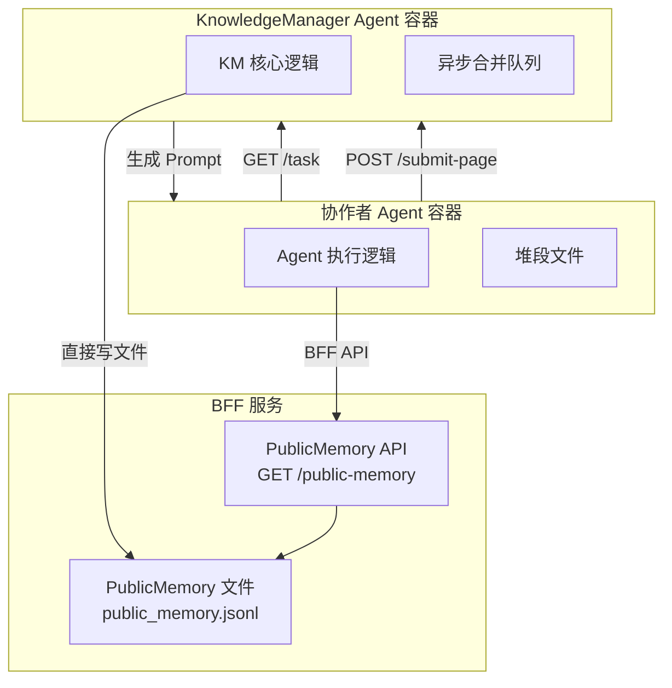
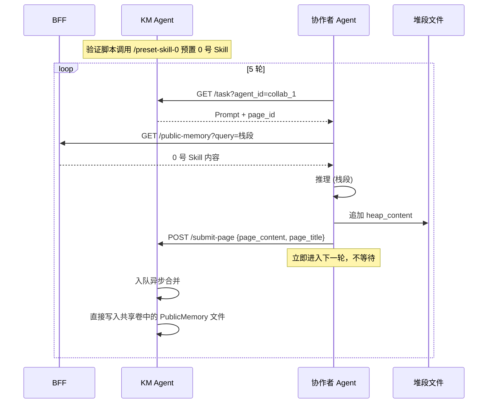

这是整合后的完整技术方案 Markdown 文档，您可以直接复制使用。

```markdown
# SAyG‑Mem 多 Agent 三段内存学习与 CWW 写入验证方案（接口明确版 v2）

## 1. 解决的问题

验证在多 Agent 协作场景下，**KnowledgeManager Agent (KM)** 能否智能地管理 PublicMemory、分配 Page、接收协作者产出并异步合并（CWW），同时**协作者 Agent** 能否正确理解 SAyG‑Mem 三段内存语义并按规则写入栈段、堆段和提交长期知识。

## 2. 整体架构与通信设计

### 2.1 组件与职责

| 组件 | 运行形态 | 职责 |
| :--- | :--- | :--- |
| **BFF 服务** | 宿主机进程（已有） | ① 创建/销毁 Agent 容器；② 提供 PublicMemory 读取 API (`GET /public-memory`)；③ 容器端口映射与健康检查 |
| **KnowledgeManager Agent** | 独立 Nanobot 容器 | ① 通过自身 API 预置 0 号 Skill（直接写入共享卷中的 PublicMemory 文件）；② 生成 5 轮 Prompt 并派发给协作者；③ 接收协作者提交的 `page_content`，入队异步合并；④ 合并后写入共享卷中的 PublicMemory 文件 |
| **协作者 Agent** | 独立 Nanobot 容器 | ① 从 KM Agent 获取 Prompt 任务；② 通过 BFF API 检索 0 号 Skill；③ 推理→栈段，结论→堆段（本地文件）；④ 将 `page_content` 直接提交给 KM Agent 的 `/submit-page` 接口 |
| **堆段文件** | 挂载到协作者容器的独立 JSONL | 协作者 Agent 本地无锁追加写入 |
| **PublicMemory** | BFF 本地文件，通过共享卷挂载到 KM Agent 容器 | KM Agent 独占写入，BFF 和协作者只读 |

### 2.2 通信路径图



### 2.3 接口定义

| 接口 | 提供方 | 调用方 | 方法/路径 | 说明 |
| :--- | :--- | :--- | :--- | :--- |
| 读取 PublicMemory | BFF | 协作者 | `GET /knowledge-manager/public-memory` | 返回 JSONL 内容，支持 `?query=关键词&top_k=3` |
| 预置 0 号 Skill | KM Agent | 验证脚本 | `POST /preset-skill-0` | Body: `{"content": "..."}`，KM 直接写入共享卷中的 PublicMemory |
| 获取任务 Prompt | KM Agent | 协作者 | `GET /task?agent_id={collab_id}` | KM 返回下一轮 Prompt 及 Page 元数据 |
| 提交 Page 结果 | KM Agent | 协作者 | `POST /submit-page` | Body: `{"page_content":"...","page_title":"..."}`，KM 入队异步合并后写入 PublicMemory |

### 2.4 共享卷挂载配置

在 `docker-compose.yml` 或容器创建参数中，将宿主机的 `./data/public_memory` 目录挂载到 KM Agent 容器的 `/app/public_memory`，同时 BFF 服务也使用相同路径读写该文件。协作者容器无需挂载此目录。

```yaml
# KM Agent 容器挂载配置
volumes:
  - ./data/public_memory:/app/public_memory  # 仅 KM Agent 和 BFF 挂载
```

## 3. 单 Agent 学习场景（最小验证）

启动 **1 个 KM Agent** 和 **1 个协作者 Agent**，执行 5 轮学习。

### 3.1 交互流程（单轮）



### 3.2 KM Agent 新增端点实现

在 KM Agent 容器内的 `agent_server.py` 中新增以下端点：

```python
# KM Agent 新增 Pydantic 模型
class PresetSkill0Request(BaseModel):
    content: str

class PageSubmitRequest(BaseModel):
    page_content: str
    page_title: str = ""

# 0 号 Skill 预置端点
@app.post("/preset-skill-0")
async def preset_skill_0(req: PresetSkill0Request):
    """预置 0 号 Skill，直接写入共享卷中的 PublicMemory"""
    entry = MemoryEntry.create(
        agent_id="system",
        type="data",
        content=req.content,
        metadata={"page_id": "page_0_skill", "skill_version": "1.0"}
    )
    with open(PUBLIC_MEMORY_PATH, 'a', encoding='utf-8') as f:
        f.write(entry.to_json() + '\n')
    return {"status": "ok", "page_id": "page_0_skill"}

# 协作者提交 Page 端点
@app.post("/submit-page")
async def submit_page(req: PageSubmitRequest, request: Request):
    """接收协作者提交的 Page，入队异步合并"""
    agent_id = request.headers.get("X-Agent-Id", "unknown")
    entry = MemoryEntry.create(
        agent_id=agent_id,
        type="data",
        content=req.page_content,
        metadata={
            "page_title": req.page_title,
            "merged_at": datetime.now().isoformat()
        }
    )
    # 异步写入 PublicMemory（此处简化为同步，实际可放入队列）
    with open(PUBLIC_MEMORY_PATH, 'a', encoding='utf-8') as f:
        f.write(entry.to_json() + '\n')
    return {"status": "ok"}

# 协作者获取任务端点
@app.get("/task")
async def get_task(agent_id: str):
    """返回下一轮 Prompt"""
    # 内部维护轮次状态，返回预设 Prompt
    round_num = get_round_for_agent(agent_id)
    if round_num > 5:
        return {"prompt": None, "completed": True}
    prompt = PROMPTS[round_num - 1]
    return {
        "prompt": prompt,
        "round": round_num,
        "page_id": f"page_{agent_id}_r{round_num}"
    }
```

### 3.3 5 轮 Prompt 设计

每轮 Prompt 由 KM Agent 生成并返回给协作者。协作者需返回结构化 JSON。

| 轮次 | Prompt 内容 |
| :--- | :--- |
| **第 1 轮** | “请检索 0 号 Skill，并结合其内容解释 SAyG‑Mem 系统中**栈段**的语义、存储内容、写入方式和生命周期。将推理过程写入栈段，最终答案写入堆段，并将核心定义提炼为 Page 提交给 KnowledgeManager。请严格以 JSON 格式返回：`{"stack_content": "...", "heap_content": "...", "page_content": "...", "page_title": "栈段语义"}`” |
| **第 2 轮** | “请解释 SAyG‑Mem 系统中**堆段**的语义、与栈段的区别、以及它如何支持多 Agent 并发写入。推理→栈段，结论→堆段，核心定义→提交 KnowledgeManager。page_title 为‘堆段语义’。” |
| **第 3 轮** | “请解释 SAyG‑Mem 系统中**数据段**的语义、写入权限和设计意图。推理→栈段，结论→堆段，核心定义→提交 KnowledgeManager。page_title 为‘数据段语义’。” |
| **第 4 轮** | “请综合前三轮学习，用对比表格总结**栈段、堆段、数据段**在归属、内容、写入方式、生命周期、设计意图上的区别。推理→栈段，表格→堆段，表格精简版→提交 KnowledgeManager。page_title 为‘三段内存对比’。” |
| **第 5 轮** | “请用一句话概括 SAyG‑Mem 设计三种段的核心价值，并阐述其对多 Agent 协作的意义。推理→栈段，结论→堆段，核心阐述→提交 KnowledgeManager。page_title 为‘设计价值总结’。” |

### 3.4 协作者 Agent 响应格式

```json
{
  "stack_content": "我在推理过程中认为栈段应该存储短期噪声...",
  "heap_content": "栈段在 SAyG‑Mem 中的语义是：私有短期记忆...",
  "page_content": "栈段 (Stack Segment) 归属 Agent 私有，存储推理噪声，任务结束清空。",
  "page_title": "栈段语义"
}
```

### 3.5 验证脚本核心逻辑（修正版）

```python
import asyncio
import requests
from pathlib import Path
from heap_segment import HeapSegment

async def main():
    # 1. 通过 BFF 创建 KM Agent 和协作者 Agent 容器
    km_conv = await create_conversation("knowledge_manager", "deepseek-chat")
    collab_conv = await create_conversation("collaborator", "deepseek-chat")
    
    km_port = km_conv["container_port"]
    collab_port = collab_conv["container_port"]
    collab_agent_id = collab_conv["conversation_id"]
    
    await wait_for_container_ready(km_port)
    await wait_for_container_ready(collab_port)

    # 2. 调用 KM Agent 预置 0 号 Skill
    resp = requests.post(
        f"http://localhost:{km_port}/preset-skill-0",
        json={"content": SKILL_0_CONTENT}
    )
    print(f"[Init] preset_skill_0: {resp.json()}")

    # 3. 协作者堆段初始化
    heap = HeapSegment(collab_agent_id, HEAP_DIR)

    # 4. 5 轮对话
    for round_idx in range(1, 6):
        heap_before = get_file_state(heap.heap_path)
        pm_before = await get_public_memory_count_via_bff()

        # 协作者从 KM 获取任务
        task_resp = requests.get(f"http://localhost:{km_port}/task?agent_id={collab_agent_id}")
        task_data = task_resp.json()
        if task_data.get("completed"):
            break
        prompt = task_data["prompt"]

        # 协作者执行任务（调用本地 Nanobot /chat 接口）
        resp = await chat_with_agent(collab_port, prompt)
        data = parse_json_response(resp["content"])

        if data:
            print(f"[Round {round_idx}] stack push: {data['stack_content'][:50]}...")
            heap.append(data["heap_content"], task_id=f"learn_r{round_idx}")
            # 提交给 KM Agent
            submit_resp = requests.post(
                f"http://localhost:{km_port}/submit-page",
                json={
                    "page_content": data["page_content"],
                    "page_title": data.get("page_title", "")
                },
                headers={"X-Agent-Id": collab_agent_id}
            )
            print(f"[Round {round_idx}] submit_page: {submit_resp.json()}")

        heap_after = get_file_state(heap.heap_path)
        pm_after = await get_public_memory_count_via_bff()
        log_file_changes(round_idx, heap_before, heap_after, pm_before, pm_after)

    # 5. 生成最终报告
    generate_final_report(km_port, collab_agent_id)
```

### 3.6 产出物清单

| 文件 | 说明 |
| :--- | :--- |
| `learn_segments_collab.py` | 完整可执行脚本（含 BFF API 调用和 KM 直接调用） |
| `logs/learn_segments_YYYYMMDD_HHMMSS.md` | 最终验证报告 |
| `data/heaps/heap_{collaborator_id}.jsonl` | 协作者堆段文件（5 条记录） |
| `data/public_memory/public_memory.jsonl` | PublicMemory（1 条 0 号 Skill + 5 条 Page），位于 BFF 本地且挂载到 KM 容器 |

## 4. 关键修正说明

| 原方案问题 | 修正后 |
| :--- | :--- |
| KM Agent 职责被 BFF 代理 | KM Agent 提供独立端点 (`/preset-skill-0`, `/submit-page`)，协作者直接调用 |
| PublicMemory 写入权限混乱 | 明确仅 KM Agent 写入，通过共享卷直接操作文件 |
| 协作者提交路径绕开 KM | 协作者直接向 KM Agent 的 `/submit-page` 提交，实现 CWW |
| 0 号 Skill 预置方式模糊 | 验证脚本通过调用 KM Agent 的 `/preset-skill-0` 完成预置 |

## 5. 0 号 Skill 预置内容

```markdown
# SAyG‑Mem 三段内存写入规则（0 号 Skill）

## 栈段 (Stack Segment)
- **语义**：Agent 私有的短期噪声隔离区。
- **存储内容**：单轮推理步骤、临时假设、中间计算、可能被推翻的观点。
- **写入方式**：内存追加（`stack.push`），任务结束自动清空。
- **禁止行为**：不得将栈段内容写入堆段或数据段。

## 堆段 (Heap Segment)
- **语义**：Agent 独立的中期协作缓冲区。
- **存储内容**：阶段性结论、可共享的中间共识、任务最终输出。
- **写入方式**：无锁追加到 `heap_{agent_id}.jsonl`，携带 `task_id` 和 `quality_score`。
- **并发特性**：每个 Agent 独立堆段，消除写入竞争。

## 数据段 (Data Segment) / PublicMemory
- **语义**：全局只读的长期知识库。
- **存储内容**：经过验证的 Skill、方法论、多轮共识、Page 处理结果。
- **写入权限**：仅 KnowledgeManager（合并了 PageManager 与 Consolidator）拥有。
- **读取方式**：Agent 执行任务前检索相关 Skill 注入上下文。

## 写入规则总结
- 推理噪声 → 栈段（不持久化）
- 任务产出 → 堆段（持久化，待合并）
- 长期知识 → 数据段（由 KnowledgeManager 写入 PublicMemory）
```

## 6. PublicMemory 最终内容示例

```jsonl
{"id": "mem_20250415_001", "agent_id": "system", "timestamp": "2025-04-15T10:00:00Z", "type": "data", "content": "# SAyG‑Mem 三段内存写入规则（0 号 Skill）\n\n## 栈段 (Stack Segment)\n- **语义**：Agent 私有的短期噪声隔离区。\n- **存储内容**：单轮推理步骤、临时假设、中间计算、可能被推翻的观点。\n- **写入方式**：内存追加（`stack.push`），任务结束自动清空。\n- **禁止行为**：不得将栈段内容写入堆段或数据段。\n\n## 堆段 (Heap Segment)\n- **语义**：Agent 独立的中期协作缓冲区。\n- **存储内容**：阶段性结论、可共享的中间共识、任务最终输出。\n- **写入方式**：无锁追加到 `heap_{agent_id}.jsonl`，携带 `task_id` 和 `quality_score`。\n- **并发特性**：每个 Agent 独立堆段，消除写入竞争。\n\n## 数据段 (Data Segment) / PublicMemory\n- **语义**：全局只读的长期知识库。\n- **存储内容**：经过验证的 Skill、方法论、多轮共识、Page 处理结果。\n- **写入权限**：仅 KnowledgeManager（合并了 PageManager 与 Consolidator）拥有。\n- **读取方式**：Agent 执行任务前检索相关 Skill 注入上下文。\n\n## 写入规则总结\n- 推理噪声 → 栈段（不持久化）\n- 任务产出 → 堆段（持久化，待合并）\n- 长期知识 → 数据段（由 KnowledgeManager 写入 PublicMemory）", "metadata": {"page_id": "page_0_skill", "skill_version": "1.0"}}
{"id": "mem_20250415_002", "agent_id": "collab_1", "timestamp": "2025-04-15T10:05:12Z", "type": "data", "content": "栈段 (Stack Segment) 在 SAyG‑Mem 中是 Agent 私有的短期噪声隔离区，存储单轮推理步骤、临时假设和中间计算，生命周期绑定单次任务，任务结束自动清空，从根本上杜绝上下文污染。", "metadata": {"page_id": "page_collab_1_r1", "page_title": "栈段语义", "merged_at": "2025-04-15T10:05:12Z"}}
{"id": "mem_20250415_003", "agent_id": "collab_1", "timestamp": "2025-04-15T10:09:35Z", "type": "data", "content": "堆段 (Heap Segment) 是 Agent 独立的中期协作缓冲区，存储阶段性结论和可共享的中间共识。与栈段的核心区别在于：堆段持久化（JSONL 文件），支持无锁追加写入，每个 Agent 独立堆段消除写入竞争，而栈段是纯内存临时存储。", "metadata": {"page_id": "page_collab_1_r2", "page_title": "堆段语义", "merged_at": "2025-04-15T10:09:35Z"}}
{"id": "mem_20250415_004", "agent_id": "collab_1", "timestamp": "2025-04-15T10:14:02Z", "type": "data", "content": "数据段 (Data Segment) / PublicMemory 是 SAyG‑Mem 的全局只读长期知识库，存储经过验证的 Skill、方法论和多轮共识。仅 KnowledgeManager 拥有写入权限，Agent 只能只读检索。这种设计保证了知识库的纯净性和全局一致性。", "metadata": {"page_id": "page_collab_1_r3", "page_title": "数据段语义", "merged_at": "2025-04-15T10:14:02Z"}}
{"id": "mem_20250415_005", "agent_id": "collab_1", "timestamp": "2025-04-15T10:20:47Z", "type": "data", "content": "| 内存段 | 归属 | 存储内容 | 写入方式 | 生命周期 | 设计意图 |\n|--------|------|----------|----------|----------|----------|\n| 栈段 | Agent 私有 | 单轮推理噪声 | 内存追加 | 任务结束清空 | 隔离短期污染 |\n| 堆段 | Agent 独立文件 | 阶段性共识 | 无锁追加 JSONL | 跨任务持久化 | 支持高并发写入 |\n| 数据段 | 全局共享 | 长期 Skill | KnowledgeManager 独占写入 | 永久持久化 | 保证知识纯净 |", "metadata": {"page_id": "page_collab_1_r4", "page_title": "三段内存对比", "merged_at": "2025-04-15T10:20:47Z"}}
{"id": "mem_20250415_006", "agent_id": "collab_1", "timestamp": "2025-04-15T10:26:19Z", "type": "data", "content": "SAyG‑Mem 通过三段内存设计实现了'栈段关噪声、堆段保并发、数据段存精华'的架构平衡，使多 Agent 协作在写入效率与知识质量之间兼得，支撑高并发场景下的可持续知识沉淀。", "metadata": {"page_id": "page_collab_1_r5", "page_title": "设计价值总结", "merged_at": "2025-04-15T10:26:19Z"}}```
```
## 7. 问题澄清
Q1:协作agent请求获取skill时，是否需要KM帮助介入？
您说得对。当 PublicMemory 中沉淀的 Skill 逐渐增多时，全部返回不仅浪费带宽，更会撑爆协作者的上下文窗口。因此，**检索必须是按需、带过滤的**。

BFF 的 `GET /knowledge-manager/public-memory` 接口应支持以下查询参数：

| 参数 | 类型 | 默认值 | 说明 |
| :--- | :--- | :--- | :--- |
| `query` | string | 无（必填） | 检索关键词，从任务描述中提取 |
| `top_k` | int | 3 | 返回最相关的 Skill 数量 |
| `agent_id` | string | 可选 | 若指定，优先返回该 Agent 历史产出的 Skill |
| `page_id` | string | 可选 | 若指定，返回与该 Page 直接相关的 Skill |

**检索流程**（由 BFF 执行，不经过 KM Agent）：
1. 协作者从当前任务 Prompt 中提取关键词（或由 KM Agent 在派发任务时附带建议关键词）。
2. 协作者调用 BFF 检索接口：`GET /knowledge-manager/public-memory?query=栈段语义&top_k=3`。
3. BFF 读取本地 PublicMemory 文件，对每条 `MemoryEntry` 的 `content` 字段进行**关键词匹配**（或后续升级为 TF-IDF / 向量相似度）。
4. BFF 返回 Top-K 条最相关 Skill 的完整内容，协作者将其注入上下文。

这样既保证了检索效率，又避免了 KM Agent 的额外负载，保持了读写分离的架构纯净性。