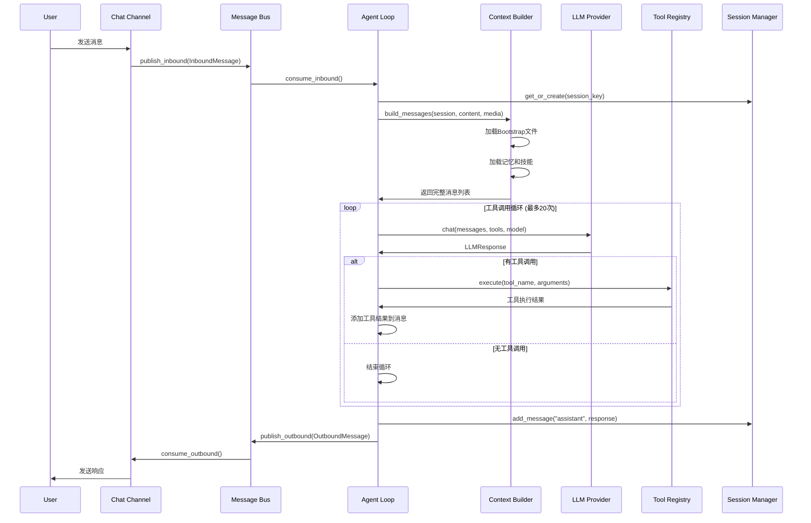
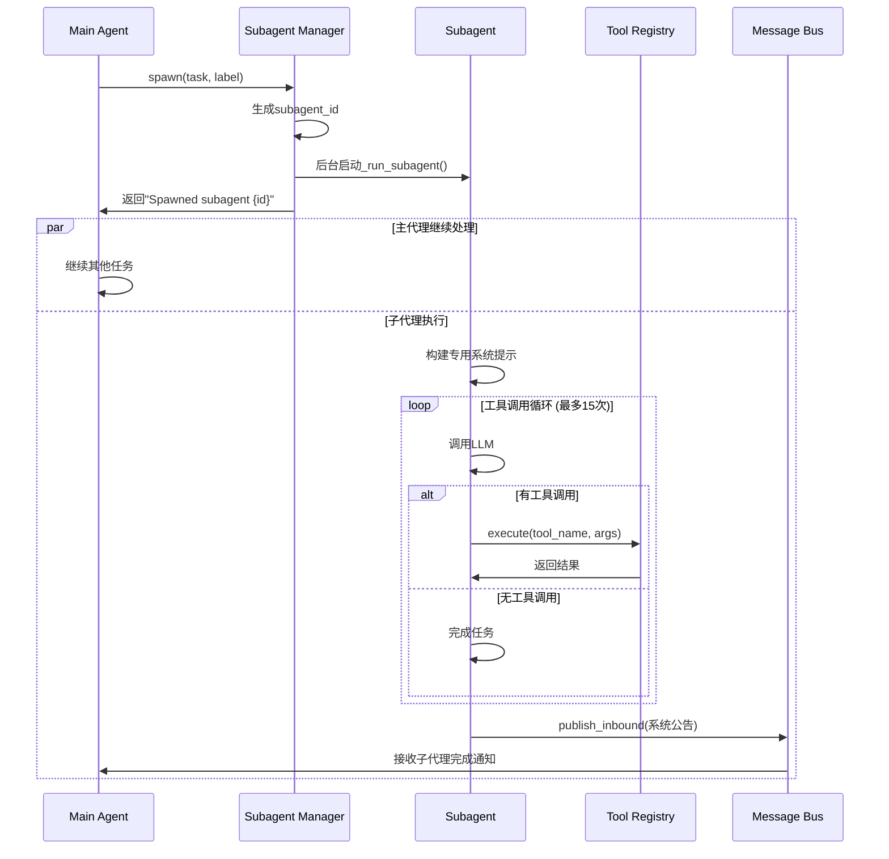
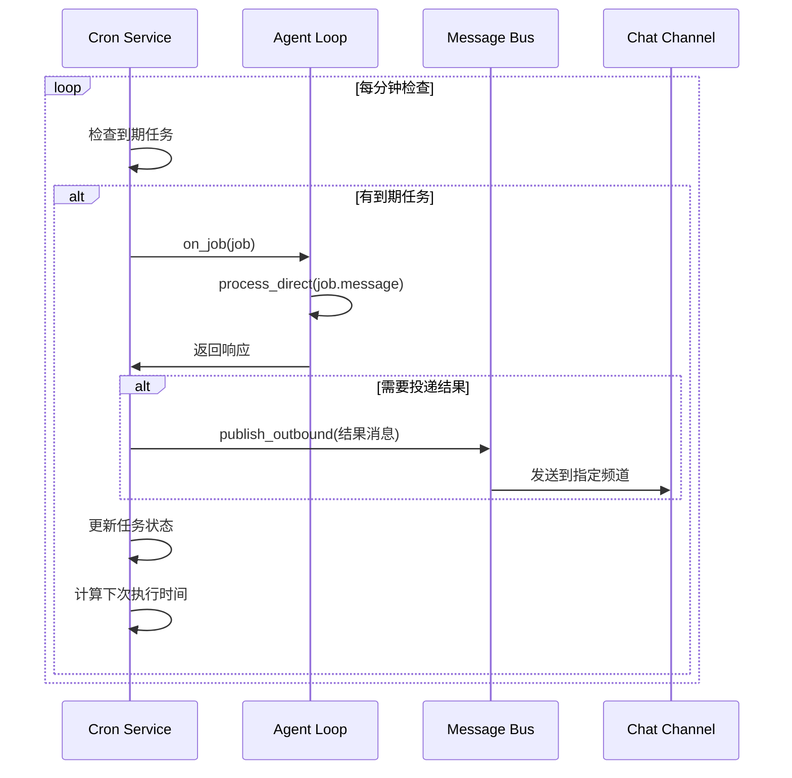
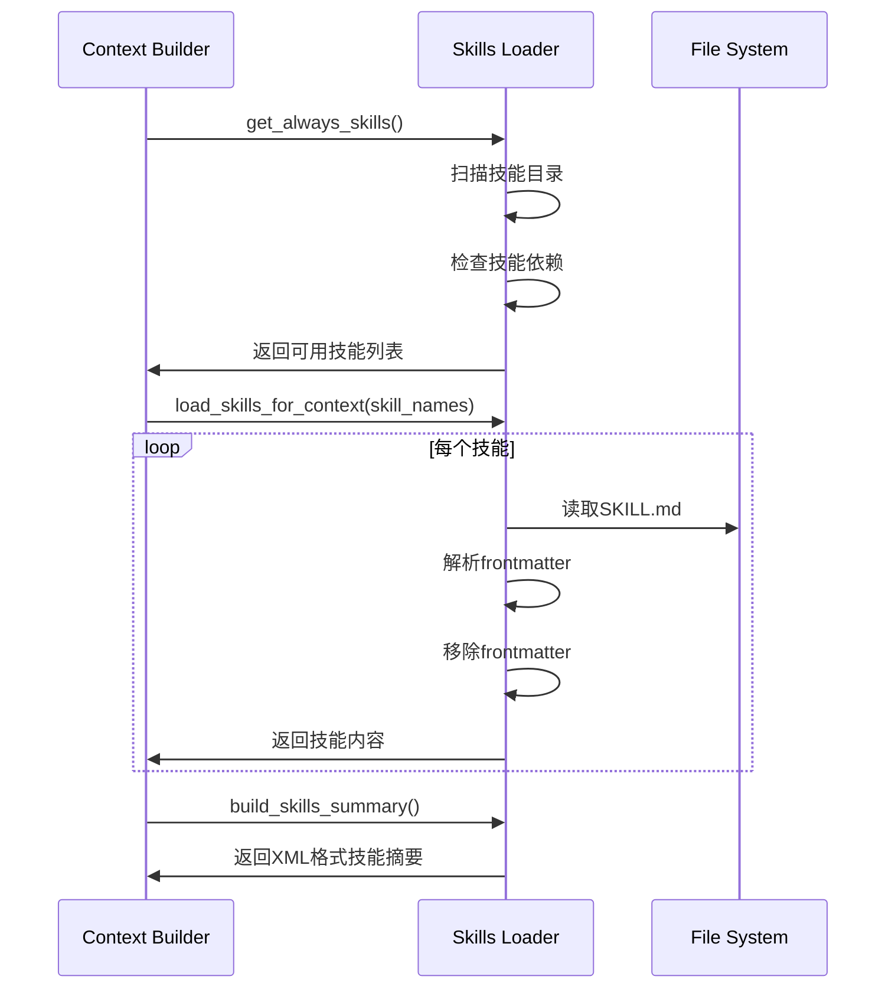

# nanobot 项目详细说明文档

## 项目概述

**nanobot** 是一个超轻量级的个人AI助手框架，仅用约4,000行代码实现核心功能，比同类项目Clawdbot小99%。它专为研究和快速开发而设计，提供清晰易懂的代码结构和强大的扩展能力。

### 核心特点
- 🪶 **超轻量级**：核心功能精简，启动快速
- 🔬 **研究友好**：代码清晰，易于理解和修改
- ⚡️ **高性能**：资源占用少，响应迅速
- 💎 **易于使用**：一键部署，配置简单
- 🔧 **高度可扩展**：模块化设计，支持自定义工具和技能

### 主要功能
- 24/7实时市场分析和信息搜索
- 全栈软件工程师助手（代码生成、调试、部署）
- 智能日程管理和定时任务
- 个人知识助手和记忆系统
- 多平台聊天集成（Telegram、WhatsApp）

---

## 系统架构

### 整体架构图

```
┌─────────────────────────────────────────────────────────────┐
│                    Chat Channels                             │
│  (Telegram, WhatsApp, CLI, Discord等)                       │
└────────────────────┬────────────────────────────────────────┘
                     │ InboundMessage
                     ▼
┌─────────────────────────────────────────────────────────────┐
│                   Message Bus                                │
│  (Async Queue - 解耦频道和代理)                             │
└────────────────────┬────────────────────────────────────────┘
                     │ consume_inbound()
                     ▼
┌─────────────────────────────────────────────────────────────┐
│                   Agent Loop                                 │
│  ┌──────────────────────────────────────────────────────┐   │
│  │ 1. 接收消息                                          │   │
│  │ 2. 构建上下文 (Context Builder)                      │   │
│  │    - Bootstrap文件 (AGENTS.md, SOUL.md等)           │   │
│  │    - 记忆 (MEMORY.md + 日记)                        │   │
│  │    - 技能 (Skills)                                  │   │
│  │    - 对话历史 (Session)                             │   │
│  │ 3. 调用LLM (Provider)                               │   │
│  │ 4. 执行工具 (Tool Registry)                         │   │
│  │    - 文件操作                                       │   │
│  │    - Shell命令                                      │   │
│  │    - Web搜索/获取                                   │   │
│  │    - 消息发送                                       │   │
│  │    - 子代理生成                                     │   │
│  │ 5. 循环直到完成 (max 20次迭代)                      │   │
│  └──────────────────────────────────────────────────────┘   │
└────────────────────┬────────────────────────────────────────┘
                     │ OutboundMessage
                     ▼
┌─────────────────────────────────────────────────────────────┐
│                   Message Bus                                │
│  (dispatch_outbound - 分发到订阅的频道)                     │
└────────────────────┬────────────────────────────────────────┘
                     │ publish_outbound()
                     ▼
┌─────────────────────────────────────────────────────────────┐
│                    Chat Channels                             │
│  (发送响应给用户)                                           │
└─────────────────────────────────────────────────────────────┘

┌─────────────────────────────────────────────────────────────┐
│              Background Services                             │
│  ┌──────────────┐  ┌──────────────┐  ┌──────────────┐      │
│  │ Cron Service │  │Heartbeat Svc │  │ Subagent Mgr │      │
│  │ (定时任务)   │  │ (30分钟检查) │  │ (后台任务)   │      │
│  └──────────────┘  └──────────────┘  └──────────────┘      │
└─────────────────────────────────────────────────────────────┘
```

### 核心设计原则

1. **解耦架构**：消息总线完全解耦频道和代理核心
2. **异步处理**：全异步设计，支持高并发
3. **模块化**：每个组件职责单一，易于测试和维护
4. **可扩展性**：工具注册表、技能系统支持动态扩展
5. **容错性**：优雅的错误处理和恢复机制

---

## 核心模块详解

### 1. Agent 核心模块 (`nanobot/agent/`)

#### AgentLoop - 代理主循环引擎 (`loop.py`)

**职责**：
- 接收和处理来自消息总线的消息
- 构建LLM上下文（系统提示 + 对话历史）
- 调用LLM并处理响应
- 执行工具调用（最多20次迭代）
- 发送响应到消息总线

**核心流程**：
```python
async def _process_message(self, msg: InboundMessage) -> None:
    # 1. 获取或创建会话
    session = self.sessions.get_or_create(msg.session_key)
    
    # 2. 构建LLM消息列表
    messages = self.context.build_messages(session, msg.content, msg.media)
    
    # 3. 工具调用循环
    for iteration in range(self.max_iterations):
        response = await self.provider.chat(
            messages=messages,
            tools=self.tools.get_schemas(),
            model=self.model
        )
        
        if response.tool_calls:
            # 执行工具并添加结果到消息
            for tool_call in response.tool_calls:
                result = await self.tools.execute(tool_call.name, tool_call.arguments)
                messages.append({"role": "tool", "content": result})
        else:
            # 没有工具调用，返回最终响应
            break
    
    # 4. 保存会话并发送响应
    session.add_message("assistant", response.content)
    await self.bus.publish_outbound(OutboundMessage(...))
```

#### ContextBuilder - 上下文构建器 (`context.py`)

**职责**：
- 组装系统提示词（Bootstrap文件、记忆、技能）
- 构建LLM消息列表
- 处理多模态输入（文本+图像）

**Bootstrap文件加载顺序**：
1. `AGENTS.md` - 代理指令和行为准则
2. `SOUL.md` - 代理人格和特性
3. `USER.md` - 用户信息和偏好
4. `TOOLS.md` - 工具使用说明
5. `IDENTITY.md` - 身份认证信息

**系统提示构建**：
```python
def build_system_prompt(self, skill_names: list[str] | None = None) -> str:
    parts = []
    
    # 核心身份
    parts.append(self._get_identity())
    
    # Bootstrap文件
    bootstrap = self._load_bootstrap_files()
    if bootstrap:
        parts.append(bootstrap)
    
    # 记忆上下文
    memory = self.memory.get_memory_context()
    if memory:
        parts.append(f"# Memory\n\n{memory}")
    
    # 技能系统
    always_skills = self.skills.get_always_skills()
    if always_skills:
        always_content = self.skills.load_skills_for_context(always_skills)
        if always_content:
            parts.append(f"# Active Skills\n\n{always_content}")
    
    return "\n\n".join(parts)
```

#### MemoryStore - 持久化记忆系统 (`memory.py`)

**记忆类型**：
- **长期记忆**：`MEMORY.md` - 重要信息和学习内容
- **日记笔记**：`memory/YYYY-MM-DD.md` - 每日活动记录

**记忆检索**：
```python
def get_memory_context(self, days: int = 7) -> str:
    parts = []
    
    # 长期记忆
    long_term = self._load_long_term_memory()
    if long_term:
        parts.append(f"## Long-term Memory\n\n{long_term}")
    
    # 最近N天的日记
    recent_notes = self._load_recent_notes(days)
    if recent_notes:
        parts.append(f"## Recent Notes\n\n{recent_notes}")
    
    return "\n\n".join(parts)
```

#### SkillsLoader - 技能加载器 (`skills.py`)

**技能类型**：
- **内置技能**：`nanobot/skills/` - 框架提供的标准技能
- **工作空间技能**：`workspace/skills/` - 用户自定义技能

**渐进式加载**：
```python
def build_skills_summary(self) -> str:
    """构建技能摘要，代理可按需读取完整内容"""
    all_skills = self.list_skills(filter_unavailable=False)
    
    lines = ["<skills>"]
    for s in all_skills:
        available = self._check_requirements(self._get_skill_meta(s["name"]))
        lines.append(f"  <skill available=\"{str(available).lower()}\">")
        lines.append(f"    <name>{s['name']}</name>")
        lines.append(f"    <description>{self._get_skill_description(s['name'])}</description>")
        lines.append(f"    <location>{s['path']}</location>")
        lines.append(f"  </skill>")
    lines.append("</skills>")
    
    return "\n".join(lines)
```

#### SubagentManager - 后台子代理管理 (`subagent.py`)

**功能**：
- 生成轻量级子代理执行特定任务
- 独立上下文和聚焦系统提示
- 通过消息总线公告结果

**子代理执行流程**：
```python
async def spawn(self, task: str, label: str | None = None) -> str:
    subagent_id = f"subagent-{uuid.uuid4().hex[:8]}"
    
    # 后台执行子代理任务
    asyncio.create_task(self._run_subagent(subagent_id, task, label))
    
    return f"Spawned subagent {subagent_id} for: {task}"

async def _run_subagent(self, subagent_id: str, task: str, label: str | None) -> None:
    # 构建子代理专用提示
    system_prompt = self._build_subagent_prompt(task)
    
    # 执行工具循环（最多15次迭代）
    messages = [{"role": "user", "content": task}]
    
    for iteration in range(15):
        response = await self.provider.chat(
            messages=[{"role": "system", "content": system_prompt}] + messages,
            tools=self.tools.get_schemas()
        )
        
        if response.tool_calls:
            # 执行工具调用
            for tool_call in response.tool_calls:
                result = await self.tools.execute(tool_call.name, tool_call.arguments)
                messages.append({"role": "tool", "content": result})
        else:
            break
    
    # 公告结果到主代理
    announcement = InboundMessage(
        channel="system",
        sender_id="subagent",
        chat_id=subagent_id,
        content=f"Subagent completed: {response.content}"
    )
    await self.bus.publish_inbound(announcement)
```

### 2. 工具系统 (`nanobot/agent/tools/`)

#### ToolRegistry - 工具注册表 (`registry.py`)

**功能**：
- 动态注册和管理工具
- 参数验证和错误处理
- 工具调用执行

**核心方法**：
```python
class ToolRegistry:
    def register(self, tool: Tool) -> None:
        """注册工具"""
        self._tools[tool.name] = tool
    
    async def execute(self, name: str, arguments: dict[str, Any]) -> str:
        """执行工具调用"""
        tool = self._tools.get(name)
        if not tool:
            return f"Error: Unknown tool '{name}'"
        
        # 参数验证
        errors = tool.validate_params(arguments)
        if errors:
            return f"Error: {'; '.join(errors)}"
        
        # 执行工具
        try:
            return await tool.execute(**arguments)
        except Exception as e:
            return f"Error executing {name}: {str(e)}"
    
    def get_schemas(self) -> list[dict[str, Any]]:
        """获取所有工具的OpenAI格式schema"""
        return [tool.to_schema() for tool in self._tools.values()]
```

#### 内置工具

**文件操作工具** (`filesystem.py`)：
- `read_file` - 读取文件内容
- `write_file` - 写入文件（自动创建目录）
- `edit_file` - 编辑文件（替换指定文本）
- `list_dir` - 列出目录内容

**Shell执行工具** (`shell.py`)：
- `exec` - 执行Shell命令
- 安全限制：超时控制、危险命令阻止、输出截断
- 可选工作空间限制

**Web访问工具** (`web.py`)：
- `web_search` - 使用Brave Search API搜索
- `web_fetch` - 获取网页内容（使用readability提取）

**通信工具** (`message.py`)：
- `message` - 发送消息到指定频道

**子代理工具** (`spawn.py`)：
- `spawn` - 生成后台子代理执行任务

### 3. 消息总线 (`nanobot/bus/`)

#### MessageBus - 异步消息队列 (`queue.py`)

**功能**：
- 解耦频道和代理核心
- 异步消息传递
- 支持订阅和分发

**消息流**：
```python
# 入站消息：频道 → 代理
await bus.publish_inbound(InboundMessage(...))
msg = await bus.consume_inbound()

# 出站消息：代理 → 频道
await bus.publish_outbound(OutboundMessage(...))
msg = await bus.consume_outbound()
```

#### 事件类型 (`events.py`)

**InboundMessage** - 来自频道的消息：
```python
@dataclass
class InboundMessage:
    channel: str          # telegram, whatsapp, cli
    sender_id: str         # 用户标识
    chat_id: str          # 聊天标识
    content: str          # 消息内容
    timestamp: datetime   # 时间戳
    media: list[str]      # 媒体URL列表
    metadata: dict        # 频道特定数据
```

**OutboundMessage** - 发送到频道的响应：
```python
@dataclass
class OutboundMessage:
    channel: str          # 目标频道
    chat_id: str         # 目标聊天
    content: str         # 响应内容
    reply_to: str | None # 回复消息ID
    media: list[str]     # 媒体文件
    metadata: dict       # 频道特定数据
```

### 4. 会话管理 (`nanobot/session/`)

#### SessionManager - 对话会话管理 (`manager.py`)

**功能**：
- JSONL格式存储消息历史
- 会话缓存和持久化
- 提供LLM格式的历史记录

**存储格式**：
```jsonl
{"_type": "metadata", "created_at": "2024-01-01T00:00:00", "metadata": {}}
{"role": "user", "content": "Hello", "timestamp": "2024-01-01T00:00:01"}
{"role": "assistant", "content": "Hi there!", "timestamp": "2024-01-01T00:00:02"}
```

**会话操作**：
```python
# 获取或创建会话
session = manager.get_or_create("telegram:123456789")

# 添加消息
session.add_message("user", "Hello world")
session.add_message("assistant", "Hi there!")

# 获取历史记录（LLM格式）
history = session.get_history(max_messages=50)

# 保存到磁盘
manager.save(session)
```

### 5. LLM提供商 (`nanobot/providers/`)

#### LiteLLMProvider - 多提供商支持 (`litellm_provider.py`)

**支持的提供商**：
- OpenRouter（推荐）
- Anthropic (Claude)
- OpenAI (GPT)
- Google Gemini
- Groq
- 智谱AI (GLM)
- vLLM（本地部署）

**自动配置**：
```python
def __init__(self, api_key: str, api_base: str | None = None, default_model: str = "anthropic/claude-opus-4-5"):
    # 根据API密钥前缀或模型名称自动检测提供商
    if api_key.startswith("sk-or-"):
        # OpenRouter
        os.environ["OPENROUTER_API_KEY"] = api_key
    elif "anthropic" in default_model:
        os.environ["ANTHROPIC_API_KEY"] = api_key
    elif "openai" in default_model or "gpt" in default_model:
        os.environ["OPENAI_API_KEY"] = api_key
    # ... 其他提供商
```

**统一接口**：
```python
async def chat(
    self,
    messages: list[dict[str, Any]],
    tools: list[dict[str, Any]] | None = None,
    model: str | None = None,
    max_tokens: int = 4096,
    temperature: float = 0.7,
) -> LLMResponse:
    # 通过LiteLLM调用各种提供商
    response = await acompletion(
        model=model or self.default_model,
        messages=messages,
        tools=tools,
        max_tokens=max_tokens,
        temperature=temperature
    )
    return self._parse_response(response)
```

### 6. 频道集成 (`nanobot/channels/`)

#### ChannelManager - 频道管理器 (`manager.py`)

**功能**：
- 初始化启用的频道
- 启动/停止频道服务
- 路由出站消息到对应频道

**频道生命周期**：
```python
async def start_all(self) -> None:
    # 启动出站消息分发器
    self._dispatch_task = asyncio.create_task(self._dispatch_outbound())
    
    # 启动所有频道
    tasks = []
    for name, channel in self.channels.items():
        tasks.append(asyncio.create_task(channel.start()))
    
    await asyncio.gather(*tasks, return_exceptions=True)

async def _dispatch_outbound(self) -> None:
    """分发出站消息到对应频道"""
    while True:
        msg = await self.bus.consume_outbound()
        channel = self.channels.get(msg.channel)
        if channel:
            await channel.send(msg)
```

#### Telegram集成 (`telegram.py`)

**功能**：
- 使用python-telegram-bot库
- 支持文本、图片、语音消息
- 用户白名单控制
- 语音转文字（可选Groq Whisper）

#### WhatsApp集成 (`whatsapp.py`)

**功能**：
- 通过Node.js桥接服务连接
- WebSocket通信
- 支持文本和媒体消息
- 扫码登录

### 7. 定时任务系统 (`nanobot/cron/`)

#### CronService - 定时任务服务 (`service.py`)

**支持的调度类型**：
- **一次性任务**：`at` - 指定时间执行
- **周期性任务**：`every` - 固定间隔执行
- **Cron表达式**：`cron` - 复杂时间规则

**任务执行流程**：
```python
async def _execute_job(self, job: CronJob) -> None:
    """执行单个任务"""
    try:
        # 调用代理处理任务消息
        response = await self.on_job(job)
        
        job.state.last_status = "ok"
        
        # 可选：投递结果到指定频道
        if job.payload.deliver and job.payload.channel:
            await self._deliver_response(job, response)
            
    except Exception as e:
        job.state.last_status = "error"
        job.state.last_error = str(e)
    
    # 计算下次执行时间
    job.state.next_run_at_ms = _compute_next_run(job.schedule, _now_ms())
```

**CLI操作**：
```bash
# 添加定时任务
nanobot cron add --name "daily-report" --message "Generate daily report" --cron "0 9 * * *"

# 列出任务
nanobot cron list

# 删除任务
nanobot cron remove <job_id>
```

### 8. 心跳服务 (`nanobot/heartbeat/`)

#### HeartbeatService - 周期性任务检查 (`service.py`)

**功能**：
- 每30分钟检查`HEARTBEAT.md`文件
- 解析任务列表并执行
- 支持任务的添加、删除、重写

**任务格式**：
```markdown
# Heartbeat Tasks

- [ ] Check calendar and remind of upcoming events
- [ ] Scan inbox for urgent emails  
- [ ] Check weather forecast for today
- [x] Completed task (will be ignored)
```

**执行流程**：
```python
async def _on_heartbeat(self) -> None:
    """处理心跳检查"""
    heartbeat_file = self.workspace / "HEARTBEAT.md"
    
    if not heartbeat_file.exists():
        return
    
    content = heartbeat_file.read_text()
    tasks = self._parse_tasks(content)
    
    if tasks:
        # 将任务作为消息发送给代理
        task_message = f"Heartbeat tasks:\n" + "\n".join(f"- {task}" for task in tasks)
        
        # 通过代理循环处理
        await self.agent_loop.process_direct(
            message=task_message,
            session_key="system:heartbeat"
        )
```

---

## 核心调用流程

### 1. 消息处理完整流程



### 2. 子代理执行流程



### 3. 定时任务执行流程



### 4. 技能加载流程



---

## 配置和部署

### 1. 配置文件结构

#### 主配置文件 (`~/.nanobot/config.json`)

```json
{
  "agents": {
    "defaults": {
      "workspace": "~/.nanobot/workspace",
      "model": "anthropic/claude-opus-4-5",
      "max_tokens": 8192,
      "temperature": 0.7,
      "max_tool_iterations": 20
    }
  },
  "providers": {
    "openrouter": {
      "apiKey": "sk-or-v1-xxx",
      "apiBase": null
    },
    "anthropic": {
      "apiKey": "sk-ant-xxx",
      "apiBase": null
    },
    "openai": {
      "apiKey": "sk-xxx",
      "apiBase": null
    },
    "vllm": {
      "apiKey": "dummy",
      "apiBase": "http://localhost:8000/v1"
    }
  },
  "channels": {
    "telegram": {
      "enabled": true,
      "token": "123456:ABC-DEF1234ghIkl-zyx57W2v1u123ew11",
      "allowFrom": ["123456789", "@username"]
    },
    "whatsapp": {
      "enabled": false,
      "bridgeUrl": "ws://localhost:3001",
      "allowFrom": ["+1234567890"]
    }
  },
  "gateway": {
    "host": "0.0.0.0",
    "port": 18790
  },
  "tools": {
    "web": {
      "search": {
        "apiKey": "BSA_xxx",
        "maxResults": 5
      }
    },
    "exec": {
      "timeout": 60,
      "restrictToWorkspace": false
    }
  }
}
```

#### 工作空间结构 (`~/.nanobot/workspace/`)

```
workspace/
├── AGENTS.md          # 代理指令和行为准则
├── SOUL.md            # 代理人格和特性  
├── USER.md            # 用户信息和偏好
├── TOOLS.md           # 工具使用说明
├── HEARTBEAT.md       # 周期性任务列表
├── memory/
│   ├── MEMORY.md      # 长期记忆
│   └── 2024-01-15.md  # 日记笔记
└── skills/            # 自定义技能
    └── my-skill/
        └── SKILL.md
```

### 2. 安装和初始化

#### 从源码安装（推荐开发）

```bash
git clone https://github.com/HKUDS/nanobot.git
cd nanobot
pip install -e .
```

#### 使用uv安装（推荐生产）

```bash
uv tool install nanobot-ai
```

#### 从PyPI安装

```bash
pip install nanobot-ai
```

#### 初始化配置

```bash
# 创建配置和工作空间
nanobot onboard

# 编辑配置文件
nano ~/.nanobot/config.json
```

### 3. 运行方式

#### CLI交互模式

```bash
# 交互式聊天
nanobot agent

# 单条消息
nanobot agent -m "Hello, how are you?"

# 指定模型
nanobot agent -m "Explain quantum computing" --model "anthropic/claude-sonnet-4-5"
```

#### 网关模式（多频道）

```bash
# 启动所有启用的频道
nanobot gateway

# 检查频道状态
nanobot channels status
```

#### 定时任务管理

```bash
# 添加定时任务
nanobot cron add --name "morning-briefing" \
  --message "Generate morning briefing with weather and news" \
  --cron "0 8 * * *" \
  --deliver --to "123456789" --channel "telegram"

# 列出所有任务
nanobot cron list

# 手动执行任务
nanobot cron run <job_id>

# 删除任务
nanobot cron remove <job_id>
```

### 4. Docker部署

#### Dockerfile

```dockerfile
FROM python:3.11-slim

WORKDIR /app

# 安装系统依赖
RUN apt-get update && apt-get install -y \
    git \
    curl \
    && rm -rf /var/lib/apt/lists/*

# 复制项目文件
COPY . .

# 安装Python依赖
RUN pip install -e .

# 创建配置目录
RUN mkdir -p /root/.nanobot

# 暴露端口
EXPOSE 18790

# 默认命令
CMD ["nanobot", "gateway"]
```

#### 构建和运行

```bash
# 构建镜像
docker build -t nanobot .

# 初始化配置（首次运行）
docker run -v ~/.nanobot:/root/.nanobot --rm nanobot onboard

# 编辑配置
nano ~/.nanobot/config.json

# 运行网关
docker run -d \
  --name nanobot \
  -v ~/.nanobot:/root/.nanobot \
  -p 18790:18790 \
  nanobot

# 查看日志
docker logs -f nanobot
```

#### Docker Compose

```yaml
version: '3.8'

services:
  nanobot:
    build: .
    container_name: nanobot
    ports:
      - "18790:18790"
    volumes:
      - ~/.nanobot:/root/.nanobot
    environment:
      - PYTHONUNBUFFERED=1
    restart: unless-stopped
    
  # WhatsApp桥接服务（可选）
  whatsapp-bridge:
    build: ./bridge
    container_name: nanobot-whatsapp-bridge
    ports:
      - "3001:3001"
    volumes:
      - ./bridge/sessions:/app/sessions
    restart: unless-stopped
```

### 5. 本地模型支持

#### vLLM部署

```bash
# 安装vLLM
pip install vllm

# 启动模型服务
vllm serve meta-llama/Llama-3.1-8B-Instruct \
  --host 0.0.0.0 \
  --port 8000 \
  --api-key dummy

# 配置nanobot使用本地模型
{
  "providers": {
    "vllm": {
      "apiKey": "dummy",
      "apiBase": "http://localhost:8000/v1"
    }
  },
  "agents": {
    "defaults": {
      "model": "meta-llama/Llama-3.1-8B-Instruct"
    }
  }
}
```

#### Ollama集成

```bash
# 启动Ollama
ollama serve

# 拉取模型
ollama pull llama3.1:8b

# 配置LiteLLM代理
{
  "providers": {
    "vllm": {
      "apiKey": "dummy", 
      "apiBase": "http://localhost:11434/v1"
    }
  },
  "agents": {
    "defaults": {
      "model": "llama3.1:8b"
    }
  }
}
```

---

## 扩展开发

### 1. 自定义工具开发

#### 工具基类

```python
from nanobot.agent.tools.base import Tool
from typing import Any

class MyCustomTool(Tool):
    @property
    def name(self) -> str:
        return "my_tool"
    
    @property 
    def description(self) -> str:
        return "Description of what my tool does"
    
    @property
    def parameters(self) -> dict[str, Any]:
        return {
            "type": "object",
            "properties": {
                "param1": {
                    "type": "string",
                    "description": "First parameter"
                },
                "param2": {
                    "type": "integer", 
                    "description": "Second parameter",
                    "minimum": 0
                }
            },
            "required": ["param1"]
        }
    
    async def execute(self, **kwargs: Any) -> str:
        param1 = kwargs.get("param1")
        param2 = kwargs.get("param2", 0)
        
        # 工具逻辑实现
        result = f"Processed {param1} with value {param2}"
        
        return result
```

#### 注册自定义工具

```python
# 在AgentLoop初始化时注册
def _register_custom_tools(self) -> None:
    self.tools.register(MyCustomTool())
    # 注册更多自定义工具...
```

### 2. 自定义技能开发

#### 技能文件结构

```
workspace/skills/my-skill/
├── SKILL.md           # 技能描述和使用说明
├── scripts/           # 相关脚本（可选）
│   └── helper.sh
└── data/              # 数据文件（可选）
    └── config.json
```

#### 技能文件格式 (`SKILL.md`)

```markdown
---
description: "Custom skill for specific task"
always: false
metadata: |
  {
    "nanobot": {
      "requires": {
        "bins": ["curl", "jq"],
        "env": ["API_KEY"]
      },
      "always": false
    }
  }
---

# My Custom Skill

This skill helps with specific tasks.

## Usage

Use the `my_tool` to accomplish X:

```bash
my_tool --param1 "value" --param2 123
```

## Examples

- Example 1: Basic usage
- Example 2: Advanced usage

## Dependencies

- curl: For HTTP requests
- jq: For JSON processing
- API_KEY environment variable
```

### 3. 自定义频道开发

#### 频道基类

```python
from nanobot.channels.base import BaseChannel
from nanobot.bus.events import InboundMessage, OutboundMessage
from nanobot.bus.queue import MessageBus

class MyCustomChannel(BaseChannel):
    def __init__(self, config: dict, bus: MessageBus):
        super().__init__(config, bus)
        self.api_token = config.get("token")
        self.is_running = False
    
    async def start(self) -> None:
        """启动频道服务"""
        self.is_running = True
        
        # 启动消息接收循环
        while self.is_running:
            try:
                # 从外部服务接收消息
                message = await self._receive_message()
                
                # 转换为InboundMessage
                inbound = InboundMessage(
                    channel="mychannel",
                    sender_id=message.user_id,
                    chat_id=message.chat_id,
                    content=message.text,
                    media=message.attachments
                )
                
                # 发送到消息总线
                await self.bus.publish_inbound(inbound)
                
            except Exception as e:
                logger.error(f"Error in channel: {e}")
    
    async def stop(self) -> None:
        """停止频道服务"""
        self.is_running = False
    
    async def send(self, message: OutboundMessage) -> None:
        """发送消息到外部服务"""
        await self._send_to_external_service(
            chat_id=message.chat_id,
            content=message.content,
            media=message.media
        )
    
    async def _receive_message(self):
        """从外部服务接收消息（需要实现）"""
        pass
    
    async def _send_to_external_service(self, chat_id: str, content: str, media: list):
        """发送到外部服务（需要实现）"""
        pass
```

### 4. 自定义LLM提供商

#### 提供商基类

```python
from nanobot.providers.base import LLMProvider, LLMResponse, ToolCallRequest
from typing import Any

class MyLLMProvider(LLMProvider):
    def __init__(self, api_key: str, api_base: str | None = None):
        super().__init__(api_key, api_base)
        self.client = MyLLMClient(api_key, api_base)
    
    async def chat(
        self,
        messages: list[dict[str, Any]],
        tools: list[dict[str, Any]] | None = None,
        model: str | None = None,
        max_tokens: int = 4096,
        temperature: float = 0.7,
    ) -> LLMResponse:
        """调用自定义LLM服务"""
        
        # 转换消息格式
        formatted_messages = self._format_messages(messages)
        
        # 调用API
        response = await self.client.chat_completion(
            messages=formatted_messages,
            tools=tools,
            model=model or "my-default-model",
            max_tokens=max_tokens,
            temperature=temperature
        )
        
        # 解析响应
        return self._parse_response(response)
    
    def _format_messages(self, messages: list[dict]) -> list[dict]:
        """转换消息格式以适配自定义API"""
        # 实现格式转换逻辑
        return messages
    
    def _parse_response(self, response: Any) -> LLMResponse:
        """解析API响应"""
        tool_calls = []
        if response.get("tool_calls"):
            for tc in response["tool_calls"]:
                tool_calls.append(ToolCallRequest(
                    id=tc["id"],
                    name=tc["function"]["name"],
                    arguments=tc["function"]["arguments"]
                ))
        
        return LLMResponse(
            content=response.get("content", ""),
            tool_calls=tool_calls,
            finish_reason=response.get("finish_reason", "stop"),
            usage=response.get("usage", {})
        )
    
    def get_default_model(self) -> str:
        return "my-default-model"
```

---

## 最佳实践

### 1. 性能优化

#### 消息处理优化
- 使用异步处理避免阻塞
- 合理设置工具调用迭代次数限制
- 实现消息队列缓冲机制

#### 内存管理
- 定期清理会话缓存
- 限制记忆文件大小
- 使用流式处理大文件

#### 并发控制
```python
# 限制并发代理实例
semaphore = asyncio.Semaphore(5)

async def process_with_limit(message):
    async with semaphore:
        return await agent_loop.process_message(message)
```

### 2. 安全考虑

#### Shell命令安全
```python
# 危险命令黑名单
DANGEROUS_COMMANDS = [
    "rm -rf", "format", "dd if=", "shutdown", 
    "reboot", "halt", "init 0", "init 6",
    ":(){ :|:& };:", "chmod -R 777 /"
]

def is_safe_command(command: str) -> bool:
    return not any(dangerous in command.lower() for dangerous in DANGEROUS_COMMANDS)
```

#### 文件访问控制
```python
def is_safe_path(path: str, workspace: Path) -> bool:
    """检查路径是否在工作空间内"""
    try:
        resolved = Path(path).resolve()
        workspace_resolved = workspace.resolve()
        return resolved.is_relative_to(workspace_resolved)
    except:
        return False
```

#### API密钥保护
- 使用环境变量存储敏感信息
- 实现密钥轮换机制
- 记录API调用审计日志

### 3. 监控和日志

#### 结构化日志
```python
from loguru import logger

# 配置日志格式
logger.add(
    "logs/nanobot.log",
    format="{time:YYYY-MM-DD HH:mm:ss} | {level} | {name}:{function}:{line} | {message}",
    rotation="1 day",
    retention="30 days",
    level="INFO"
)

# 使用结构化日志
logger.info("Message processed", 
    session_key=session.key,
    message_length=len(message.content),
    tool_calls=len(response.tool_calls),
    processing_time=processing_time
)
```

#### 性能监控
```python
import time
from functools import wraps

def monitor_performance(func):
    @wraps(func)
    async def wrapper(*args, **kwargs):
        start_time = time.time()
        try:
            result = await func(*args, **kwargs)
            duration = time.time() - start_time
            logger.info(f"{func.__name__} completed in {duration:.2f}s")
            return result
        except Exception as e:
            duration = time.time() - start_time
            logger.error(f"{func.__name__} failed after {duration:.2f}s: {e}")
            raise
    return wrapper
```

### 4. 测试策略

#### 单元测试
```python
import pytest
from nanobot.agent.tools.filesystem import ReadFileTool

@pytest.mark.asyncio
async def test_read_file_tool():
    tool = ReadFileTool()
    
    # 测试参数验证
    errors = tool.validate_params({"path": "/test/file.txt"})
    assert len(errors) == 0
    
    # 测试执行（需要mock文件系统）
    with patch("pathlib.Path.read_text") as mock_read:
        mock_read.return_value = "test content"
        result = await tool.execute(path="/test/file.txt")
        assert "test content" in result
```

#### 集成测试
```python
@pytest.mark.asyncio
async def test_agent_message_flow():
    # 创建测试配置
    config = Config()
    bus = MessageBus()
    provider = MockLLMProvider()
    
    # 创建代理循环
    agent = AgentLoop(bus, provider, workspace=Path("/tmp/test"))
    
    # 发送测试消息
    message = InboundMessage(
        channel="test",
        sender_id="user1", 
        chat_id="chat1",
        content="Hello"
    )
    
    await bus.publish_inbound(message)
    
    # 验证响应
    response = await bus.consume_outbound()
    assert response.content is not None
    assert response.channel == "test"
```

### 5. 部署和运维

#### 健康检查
```python
from fastapi import FastAPI

app = FastAPI()

@app.get("/health")
async def health_check():
    return {
        "status": "healthy",
        "timestamp": datetime.now().isoformat(),
        "version": __version__,
        "channels": channel_manager.get_status(),
        "cron_jobs": cron_service.status()
    }
```

#### 优雅关闭
```python
import signal
import asyncio

class GracefulShutdown:
    def __init__(self):
        self.shutdown = False
        signal.signal(signal.SIGINT, self._signal_handler)
        signal.signal(signal.SIGTERM, self._signal_handler)
    
    def _signal_handler(self, signum, frame):
        logger.info(f"Received signal {signum}, initiating graceful shutdown...")
        self.shutdown = True
    
    async def wait_for_shutdown(self):
        while not self.shutdown:
            await asyncio.sleep(0.1)
```

#### 配置热重载
```python
import watchdog.events
import watchdog.observers

class ConfigWatcher(watchdog.events.FileSystemEventHandler):
    def __init__(self, config_path: Path, reload_callback):
        self.config_path = config_path
        self.reload_callback = reload_callback
    
    def on_modified(self, event):
        if event.src_path == str(self.config_path):
            logger.info("Config file changed, reloading...")
            asyncio.create_task(self.reload_callback())
```

---

## 故障排除

### 1. 常见问题

#### LLM调用失败
```python
# 检查API密钥配置
if not os.environ.get("OPENROUTER_API_KEY"):
    logger.error("Missing OpenRouter API key")

# 检查模型名称格式
if not model.startswith("openrouter/"):
    model = f"openrouter/{model}"

# 实现重试机制
@retry(stop=stop_after_attempt(3), wait=wait_exponential(multiplier=1, min=4, max=10))
async def call_llm_with_retry(messages, tools):
    return await provider.chat(messages=messages, tools=tools)
```

#### 工具执行超时
```python
# 设置合理的超时时间
async def execute_with_timeout(tool_func, timeout=60):
    try:
        return await asyncio.wait_for(tool_func(), timeout=timeout)
    except asyncio.TimeoutError:
        return f"Tool execution timed out after {timeout}s"
```

#### 内存泄漏
```python
# 定期清理会话缓存
async def cleanup_sessions(session_manager):
    while True:
        await asyncio.sleep(3600)  # 每小时清理一次
        session_manager.cleanup_old_sessions(max_age_hours=24)
```

### 2. 调试技巧

#### 启用详细日志
```python
# 设置日志级别
logger.remove()
logger.add(sys.stderr, level="DEBUG")

# 记录LLM调用详情
logger.debug("LLM Request", 
    model=model,
    message_count=len(messages),
    tool_count=len(tools) if tools else 0
)
```

#### 消息流跟踪
```python
# 为每个消息添加跟踪ID
import uuid

class TrackedMessage:
    def __init__(self, original_message):
        self.trace_id = str(uuid.uuid4())[:8]
        self.original = original_message
        logger.info(f"[{self.trace_id}] Message received: {original_message.content[:50]}...")
```

#### 性能分析
```python
import cProfile
import pstats

def profile_agent_loop():
    profiler = cProfile.Profile()
    profiler.enable()
    
    # 运行代理循环
    asyncio.run(agent_loop.start())
    
    profiler.disable()
    stats = pstats.Stats(profiler)
    stats.sort_stats('cumulative')
    stats.print_stats(20)
```

---

## 总结

nanobot是一个设计精良的轻量级AI助手框架，通过以下关键特性实现了强大的功能：

1. **模块化架构**：清晰的职责分离，易于理解和扩展
2. **异步设计**：高性能的并发处理能力
3. **解耦通信**：消息总线实现组件间的松耦合
4. **灵活配置**：支持多种LLM提供商和部署方式
5. **丰富生态**：工具系统、技能系统、频道集成等

该框架特别适合：
- AI研究和实验
- 个人助手开发
- 企业内部工具集成
- 教学和学习AI代理开发

通过本文档的详细说明，开发者可以快速理解nanobot的架构设计，掌握核心概念，并根据需要进行定制和扩展。