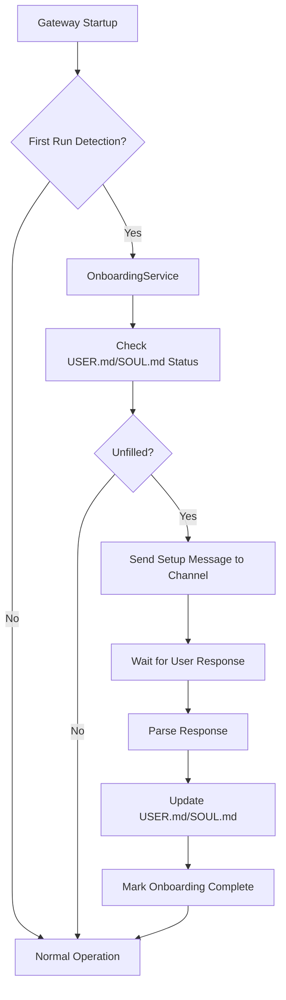

# Auto-Onboarding Setup Message Plan

## Overview

This document outlines the implementation plan for automatically sending a setup message to the channel when the gateway is initialized for the first time. The goal is to collect basic identity information for both the bot (SOUL.md) and the user (USER.md).

## Architecture



## Implementation Steps

### Step 1: Create Onboarding Service Module

**File:** `nanobot/services/onboarding.py`

```python
# Key components:
- OnboardingService class
- First-run detection
- Setup message template
- Response parser
- USER.md/SOUL.md updater
```

### Step 2: Add First-Run Detection

Detect if this is the first time the gateway is initializing by:
1. Checking if `USER.md` contains only placeholder values
2. Checking if a `.nanobot_initialized` marker file exists
3. Checking if any chat history exists in sessions

### Step 3: Define Setup Questions

The setup message will ask:

**Bot Identity (for SOUL.md):**
1. What should I call you? (bot name)
2. How should I address you? (formal/informal)
3. What are my core values? (brief description)

**User Identity (for USER.md):**
1. What's your name?
2. What's your timezone?
3. What's your preferred language?
4. What's your primary role/occupation?

### Step 4: Implement Message Sending

The `OnboardingService` will:
1. Accept the channel name and chat_id
2. Send a structured setup message via the bus
3. Use the MessageTool or direct bus publish

### Step 5: Response Handling

When user responds:
1. Parse the natural language response
2. Extract key information
3. Update the respective markdown files
4. Mark onboarding as complete

### Step 6: Gateway Integration

In `commands.py` `gateway()` function:
1. Create OnboardingService instance
2. Call `check_and_notify()` after channels start
3. Pass the first enabled channel for the welcome message

## Files to Create/Modify

### New Files:
1. `nanobot/services/__init__.py` - Services module init
2. `nanobot/services/onboarding.py` - Onboarding service

### Modified Files:
1. `nanobot/cli/commands.py` - Import and trigger onboarding
2. `nanobot/agent/memory.py` - May need to add methods for updating SOUL.md/USER.md

## Message Format

The setup message will be:

```
👋 Welcome to nanobot! Let's get to know each other.

Before we start, I need to learn a bit about you:

**About You:**
1. What's your name?
2. What's your timezone?
3. What's your preferred language?
4. What's your primary role or what do you do?

**About Me (nanobot):**
5. What would you like to call me?
6. How should I address you - formally or casually?

Please answer these questions, and I'll remember them for future conversations! 😊
```

## Response Parsing

Using simple pattern matching to extract:
- Name: Look for patterns like "my name is X" or "I'm X"
- Timezone: Look for "UTC", "+/-" patterns, or timezone names
- Language: Look for language keywords
- Role: Look for role-related keywords

## Completion Marker

After successful onboarding:
1. Create `.nanobot_initialized` marker file in data directory
2. Store timestamp and user info
3. Future runs will skip the setup message

## Edge Cases

1. **User doesn't respond immediately:** Onboarding state persists until completed
2. **Partial responses:** Store what was provided, ask for missing info next time
3. **Multiple channels:** Only send to the first channel that connects
4. **Re-onboarding:** Allow `/onboard` command to restart setup

## Testing

1. Test with empty USER.md/SOUL.md - should trigger setup
2. Test with filled files - should skip setup
3. Test response parsing with various input formats
4. Test updating markdown files correctly
5. Test marker file creation and detection
